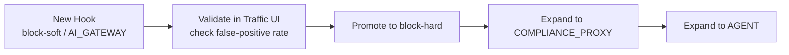

# AI Gateway Hooks

The hooks framework is the cross-cutting enforcement mechanism that runs the same Go code across all three traffic paths — AI Gateway, Compliance Proxy, and Desktop Agent — driven by the same `HookConfig` shape from the same Hub-pushed config. A hook runs at one of three stages (request, response, or connection), receives a `NormalizedPayload` of the canonical prompt or completion text, and returns a verdict: approve, redact, block-soft, or block-hard. This page covers the pipeline model, the `onMatch` schema, streaming compliance modes, and the safe rollout sequence.

---

## The three stages

| Stage | When it runs | Input |
|---|---|---|
| `request` | Before forwarding upstream | Canonical request `NormalizedPayload` + metadata |
| `response` | After receiving upstream response (or per chunk during streaming) | Canonical response `NormalizedPayload` + metadata |
| `connection` | Once per upstream connection, before any request flows | TLS context (SNI, client-cert fingerprint, target host); no body |

Streaming is not a separate stage. Chunked-async traffic reuses the `response` stage and re-runs the hook per chunk — see the streaming compliance modes section below.

## The `onMatch` schema

Every hook configuration carries an `onMatch` object that declares what to do when the hook's evaluation fires.

```yaml
config:
  onMatch:
    inflightAction: block-hard | block-soft | redact | approve
    storageAction:  keep | redact | drop-content
    replacement:    "***"          # used by inflightAction=redact or storageAction=redact
```

**`inflightAction`** — what happens to the in-flight copy of the request/response:

- `block-hard` — reject the request; pipeline short-circuits; the client sees `HTTP 451` (request stage) or a stream-terminated error (streaming). Subsequent hooks are skipped.
- `block-soft` — the pipeline continues; the soft reject is recorded in the audit trail. The upstream request still goes through. Used for "alert but don't block" policies.
- `redact` — the matched content is replaced with the `replacement` string before forwarding. The request continues with the redacted body.
- `approve` — let the request through unchanged.

**`storageAction`** — what happens to the **stored** audit copy, independent of the inflight action:

- `keep` — store the original content as-is.
- `redact` — substitute `replacement` for matched spans in the stored record only.
- `drop-content` — store metadata only; the matched content is not persisted.

The split allows policies like "block the request but keep the original in audit for investigation" (`inflightAction=block-hard, storageAction=keep`) or "let it through but redact in storage" (`inflightAction=approve, storageAction=redact`). Always verify the combination against expected semantics when creating a hook — a common misconfiguration is setting `inflightAction=block-hard` on a hook intended to redact, which blocks all matched requests instead of replacing content.

## Pipeline aggregation

Hooks run in priority order within each stage. The aggregated result:

- If any hook returns `block-hard`: final verdict is `block-hard`, attributed to the first hard reject. Subsequent hooks are skipped.
- If any hook returns `block-soft` (and no `block-hard`): final verdict is `block-soft`, attributed to the first soft reject. All hooks still run.
- Otherwise: final verdict is `approve`.

`Modify` verdicts (from redact hooks) compose: each hook's `TransformSpans` accumulate, and the final redacted body applies all spans at once.

The aggregated decision is stamped on the traffic event as `blocking_rule` (the `RuleID` of the first hard reject, if any) plus a per-stage pipeline trace in `request_hooks_pipeline` / `response_hooks_pipeline`.

## Built-in hooks

| Hook | Purpose | Available on |
|---|---|---|
| PII Detector | Pattern + ML pre-filter; classifies and optionally redacts PII | All paths |
| Keyword Filter | Configurable exact + regex patterns | All paths |
| Content Safety | Policy-based safety evaluation | All paths |
| Rate Limiter | Per-source / per-VK / per-org rate limits (Valkey or local) | All paths |
| Request Size Validator | Body-size limits | All paths |
| IP Access Filter | Source IP allowlist / denylist | All paths |
| Webhook Forward | Forward to admin-configured webhook for custom evaluation | AI Gateway only |
| Quality Checker | Response quality evaluation against criteria | AI Gateway only |
| AI Guard | Semantic classification via embeddings | AI Gateway only (cost-sensitive) |

Each built-in hook lives under `packages/shared/policy/hooks/<hook_name>/` and auto-registers in its package `init()`.

## Streaming compliance modes

The interaction between streaming SSE and hooks is configured per traffic path:

| Mode | Behavior |
|---|---|
| `passthrough` | Relay only. No hook execution, no body capture. |
| `buffer_full_block` | Assemble the full response before forwarding any byte. Response-stage hook runs once at stream end. `block-hard` returns `HTTP 451`; no bytes reach the client. Trades real-time UX for blocking ability. |
| `chunked_async` | Relay bytes to client in real time; asynchronously accumulate extracted content in chunks. Response-stage hook runs per chunk + once at stream end. Cannot stop bytes already sent, but produces a complete audit trail and triggers post-hoc alerting on violation. |

Per-scope `fail_behavior` (`fail_open` or `fail_close`) determines what happens on hook timeout, error, or oversize buffer.

## `applicableIngress` filtering

Every `HookConfig` declares which paths it applies to:

- `["ALL"]` — runs on AI Gateway, Compliance Proxy, and Desktop Agent.
- Any subset of `["AI_GATEWAY", "COMPLIANCE_PROXY", "AGENT"]` — runs only on the listed paths.

Hub's change-signal fans out only to the Things whose path appears in the subset, so an AI-Gateway-only hook does not affect the compliance proxy or agents.

## Safe rollout sequence

The recommended rollout for a new hook:

1. **Create with `applicableIngress: ["AI_GATEWAY"]` and `inflightAction: block-soft` (or `approve` + `storageAction: keep`).** Flag-only mode: the hook fires and records decisions without affecting traffic.
2. **Validate via CP UI Traffic page** — filter by hook ID, check decision count and false-positive rate over real traffic.
3. **Promote to `inflightAction: block-soft`** to start recording violations audibly without blocking.
4. **Promote to `inflightAction: block-hard`** when the false-positive rate is acceptable.
5. **Expand `applicableIngress`** to `COMPLIANCE_PROXY`, then to `AGENT`, one at a time.
6. **Monitor Config Sync** — the Infrastructure → Config Sync page shows whether every node has applied the new config.



## Verifying a hook

```bash
# Send a request that should trip the hook:
curl http://localhost:3050/v1/chat/completions \
  -H "Authorization: Bearer <VIRTUAL_KEY>" \
  -d '{"model":"gpt-4o","messages":[{"role":"user","content":"my SSN is 123-45-6789"}]}'

# Inspect the audit row:
docker exec postgres psql -U postgres -d nexus_gateway \
  -c "SELECT request_hook_decision, request_hooks_pipeline \
      FROM traffic_event WHERE request_id='<id>'"
```

The pipeline trace shows the hook ID, verdict, latency, and attribution for every hook that ran.

---

## Canonical docs

- [`hook-architecture.md`](https://github.com/AlphaBitCore/nexus-gateway/blob/main/docs/developers/architecture/services/ai-gateway/hook-architecture.md) — Full pipeline model, `onMatch` schema, streaming modes, built-in hooks, and adding a new hook
- [`hook-rollout.md`](https://github.com/AlphaBitCore/nexus-gateway/blob/main/docs/users/features/flows/hook-rollout.md) — End-to-end rollout flow with failure modes and verification steps
- [`ai-gateway.md`](https://github.com/AlphaBitCore/nexus-gateway/blob/main/docs/users/features/cp-ui/ai-gateway.md) — Admin surfaces that configure and validate hooks

**Adjacent wiki pages**: [AI Gateway Overview](AI-Gateway-Overview) · [AI Gateway Routing Rules](AI-Gateway-Routing-Rules) · [Feature Hooks Framework](Feature-Hooks-Framework) · [Feature PII Redaction](Feature-PII-Redaction) · [Compliance Proxy Overview](Compliance-Proxy-Overview)
