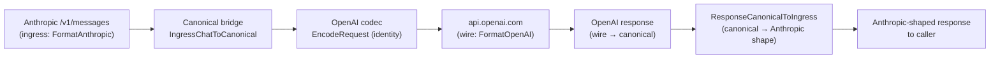

# AI Gateway Ingress Endpoints

The AI Gateway exposes five `/v1/*` proxy endpoints and two utility endpoints on `:3050`. Each endpoint accepts a specific wire format, normalizes the request into the canonical OpenAI chat-completions shape (or the canonical embeddings shape), routes it, and returns a response in the same format the caller sent. This page describes when to use each endpoint, what authentication is required, and how cross-format routing works when the ingress format and the upstream target differ.

---

## Endpoint catalog

### `/v1/chat/completions` — OpenAI chat ingress

The primary ingress. Accepts the OpenAI chat-completions wire format: `model`, `messages[]`, `temperature`, `stream`, `tools[]`, etc. Both streaming (SSE) and non-streaming are supported.

```yaml
POST /v1/chat/completions
Authorization: Bearer <virtual-key>
Content-Type: application/json

{
  "model": "gpt-4o",
  "messages": [{"role": "user", "content": "Hello"}],
  "stream": false
}
```

Setting `model: "auto"` activates smart routing — the gateway's dispatch model selects the best available provider/model based on prompt content and request context. See [AI Gateway Smart Routing](AI-Gateway-Smart-Routing).

The `nexus.dry_run: true` extension field (anywhere in the body) short-circuits upstream dispatch: the gateway runs the cost estimator and returns an empty-content response with predicted `usage` fields. No upstream call is made and no traffic event is counted against quota.

### `/v1/messages` — Anthropic Messages ingress

Accepts the Anthropic Messages wire format: `model`, `messages[]`, `system` (string or content-block array), `max_tokens` (required by Anthropic), `tools[]` (Anthropic tool_use shape). The response is Anthropic-shaped.

```yaml
POST /v1/messages
Authorization: Bearer <virtual-key>
anthropic-version: 2023-06-01
Content-Type: application/json

{
  "model": "claude-sonnet-4-6",
  "max_tokens": 1024,
  "messages": [{"role": "user", "content": "Hello"}]
}
```

If a routing rule resolves this request to an OpenAI target (cross-format routing), the canonical bridge converts the Anthropic body to the canonical OpenAI shape before the OpenAI adapter encodes the wire request. The response is then converted back to Anthropic shape before returning to the caller. The caller never sees OpenAI-format bytes.

Anthropic streaming uses `event:` / `data:` SSE framing. The gateway's Anthropic stream decoder handles the `event: content_block_delta` / `event: message_delta` chunks and translates them to canonical streaming form.

### `/v1/responses` — OpenAI Responses API ingress

Accepts the OpenAI Responses API wire format. This is treated as a distinct ingress format (not an alias for `/v1/chat/completions`) because the Responses API carries stateful fields like `previous_response_id` and `store` that have no canonical representation. When the target adapter declares native Responses API support (`RequestShapes` includes `"responses-api"`), the request is passed through with only model rewrite applied. When the target does not support the shape, the canonical bridge converts Responses → chat-completions → target wire, and the response is converted back to Responses shape.

```yaml
POST /v1/responses
Authorization: Bearer <virtual-key>
Content-Type: application/json

{
  "model": "gpt-4o",
  "input": "Tell me a joke",
  "store": true
}
```

### `/v1/embeddings` — Embeddings ingress

Accepts the OpenAI embeddings wire format. The `model` field must resolve to a model with the `embedding` capability flag; smart routing (`model: "auto"`) is not supported on this endpoint.

```yaml
POST /v1/embeddings
Authorization: Bearer <virtual-key>
Content-Type: application/json

{
  "model": "text-embedding-3-small",
  "input": "The quick brown fox"
}
```

Gemini's `:batchEmbedContents` endpoint requires a `model` field on each sub-request inside the `requests` array in addition to the URL-level model path. The Gemini embeddings codec handles this automatically.

### `/v1/models` — Model listing

Returns all enabled models in the OpenAI-compatible list format. No authentication required.

```yaml
GET /v1/models
```

The response lists every `Model` row where `enabled = true`. Each entry carries `id`, `object`, `created`, `owned_by`, and `owner_display_name`. Callers can use this to discover what models the gateway currently offers before constructing requests.

### `/v1/estimate` — Cost prediction

Returns a predicted cost without forwarding the request upstream. Accepts the same body as `/v1/chat/completions`. The estimator runs the routing engine, picks a target, reads the Model row price, and projects the token count against the price.

### `/v1/classify` — AI Guard classification

Runs the AI Guard classifier directly on the provided text without going through the proxy hot path. Used by the CP UI "test classification" surface. Requires VK authentication.

## Cross-format routing

When the ingress format and the resolved target's wire family differ, the canonical bridge executes the conversion transparently.



Same-family passthrough skips the canonical round-trip: an OpenAI request destined for an OpenAI target forwards the body verbatim, with only the model rewrite hook (`PassthroughRewrite`) applied for per-model wire quirks.

## Normalization pipeline

Every captured body — regardless of ingress format — is normalized into a `NormalizedPayload` for hook evaluation, audit storage, and the CP Traffic UI. The three-tier pipeline:

1. **Tier 1** — per-adapter precision parse (OpenAI, Anthropic, Gemini, plus web/IDE adapters that delegate to `extract.NormalizeForAdapter`). Returns `Confidence = 1.0` on clean parse.
2. **Tier 2** — `PatternNormalizer`: JSON multi-spec probe across 7 chat-request shapes + non-JSON detector chain (Connect-RPC protobuf for Cursor, Google batchexecute for Gemini web). Returns `Kind = KindAIChat` even for unregistered hosts that use a recognized wire shape.
3. **Tier 3** — `GenericHTTPNormalizer` catch-all. Always succeeds; returns `http-text` / `http-json` / `http-binary` projection.

The normalized result is stored in `traffic_event_normalized` (1:1 sidecar of `traffic_event`) at write time, not recomputed on read.

## Authentication

All proxy endpoints (`/v1/chat/completions`, `/v1/messages`, `/v1/responses`, `/v1/embeddings`, `/v1/estimate`, `/v1/classify`) require a virtual key in the `Authorization: Bearer <vk>` header. The VK is validated by `auth/vkauth/` against the DB row (cached in Valkey for sub-millisecond latency). `/v1/models` requires no authentication.

---

## Canonical docs

- [`normalization-architecture.md`](https://github.com/AlphaBitCore/nexus-gateway/blob/main/docs/developers/architecture/services/ai-gateway/normalization-architecture.md) — Three-tier normalization pipeline and `NormalizedPayload` storage
- [`provider-adapter-architecture.md`](https://github.com/AlphaBitCore/nexus-gateway/blob/main/docs/developers/architecture/services/ai-gateway/provider-adapter-architecture.md) — Cross-format routing contract (§3a Rules 1-7) and ingress ≠ canonical distinction
- [`ai-gateway-v1.yaml`](https://github.com/AlphaBitCore/nexus-gateway/blob/main/docs/users/api/openapi/ai-gateway/ai-gateway-v1.yaml) — OpenAPI 3.1 spec for all `/v1/*` endpoints

**Adjacent wiki pages**: [AI Gateway Overview](AI-Gateway-Overview) · [AI Gateway Provider Adapters](AI-Gateway-Provider-Adapters) · [AI Gateway Routing Rules](AI-Gateway-Routing-Rules) · [AI Gateway Streaming](AI-Gateway-Streaming) · [Canonical Vs Wire Format](Canonical-Vs-Wire-Format)
