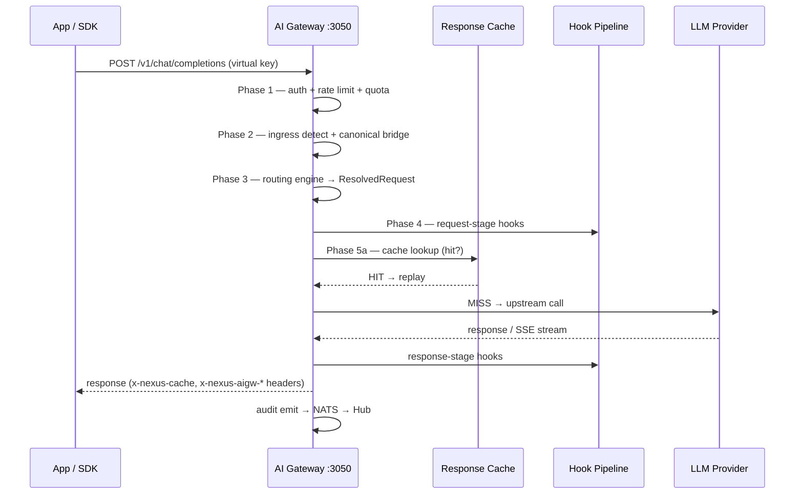

# AI Gateway Overview

The AI Gateway is the data-plane service that proxies `/v1/*` traffic from applications to upstream LLM providers, enforcing compliance hooks, quota limits, caching, and routing rules in a single hot path. It runs independently of Nexus Hub — a Hub outage does not interrupt in-flight traffic; the gateway continues serving with its last-loaded config. The gateway listens on `:3050` and is the only service that applications and SDKs talk to directly via a virtual key (VK).

---

## Request lifecycle

Every request travels through five ordered phases before an upstream response returns to the caller.

**Phase 1 — Auth + rate limit + quota.** The middleware stack validates the virtual key via `auth/vkauth/`, enforces per-VK rate limits (token bucket in Valkey), and checks quota budgets. Failures return `401`, `403`, or `429` before any upstream contact.

**Phase 2 — Ingress detection and canonical bridge.** `ingress/proxy/ingress.go` detects which ingress format the request carries (OpenAI chat-completions, Anthropic Messages, OpenAI Responses, Gemini generateContent, or embeddings) and extracts the model identifier. For cross-format routing — for example, an Anthropic-shape request destined for an OpenAI target — `execution/canonicalbridge` converts the ingress body to the canonical OpenAI chat-completions shape before the routing engine sees it.

**Phase 3 — Routing engine.** The routing engine evaluates rules in priority order against the canonical payload (see [AI Gateway Routing Rules](AI-Gateway-Routing-Rules)). The result is a `ResolvedRequest` carrying the chosen provider, model, credential, and routing trace.

**Phase 4 — Hook pipeline.** Request-stage hooks run against the canonical `NormalizedPayload`. A `block-hard` verdict short-circuits the pipeline and returns `HTTP 451`; a `redact` verdict modifies the in-flight body before it reaches the upstream. See [AI Gateway Hooks](AI-Gateway-Hooks) for the full pipeline model.

**Phase 5 — Cache + upstream dispatch.** The response cache is consulted first (semantic + exact). On a miss, the executor calls the upstream via the provider adapter, collects the response (streaming or non-streaming), runs response-stage hooks, stamps the `traffic_event`, and emits the audit record to NATS.

## Ingress endpoints

The gateway exposes five `/v1/*` endpoints and two admin probe endpoints.

| Endpoint | Method | Auth | Purpose |
|---|---|---|---|
| `/v1/chat/completions` | POST | VK | OpenAI-shape chat; `"auto"` model triggers smart routing |
| `/v1/messages` | POST | VK | Anthropic Messages ingress; cross-format routing supported |
| `/v1/responses` | POST | VK | OpenAI Responses API ingress |
| `/v1/embeddings` | POST | VK | OpenAI-shape embeddings; `"auto"` not supported |
| `/v1/models` | GET | none | List all enabled models (OpenAI-compat format) |
| `/v1/estimate` | POST | VK | Predicted cost without forwarding upstream |
| `/v1/classify` | POST | VK | Run AI Guard classifier directly |

`:generateContent` (Gemini-shape) is routed through the same proxy path; the ingress detector identifies the wire format from the URL suffix and content-type.

## Package layout

The gateway's internal packages are organised into five buckets, each with a dedicated architecture doc.

| Bucket | What it owns |
|---|---|
| `ingress/` | HTTP entry surface: proxy, models, envelope, debug probes |
| `routing/` | Strategy tree, match conditions, canonical payload, smart routing |
| `execution/` | Executor, canonical bridge, estimator, emergency passthrough, header forwarding |
| `policy/` | Hook dispatcher, quota, rate limit, AI Guard, request context |
| `platform/` | Audit emit, Prometheus metrics, middleware, DB read-side store, streaming |

Provider adapters live in `providers/specs/<name>/` (per-adapter codec + stream + transport + errors). The shared traffic adapter registry (`packages/shared/traffic/adapters/`) covers 50+ API, web, and IDE surfaces used by the Compliance Proxy and Desktop Agent.

## Response headers

Every proxied response carries a standard set of headers that callers can use for observability and debugging.

| Header | Meaning |
|---|---|
| `x-nexus-aigw-request-id` | Nexus request ID for cross-referencing the `traffic_event` row |
| `x-nexus-aigw-provider` | Provider that served the request |
| `x-nexus-aigw-model` | Model that served the request |
| `x-nexus-aigw-latency-ms` | Total gateway latency including upstream round-trip |
| `x-nexus-aigw-routing-rule` | Routing rule ID that resolved the target |
| `x-nexus-cache` | `HIT` / `MISS` / `MISS-EVICT` — response cache status |
| `x-nexus-quota-warning` | Present when the VK is approaching its quota limit |
| `x-nexus-attempts` | Number of provider attempts (> 1 = a fallback fired) |

## Configuration and startup

The gateway registers with Nexus Hub as a Thing (node) on boot, pulls its config snapshot via the Hub-centric pull-only config sync, and holds an atomic.Pointer to the live config. When Hub signals a config change — new routing rule, updated hook, rotated credential — the gateway fetches the delta and swaps the pointer. No restart is required. The gateway's YAML config file (`ai-gateway.dev.yaml` in development) carries service-shape settings (ports, timeouts, log level); secrets are env-only and never in YAML.

---

## Canonical docs

- [`ai-gateway-internals-architecture.md`](https://github.com/AlphaBitCore/nexus-gateway/blob/main/docs/developers/architecture/services/ai-gateway/ai-gateway-internals-architecture.md) — Internal subpackage reference for the 11-bucket layout
- [`normalization-architecture.md`](https://github.com/AlphaBitCore/nexus-gateway/blob/main/docs/developers/architecture/services/ai-gateway/normalization-architecture.md) — Three-tier normalization pipeline (Tier 1 per-adapter / Tier 2 pattern / Tier 3 generic)
- [`routing-architecture.md`](https://github.com/AlphaBitCore/nexus-gateway/blob/main/docs/developers/architecture/services/ai-gateway/routing-architecture.md) — Strategy tree, canonical payload, ResolvedRequest, admin guard
- [`provider-adapter-architecture.md`](https://github.com/AlphaBitCore/nexus-gateway/blob/main/docs/developers/architecture/services/ai-gateway/provider-adapter-architecture.md) — §3a Rules 1-8 governing every provider adapter

**Adjacent wiki pages**: [AI Gateway Routing Rules](AI-Gateway-Routing-Rules) · [AI Gateway Provider Adapters](AI-Gateway-Provider-Adapters) · [AI Gateway Ingress Endpoints](AI-Gateway-Ingress-Endpoints) · [AI Gateway Hooks](AI-Gateway-Hooks) · [The Five Services](The-Five-Services)
