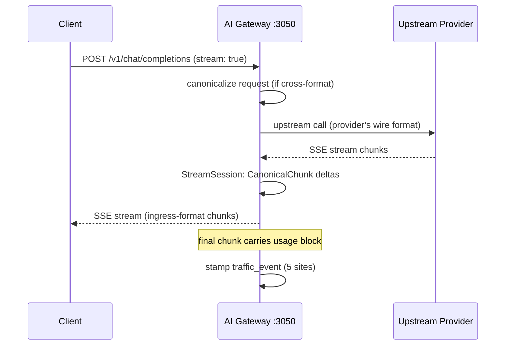

# AI Gateway Streaming

*Audience: contributors adding provider adapters or ingress endpoints; operators debugging SSE behaviour.*

Streaming in Nexus Gateway means emitting Server-Sent Events (SSE) to the caller while simultaneously reading the upstream provider's chunked response. Every ingress endpoint — `/v1/chat/completions`, `/v1/messages`, `/v1/responses`, and `/v1/models` — must behave identically with `stream: true`. Streaming and non-streaming paths go through the same codec rules, the same cache write/read sites, and the same hook pipeline; parity is an architectural invariant, not a best-effort goal.

---

## SSE across ingresses

All four AI Gateway ingress endpoints support streaming. A client sets `stream: true` (or the equivalent for the ingress format) and receives SSE chunks in the provider's expected wire shape for that ingress — even when the upstream is a different provider. The gateway handles the wire-format reshaping transparently.

The cost stamp happens at stream end, when the provider's final `usage` chunk arrives. For cache-hit replays the stamp happens when the cached entry's `Usage` struct is read.

### Cross-format streaming

When a client sends an Anthropic `/v1/messages` request (SSE in Anthropic wire format) but the routing rule resolves to an OpenAI model, the gateway:

1. Canonicalizes the Anthropic request body into OpenAI chat-completions shape via `canonicalbridge.IngressChatToCanonical`.
2. Dispatches to the OpenAI adapter; the upstream streams back OpenAI SSE.
3. The `StreamSession` emits `CanonicalChunk` deltas — format-neutral.
4. `canonicalbridge.ResponseCanonicalToIngress` re-encodes each chunk into Anthropic SSE wire format before forwarding to the client.

The client sees Anthropic-format SSE throughout, regardless of which provider handled the request. This symmetry holds for all ingress × upstream combinations.

## StreamSession — per-provider SSE parsing

Each provider adapter under `packages/ai-gateway/internal/providers/specs/<adapter>/stream/` implements `StreamDecoder.Open`, which returns a `StreamSession`. The session handles:

- **Incremental JSON parsing** — never fully buffering the upstream response body; each frame is parsed as it arrives.
- **Buffer management** — per-session max size cap and backpressure signalling.
- **Heartbeat and keep-alive frames** — recognised and discarded without forwarding to the client.
- **Graceful close** — upstream FIN, half-open connection, and mid-stream errors, all resolved without leaving the client connection in an ambiguous state.
- **Per-provider wire quirks** — Gemini uses chunked HTTP/2 frames (not text/event-stream SSE) and a `[DONE]` sentinel; Anthropic SSE splits across `event:` / `data:` line pairs and uses named event types (`content_block_delta`, `message_delta`, etc.); OpenAI's first chunk carries the role field only, with no content delta.

Sessions emit `CanonicalChunk` values — delta diffs over the canonical OpenAI chat-completions response shape. The hook pipeline and the response cache both consume `CanonicalChunk`, so they work identically regardless of which provider produced the stream.

### Provider wire format comparison

| Provider | Transport | Frame shape | Finish signal |
|---|---|---|---|
| OpenAI / DeepSeek / Groq / most compat | `text/event-stream` SSE | `data: {"choices":[{"delta":{...}}]}` | `data: [DONE]` |
| Anthropic | `text/event-stream` SSE | `event: content_block_delta\ndata: {...}` | `event: message_stop` |
| Gemini | Chunked HTTP/2 JSON array | `[{"candidates":[...]}, ...]` frames | Upstream closes the body |
| Azure OpenAI | Same as OpenAI; `model-deployment-id` header added | Same | Same |

The `StreamSession` for each provider family normalizes these differences. All callers downstream see `CanonicalChunk` with uniform fields: `delta.content`, `delta.tool_calls`, `finish_reason`, and `usage` (on the final chunk).

## Streaming and non-streaming parity (§3a Rule 6)

A codec rule that strips a parameter from a non-streaming request applies equally to the streaming variant. The upstream rejects both shapes for the same reason. Because both paths call the same `PrepareBody` function before dispatching, most parity issues never arise. The gap typically surfaces on **error-frame construction** — when the gateway builds a synthetic SSE error chunk on the response side and inadvertently uses the wrong ingress format.

Explicit check: after any codec change, verify that the same rule applies to both `handleNonStream` (site 1) and `handleStreamHit` / `handleStreamWithSubscription` (sites 2–5 in `proxy_cache.go`).

## Streaming and the response cache

The response cache stores streaming responses as a `[]ChunkRecord` array (JSON-serialized) tagged `response_kind=stream` in the Valkey entry. On a cache hit for a streaming client, `handleStreamHit` in `proxy_cache.go` reads the chunk array and replays it as SSE with proper timing. On a cache miss the `handleStreamWithSubscription` path records incoming chunks as they arrive, so the cache write and the client stream proceed in parallel — the first response pays the upstream; subsequent identical requests are served from cache.

A streaming hit from the semantic cache (L2) works identically: the L2 entry's `response_kind` tag is checked at lookup time so a streaming client never receives a non-streaming entry.

## Mid-stream hook abort

The hook pipeline has a streaming stage that evaluates chunks as they arrive. If a response hook returns `block` mid-stream after some bytes have already been forwarded to the client, the gateway cannot retroactively send a 4xx status. Instead it emits an SSE `event: error` chunk with a sanitized message and closes the stream. The traffic event is stamped `partial=true`. The partial response is never written to the response cache.

## Streaming dry-run

A client requesting `stream: true` alongside `nexus.dry_run: true` receives exactly one SSE chunk containing the estimated usage block followed by `[DONE]`. There is no token-by-token simulation — the estimator returns its output as a single event.

## Nonce isolation across ingresses

The response cache key is computed from the `prepared_body` output of `Adapter.PrepareBody`. For routing rules with `vary_by_user=true` or `vary_by_vk=true`, a per-user or per-VK nonce is folded into the hash. This means the same streaming request sent by user A and user B produces two separate cache entries — one for each nonce — even if the messages are identical. Cache hits are scoped to the correct population; cross-user leakage via cache replay is structurally prevented.

The Semantic cache (L2) applies an even stricter default: `vary_by=vk` by default, because approximate matching introduces a similarity-based leakage surface that per-user isolation alone would not fully close.

## Singleflight coalescer

When multiple concurrent requests arrive with identical canonical bodies, only the first one dispatches to the upstream — the others "join" the in-flight request and receive the same response when the leader completes. This singleflight coalescer lives in `packages/ai-gateway/internal/cache/stream/` and operates on streaming responses too. The traffic event for a joined request carries `gateway_cache_status=hit_inflight`; the unified `cache_status` column reports `HIT`.

For singleflight on streaming responses, the leader writes chunks to the cache entry as they arrive; joiners read from the same entry in real time. A joiner that connects mid-stream receives chunks from the beginning of the cached buffer, not from the current position — every client gets the complete response.

Cancellation semantics: if the leader disconnects early, the leader's upstream call continues on an independent context so work is not wasted for the joiners. Joiners that disconnect stop waiting for new chunks; the leader's call runs to completion regardless.

## Observability for streaming

Each streaming request produces a traffic event at stream end (not per-chunk). The event carries the same fields as non-streaming: `error_class`, `cache_status`, `cost_usd`, `prompt_tokens`, `completion_tokens`, and reasoning tokens where applicable. The `partial` flag distinguishes a mid-stream abort from a successful completion.

Debug-level logs in `spec_adapter.go` and `shared/httpclient/logging.go` capture the first 8 KB of the upstream stream body under the log message `"upstream stream body"`. Activate with `log.level: "debug"` in the service's `*.dev.yaml`. No code change is needed for standard stream body inspection. For mid-stream chunk values, add a temporary `slog.LevelDebug` log inside the relevant stream session and remove it before committing.

Prometheus counter `nexus_aigateway_stream_requests_total{provider, model, outcome}` tracks completed and aborted streams per provider and model. The `outcome` label is `success`, `partial_abort` (mid-stream hook block), or `upstream_error` (provider failure after first byte).

---

## Canonical docs

- [`normalization-architecture.md`](https://github.com/AlphaBitCore/nexus-gateway/blob/main/docs/developers/architecture/services/ai-gateway/normalization-architecture.md) — three-tier normalizer that parses SSE and non-SSE wire formats into canonical `NormalizedPayload`
- [`provider-adapter-architecture.md`](https://github.com/AlphaBitCore/nexus-gateway/blob/main/docs/developers/architecture/services/ai-gateway/provider-adapter-architecture.md) — §3a Rule 6 (streaming parity), §4 (StreamSession), §5 (token-field stamp sweep)
- [`response-cache-architecture.md`](https://github.com/AlphaBitCore/nexus-gateway/blob/main/docs/developers/architecture/services/ai-gateway/response-cache-architecture.md) — streaming entry storage and replay

**Adjacent wiki pages**: [AI Gateway Provider Adapters](AI-Gateway-Provider-Adapters) · [AI Gateway Response Cache](AI-Gateway-Response-Cache) · [AI Gateway Hooks](AI-Gateway-Hooks) · [AI Gateway Ingress Endpoints](AI-Gateway-Ingress-Endpoints)
