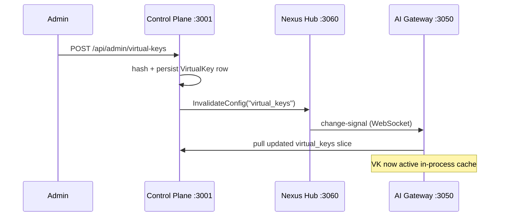

# AI Gateway Virtual Keys Quotas

*Audience: operators managing API access and budget controls.*

Virtual keys (VKs) are the bearer tokens that applications use to call the AI Gateway. Every request carries a VK; the gateway resolves it to an organization, project, and set of permissions, then enforces quota policies before routing to the upstream provider. Quota is enforced using a sliding-window counter in Valkey. When Valkey is unavailable, quota enforcement fails closed by default — requests are rejected rather than served without budget tracking.

---

## Virtual key lifecycle

A virtual key is created in the Control Plane under `AI Gateway → Virtual Keys`. The admin scopes the key to an organization or project, restricts which models it may call, and optionally attaches one or more quota policies. The Control Plane persists the `VirtualKey` row in Postgres and signals the AI Gateway via Hub config sync to pull the fresh key list.

The plaintext key is shown exactly once in the UI after creation. After that only the hash is stored — the original cannot be recovered. The key format is `vk-<random>`.

### Org resolution — two join chains

A virtual key resolves its organization through one of two paths:

- **Application VK** — scoped to a `Project` row; org resolved via `Project.organizationId`.
- **Personal VK** — scoped to a `NexusUser` row (issued to an individual); org resolved via `NexusUser.organizationId`.

The `vkSelectSQL` query in `packages/ai-gateway/internal/auth/vkauth/` uses `COALESCE` to cover both chains. Adding a new VK-derived column requires coverage of both paths or personal VK rows silently return `NULL` for that column.

## Quota model

A quota policy attaches to **one scope** — one organization, one project, or one virtual key. Multiple policies can attach to the same scope (for example, a daily token quota and a monthly cost quota; both must pass).

Each policy specifies:

| Field | Values |
|---|---|
| `scope` | `org` / `project` / `virtual_key` |
| `period` | `minute` / `hour` / `day` / `month` |
| `unit` | `requests` / `tokens` / `cost_usd` |
| `limit` | numeric ceiling |
| `burst_allowance` | optional soft overage above `limit` |
| `overage_behavior` | `block` / `warn` / `allow` |

`QuotaOverride` rows let admins raise or lower the effective limit for a specific VK, user, project, or org without touching the shared policy.

## Sliding-window enforcement

For each `(scope, period)` pair, the engine maintains a sorted set in Valkey keyed `quota:<scope>:<period>:<scope_id>`. Each incoming request adds `(timestamp, unit_count)` to the set. A Lua script atomically drops entries older than `now − period`, sums the remaining counts, and compares against `limit + burst_allowance`.

The check-and-increment script covers the full org ancestor path in one round-trip. A request scoped to a project rolls up through every ancestor organization; parent caps bind — a request that passes the project cap but exceeds a parent org cap is rejected at the parent. The materialized ancestor path (from `tenancy-architecture.md`) makes this constant-time.

### Reserve / reconcile pattern

Quota is deducted in two phases:

1. **Reserve (pre-routing)** — a conservative estimate is deducted upfront. For `requests`, this is `+1`. For `tokens`, it is the input token count plus a configured response budget. For `cost_usd`, it is the estimated input cost plus a reserved output cost.
2. **Reconcile (post-completion)** — the reservation is adjusted to actual usage at stream end or response completion. A failed request is refunded so it does not consume quota.

This two-phase approach prevents both "free" tokens (a response producing 4× the reserved output still gets charged correctly) and over-reservation lockouts (a zero-token response is mostly refunded).

## Enforcement gates

Quota gates run in series before routing:

| Gate | When | Response on exceed |
|---|---|---|
| Per-VK quota | Before routing | 429 — `code=nexus_quota_exceeded` |
| Per-project quota | Before routing | 429 |
| Per-org quota (transitive) | Before routing | 429 |
| Cost cap mid-stream | During chunked response | Stream cut with cost-exceeded marker |

The first gate to fail wins. The 429 response includes `Retry-After`, `limit`, `remaining`, and `reset_at`. The `X-Nexus-Limit-Source: nexus` header distinguishes these Nexus-side 429s from upstream-provider 429s forwarded by the gateway. See [AI Gateway Error Taxonomy](AI-Gateway-Error-Taxonomy) for the full 429 shape.

## Failure modes and fail-closed semantics

| Failure | Default behaviour | Override |
|---|---|---|
| **Valkey unavailable** | **Reject (fail-closed)** — quota cannot be tracked without the counter store, so requests are blocked. | Set `redis_fail_closed: false` on the policy to allow pass-through on Valkey outage (per-policy opt-in). |
| Lua script error | Treated the same as Valkey-down. | Same override. |
| Quota mis-configured (negative limit) | Admin guard rejects on save. | — |
| Counter race (multi-instance) | Atomic Lua script per scope ensures correctness. | — |

The fail-closed default is intentional for budget enforcement: an unknown counter state means unknown spend. Operators who want availability over strict budget tracking set `redis_fail_closed: false` on specific policies with explicit acceptance of over-quota risk.

## Emergency passthrough interaction

When the kill switch is active and the gateway is in passthrough mode, quota gates are bypassed. Requests flow unhooked and unmetered, but remain recorded in the audit pipeline with `passthrough=true` and `quota_bypassed=true`. The audit trail compensates for the enforcement bypass.

## Creating and managing virtual keys

### Minimum required steps

1. Navigate to `AI Gateway → Virtual Keys → New Virtual Key` in the Control Plane UI.
2. Set the key name and scope it to an organization or project.
3. Optionally restrict which models the key may call (`Model Restrictions`).
4. Optionally attach a quota policy (or attach one later from the Quota Policies page).
5. Submit — the plaintext key is shown once. Copy and store it securely; it cannot be retrieved again.

### Model restrictions

A virtual key can restrict which provider/model combinations it is allowed to call. Requests using a VK that specifies model restrictions are rejected with 403 if the resolved model falls outside the allowed set. This lets teams issue scoped keys — for example, a VK that may only call `claude-sonnet-4-6` for a specific application.

### Revoking a key

Revoke a key from the virtual key detail page. The Control Plane marks the row inactive and signals the AI Gateway via Hub config sync. Subsequent requests carrying the revoked key receive 401. In-flight requests that were already authenticated complete normally; only new authentication attempts are rejected.

## Analytics

The Control Plane Quota Usage page shows current consumption per policy, projected exhaustion time (linear extrapolation from the rolling counters), and per-VK breakdown. Hub maintains a periodic aggregate view of per-policy usage in `packages/nexus-hub/internal/quota/store/` — this view is advisory; enforcement always runs against the live Valkey counters.

Cost analytics on the Traffic page group by `virtual_key_id` and `org_id`, rolling up through the organization hierarchy. `traffic_event` rows carry both `virtual_key_id` and `org_id` so per-VK spend and per-org spend are both queryable without joining to the quota policy tables.

---

## Canonical docs

- [`quota-architecture.md`](https://github.com/AlphaBitCore/nexus-gateway/blob/main/docs/developers/architecture/cross-cutting/safety/quota-architecture.md) — sliding-window algorithm, reserve/reconcile, parent-cap rollup, and all failure modes
- [`vk-lifecycle.md`](https://github.com/AlphaBitCore/nexus-gateway/blob/main/docs/users/features/flows/vk-lifecycle.md) — step-by-step VK creation, config-sync, and request flow
- [`error-taxonomy-architecture.md`](https://github.com/AlphaBitCore/nexus-gateway/blob/main/docs/developers/architecture/cross-cutting/safety/error-taxonomy-architecture.md) — Nexus-side 429 envelope shape

**Adjacent wiki pages**: [AI Gateway Error Taxonomy](AI-Gateway-Error-Taxonomy) · [AI Gateway Cost Estimation](AI-Gateway-Cost-Estimation) · [AI Gateway Routing Rules](AI-Gateway-Routing-Rules) · [Control Plane Multi Tenancy](Control-Plane-Multi-Tenancy)
