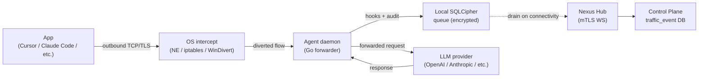

# Agent Privacy Data Flows

*Audience: security reviewers, compliance teams, and end users who want to understand exactly what the agent captures, stores, and transmits.*

The Desktop Agent intercepts AI traffic at the OS level and transmits structured audit events to Hub over mTLS. What leaves the device, what is stored locally, and what reaches the server depends on the traffic upload level configured by the admin. This page describes each data flow, what each record contains, and what filtering controls are available.

---

## What the agent captures

For each intercepted flow, the agent records a structured `traffic_event` row. The fields captured depend on the platform and whether TLS bump was possible:

| Platform | TLS bump | Captured fields |
|---|---|---|
| Linux / Windows | Yes | Host, port, process name, request body (up to spillstore limit), response body, hook decisions, phase timings |
| macOS (NE) | No | Host, port, process bundle ID, connection metadata, policy decision — no request/response body content |

All captured events include:
- Destination host and port
- Process identity (bundle ID on macOS, process name on Linux/Windows)
- Intercept policy decision (`inspect`, `passthrough`, `exempted`, `out-of-scope`)
- Hook decisions applied (allow, redact, block, and which hook matched)
- Phase timing durations (`request_hooks_ms`, `upstream_ttfb_ms`, `upstream_total_ms`, `response_hooks_ms`, `duration_ms`)
- `trace_id` for cross-service correlation
- Timestamps (`started_at`, `completed_at`)

Body content (request payload, response content) is captured only on Linux and Windows where TLS bump is possible. Redaction hooks run before the body content is stored — if a hook redacts PII, the redacted version is what reaches the audit record.

## Local storage

Captured events are written to a local SQLCipher queue before being drained to Hub. The queue is encrypted at rest using a key from the platform keystore:

| Platform | Keystore |
|---|---|
| macOS | Apple Keychain |
| Linux (desktop) | libsecret (D-Bus Secret Service) |
| Linux (headless) | Encrypted file at `${ConfigDir}/secrets.enc` |
| Windows | Windows Credential Manager |

The audit DB key is fetched from the keystore at boot. If the key is lost (keystore wipe), the local queue is cleared and a fresh start is reported to Hub. The queue file itself lives under `paths.DefaultPaths().StateDir`.

## What leaves the device (traffic upload level)

The admin controls which captured events are transmitted to Hub via `agent_settings.trafficUploadLevel`:

| Level | Events transmitted |
|---|---|
| `all` | Every captured event, including relayed out-of-scope traffic |
| `processed` (default) | Events the agent actively inspected (in-scope domain, hooks ran). Out-of-scope relay events are not uploaded. |
| `blocked` | Only events where a hook issued a hard reject |

Filtering happens at emit time on the device, not at the server. This means events below the configured level never leave the device — they are held in the local queue (subject to queue rotation policy) but not uploaded.

Three outcome categories always bypass the filter regardless of level: `deny`, `block`, and `error`. These are auditable regardless of the upload level setting.

The current upload level is visible on the agent UI's Policies page.

## What Hub and the Control Plane see

Events that reach Hub are stored in the `traffic_event` table and are visible to admins in the Control Plane UI:

- **Traffic event list** — all uploaded events for devices the admin has access to.
- **Traffic drawer** — per-request breakdown including cost (where measurable), tokens, hook decisions, and phase timings.
- **Attestation fields** (`attestation_verified`, `attestation_agent_id`) — populated when the agent's `x-nexus-attestation` header was verified by the Compliance Proxy. These fields are reserved schema; the agent's audit row is the system-of-record for attested flows, and no duplicate Compliance Proxy row is written.

Body content (for Linux/Windows bumped flows) may be stored in the spillstore (S3 or local filesystem) when it exceeds the inline threshold. The Traffic drawer fetches it via a presigned URL.

## OTEL spans

The agent emits OTEL spans for request lifecycle, hook execution, and audit emit phases through `packages/agent/internal/observability/telemetry/`, which is a thin wrapper around the shared `SwappableTracerProvider`. Service-health signals (queue depth, cert validity, hook decisions) reach Hub as `metrics_sample` events over the mTLS WebSocket — a separate channel from the OTEL exporter.

The current agent telemetry package contains no crash-report pipeline, no operational telemetry endpoint beyond OTEL spans, and no PII redaction step in the telemetry path. File-path and IP anonymization, if needed by a downstream consumer, must be handled at the OTEL exporter layer or in the shared `core/telemetry` package.

## Flow diagram

The queue drain is asynchronous. The agent continues to forward traffic and accumulate audit events even when Hub is unreachable; events drain when connectivity returns.

## What the agent UI shows

The agent UI's About page displays:

- Agent version
- Device ID (assigned by Hub at enrollment)
- Organization name
- Signed-in user (when SSO'd; "Not signed in" otherwise)
- Hub endpoint URL
- Auto-update channel and last check result

The "Sign out" button clears the persisted SSO email shown in the UI. It does not affect the device cert, the mTLS identity, or ongoing traffic interception — those continue independently of the user's UI session state.

---

## Canonical docs

- [`agent-telemetry-architecture.md`](https://github.com/AlphaBitCore/nexus-gateway/blob/main/docs/developers/architecture/services/agent/agent-telemetry-architecture.md) — What the `telemetry` package actually contains; what is intentionally absent (crash reports, anonymous mode, operational telemetry)
- [`agent-forwarder-architecture.md`](https://github.com/AlphaBitCore/nexus-gateway/blob/main/docs/developers/architecture/services/agent/agent-forwarder-architecture.md) — Traffic upload level semantics; audit upload channels; phase-duration fields
- [`about.md`](https://github.com/AlphaBitCore/nexus-gateway/blob/main/docs/users/features/agent-ui/about.md) — Agent UI About page fields and buttons

**Adjacent wiki pages**: [Agent Overview](Agent-Overview) · [Agent Policy Evaluation](Agent-Policy-Evaluation) · [Agent Enrollment Attestation](Agent-Enrollment-Attestation) · [Feature Audit And SIEM](Feature-Audit-And-SIEM) · [Spillstore](Spillstore)
