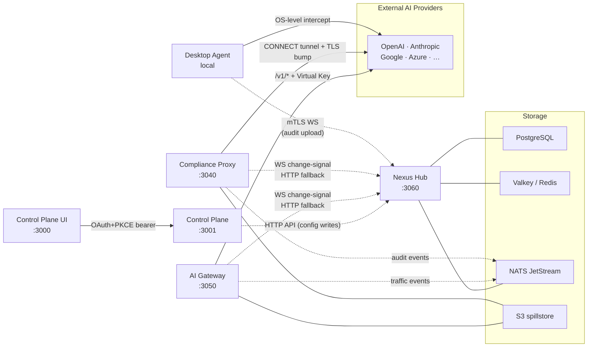

# Architecture Overview

*Audience: evaluators assessing system design and contributors orienting to the codebase.*

Nexus Gateway is a 5-service architecture built around a Hub-centric Thing model: every managed service and every desktop agent registers with Nexus Hub as a Thing (a node in the Hub-coordinated service mesh), receives configuration through a pull-only sync contract, and emits traffic events into a shared audit pipeline. The system separates into a control plane (Hub + Control Plane) that owns durable state, and a data plane (AI Gateway + Compliance Proxy + Desktop Agent) that carries live AI traffic. A Hub or Control Plane outage degrades enforcement visibility but does not stop AI traffic — data-plane services continue routing, enforcing hooks, and auditing requests from their last-known config snapshot. See [Control Plane Vs Data Plane](Control-Plane-Vs-Data-Plane) for the full resilience contract.

---

## Service topology

Five cooperating Go services plus a React SPA form the complete system. The common description "three traffic paths" refers only to the three data-plane interceptors; Hub and Control Plane are the central platform tier that supervises all of them.

| Service | Port | Role |
|---|---|---|
| **Nexus Hub** | `:3060` | Platform operations center. Thing registry, device shadow, config-sync orchestration, scheduled jobs, metrics pipeline, Agent CA, SIEM bridge, alert evaluation, audit sink. |
| **Control Plane** | `:3001` | Admin API / BFF for the dashboard UI. IAM, OAuth+PKCE admin auth, SSO/IdP federation, config CRUD, analytics queries. Stateless; proxies config writes to Hub. |
| **AI Gateway** | `:3050` | Serves `/v1/*` AI traffic. Provider adapters (50+), routing engine, prompt cache, response cache, quota enforcement, hook pipeline. |
| **Compliance Proxy** | `:3040` | Transparent TLS-intercepting forward proxy. CONNECT tunneling, dynamic cert minting, hook pipeline, text-first normalizer, audit emission. |
| **Desktop Agent** | local | Endpoint binary (macOS / Windows / Linux). OS-level traffic intercept, local hook pipeline, mTLS enrollment, SQLCipher audit queue, auto-updater. |

The Control Plane UI (`packages/control-plane-ui`, port `:3000`) is a React + Vite SPA. During development it runs as a separate dev server; in production it is bundled into the Control Plane binary. It is the admin surface — not a sixth service.

All five server-side services register with Hub as Things via `packages/shared/transport/thingclient` (WebSocket primary, HTTP fallback). The Desktop Agent registers with the same enrollment + shadow contract, using mTLS device certificates issued by Hub's self-hosted ECDSA P-256 CA.



Solid arrows carry synchronous AI traffic. Dotted arrows carry asynchronous control-plane signals, config pulls, and audit events.

## Control plane vs data plane

The system divides into two responsibilities:

**Control plane** (Hub + Control Plane) owns all durable state: Thing registry, shadow configs, IAM policies, provider credentials, alert rules, scheduled jobs. Both services are stateless process instances; their state lives in PostgreSQL and Valkey. The Control Plane is itself a Thing registered with Hub — the same shadow contract that applies to the AI Gateway applies to the Control Plane.

**Data plane** (AI Gateway, Compliance Proxy, Desktop Agent) carries live AI traffic. Each data-plane service is stateless between restarts — it pulls its configuration from Hub on boot and on each change-signal, holds config in atomic in-memory snapshots, and emits traffic events and audit records to the message queue. The three data-plane services share all compliance business logic via `packages/shared/` but run as independent processes with independent config-pull schedules.

Data-plane services are **fail-open** for hook errors and for absent control-plane connectivity. When Hub or the Control Plane is unreachable, enforcement degrades (alerts fire) but AI traffic continues. See [Fail Open Posture](Fail-Open-Posture) for the full contract, including the macOS Network Extension's stricter variant and the emergency passthrough bypass.

## Storage layer

| Store | Role |
|---|---|
| **PostgreSQL** | Durable system of record. Schema managed by Prisma (`tools/db-migrate/`); runtime queries use hand-written SQL + pgx. No `sqlc`. Holds the Thing registry, shadow JSONB columns, IAM policies, credentials (encrypted), traffic events, audit log. |
| **Valkey (Redis-compatible)** | Cache only — no pub/sub. Admin sessions, IAM cache (60s TTL), rate-limit counters, response cache (exact-match), desired-state cache, TLS cert cache (Compliance Proxy LRU + Valkey), quota counters. Config propagation uses Hub WebSocket push, not Valkey. |
| **NATS JetStream** | Message queue via the `shared/mq` interface (pluggable; NATS is the current driver). Streams carry traffic events, audit events, and ops metrics. Hub coordinates consumer groups. |
| **S3 spillstore** | Body overflow. Request and response bodies ≥ 256 KB are written through `shared/spillstore` (S3 in production; local FS in development). Audit rows store content-hashed references; the admin UI fetches bodies via presigned URLs. |
| **SQLCipher (Desktop Agent)** | Encrypted local audit queue on each endpoint device. Drained over mTLS to Hub. The platform keystore (via `platform.DefaultPaths()`) holds the encryption key. |

A common source of confusion: Valkey is a **cache**. It is not a pub/sub bus and is not in the config propagation path. Config changes flow through Hub WebSocket push → Thing pull; admins who expect Redis pub/sub to invalidate config will not find it here.

## Three traffic paths (summary)

The gateway intercepts AI traffic through three independent, parallel paths. Traffic that enters one path does not flow through another. The same compliance hook configurations propagate to all three paths (subject to `applicableIngress` filtering), and audit events from all three land in the unified audit timeline.

**Path A — AI Gateway.** Applications send requests directly to `/v1/*` using a Virtual Key bearer token. This path supports Virtual Key-based quota enforcement, declarative routing rules, prompt/response caching, and cost tracking.

**Path B — Compliance Proxy.** Applications configure their HTTPS proxy setting to point at `:3040`; no SDK code changes are required. The proxy dynamically mints TLS leaf certificates to inspect traffic, then runs the same hook pipeline as the AI Gateway.

**Path C — Desktop Agent.** The agent intercepts outbound traffic at the OS network layer (macOS Network Extension, Linux iptables, Windows WinDivert). It runs a full forwarding pipeline — not passive sniffing — and writes audit events to a local SQLCipher database that is drained to Hub over mTLS.

The attestation header `X-Nexus-Agent-ID` prevents double-enforcement: when the Compliance Proxy receives a CONNECT request from a flow already intercepted by a Desktop Agent, it relays the traffic without re-running its own hook pipeline.

For per-path capability comparison and the attestation contract, see [Three Traffic Paths](Three-Traffic-Paths).

## Hub-centric Thing model

Every managed entity is a Thing. Configuration flows through a pull-only model: Hub never pushes full config; it signals which keys changed, and each Thing pulls only those keys. This unifies the cold-start path with the live-update path — the same callbacks, the same apply contract, the same reported-state stamps. A Thing that boots while Hub is down waits for Hub to become reachable before serving traffic (fail-closed cold-start for server-side services).

Config keys belong to three categories: Cat A keys are small inline values carried directly on the change-signal (kill switch, emergency-passthrough flag — millisecond propagation); Cat B keys trigger an explicit fetch (hook configs, routing rules, credentials — sub-second propagation); Cat C keys resolve from template defaults with per-Thing overrides.

For the full data model, shadow schema, category classification, and terminology boundary (internal Thing/Shadow/desired/reported vs user-facing node/config sync/target/applied), see [Thing Model And Config Sync](Thing-Model-And-Config-Sync).

## Cross-cutting mechanisms

Several mechanisms run across all three traffic paths and across all services.

**Hooks and enforcement.** Hooks are the compliance enforcement mechanism — they run in all three data-plane services with the same code from `packages/shared/policy/hooks`. Three stages: request (before upstream), response (after upstream), and per-chunk for streaming. Decisions aggregate: first hard reject wins; soft reject without hard reject yields soft rejection; the highest data-classification label is recorded regardless of outcome. Streaming compliance modes (`passthrough`, `buffer_full_block`, `chunked_async`) give operators graduated control over in-flight streaming traffic.

**Cost, cache, and estimation.** Cost is computed from one canonical function: `metrics.CalculateCost(usage, prices)`. Input: canonical `Usage` struct (uncached input, cached read tokens, cache creation tokens, output tokens) + per-`Model` row prices (four fields: input, output, cached input read, cached input write). Output: four-component USD breakdown (UncachedInput, CacheRead, CacheWrite, Output). All five stamp sites in `proxy.go` and `proxy_cache.go` call this same function to keep non-stream, stream, and cache-replay paths consistent.

**Observability.** Prometheus metrics (promauto-registered per service), OpenTelemetry spans (correlated via `trace_id` / `request_id`), and the audit pipeline (traffic events + admin audit log → NATS → Hub audit sink → PostgreSQL) form the observability stack. The `trace_id` field on traffic events enables cross-path forensics: a request intercepted by the Desktop Agent and routed via the AI Gateway can be correlated in analytics queries.

**Terminology boundary.** Internal code and developer docs use Thing / Shadow / desired / reported / drift. User-facing surfaces (admin UI, API responses, product docs, error messages) use node / config sync / target config / applied config / out of sync. The CI guard `npm run check:terminology` enforces this boundary for `docs/users/`. The same convention applies to wiki pages: Concepts and contributor-audience pages may use internal terms with a first-mention gloss; Feature, Operations, and Getting-Started pages must use user-facing terms exclusively.

## Deployment topology

Today's production runs as a **single EC2 node**: Hub + Control Plane + AI Gateway + Compliance Proxy + PostgreSQL + Valkey + NATS JetStream, fronted by nginx for TLS termination, plus per-endpoint Desktop Agent installs. Future multi-instance and region-split deployment is structurally supported — all services are stateless; the Thing/shadow model is multi-instance-aware — but is not in scope for any current PR.

The pre-GA "no installed user base" policy (CLAUDE.md "Development-phase policy") applies: refactors are greenfield, no backward-compatibility shims, no phased compatibility rollouts.

## Trust boundaries summary

Five trust boundaries govern inter-component communication:

| Channel | Authentication | Terminates at |
|---|---|---|
| Admin UI → Control Plane | OAuth+PKCE bearer token | Control Plane |
| Control Plane / AI Gateway / Compliance Proxy → Hub | `INTERNAL_SERVICE_TOKEN` pre-shared bearer | Hub |
| Application → AI Gateway | Virtual Key bearer (`vk-...`) | AI Gateway |
| Desktop Agent → Hub | mTLS device certificate (Hub-issued ECDSA P-256) | Hub |
| External IdP → Control Plane | SAML assertion / OIDC ID token | Control Plane |

Provider credentials (API keys for OpenAI, Anthropic, etc.) are encrypted at rest with AES-256-GCM in the `Credential` table. The `CREDENTIAL_ENCRYPTION_KEY` environment variable (tagged `[MUST MATCH]` across AI Gateway + Control Plane) is the master key. Credentials are decrypted only in memory and only for the request lifetime.

Secrets are env-only — no secret field appears in any committed YAML. See [Trust Boundaries](Trust-Boundaries) for per-boundary detail and the `[MUST MATCH]` catalog.

## Cross-cutting primitives

Beyond the five services, several platform-level primitives run across everything. Contributors encounter these within their first day of code exploration.

**The `go.work` workspace.** All five Go services and `packages/shared/` are built together via a `go.work` workspace at the repo root. Each service has its own `go.mod`; `packages/shared/` sub-packages are resolved from the workspace. The `replace` directives in each `go.mod` are sibling-only — they never point at upstream GitHub paths. Breaking this rule causes `GOWORK=off` builds to silently pull stale GitHub snapshots of shared packages instead of the local versions.

**The `shared/mq` interface.** Traffic events, audit events, and ops metrics are emitted to NATS JetStream via the `packages/shared/mq` interface. The interface is pluggable — the current driver is NATS, but the abstraction allows swapping without changing service code. Hub coordinates consumer groups: the audit-sink consumer group drains the audit stream and writes to PostgreSQL; the metrics-sink consumer group aggregates Prometheus samples.

**`trace_id` propagation.** Every request entering the gateway (Path A, B, or C) is assigned a `trace_id`. This ID propagates through the hook pipeline, the upstream call, the cost stamper, and the audit row. OTEL spans are correlated with the same `trace_id`. In analytics queries, the `trace_id` column on `traffic_event` lets operators stitch together multi-hop flows.

**Provider catalog.** The `Provider` and `Model` tables in PostgreSQL are the single source of truth for provider capability and pricing. Provider adapter code under `packages/ai-gateway/internal/providers/specs/<name>/` wires the Go-level capability; the DB `Model` row wires the price (four fields: input, output, cached input read, cached input write). Adding a new model means adding a DB row — no code change is required unless the model has unusual wire-format quirks.

## Where to read next

The architecture spans many cross-cutting concerns. Use this map to find the right depth:

| Topic | Go deeper here |
|---|---|
| Per-service internals | [The Five Services](The-Five-Services) |
| Three traffic paths compared | [Three Traffic Paths](Three-Traffic-Paths) |
| Config sync mechanics | [Thing Model And Config Sync](Thing-Model-And-Config-Sync) |
| Why Hub outage ≠ traffic stops | [Control Plane Vs Data Plane](Control-Plane-Vs-Data-Plane) |
| NE fail-open invariants, emergency passthrough | [Fail Open Posture](Fail-Open-Posture) |
| Auth surfaces, secrets posture | [Trust Boundaries](Trust-Boundaries) |
| Provider adapter rules, canonical format | [Canonical Vs Wire Format](Canonical-Vs-Wire-Format) |
| Full system architecture (dense) | [`overview.md`](https://github.com/AlphaBitCore/nexus-gateway/blob/main/docs/developers/architecture/overview.md) |

## Hooks and enforcement architecture

Hooks are the shared compliance enforcement mechanism. The same hook-pipeline code (`packages/shared/policy/hooks`) runs in all three data-plane services. This is load-bearing: a hook written for the AI Gateway automatically applies to the Compliance Proxy and Desktop Agent when the `applicableIngress` field includes their path types.

**Hook stages.** Every request that passes through a data-plane service runs up to three hook stages:

1. **Request stage** — fires before the request is forwarded to the upstream provider. Used for PII detection, keyword blocking, IP access control, and input transformation (e.g., prompt injection).
2. **Response stage** — fires after the complete response is received (or after the stream ends for streaming responses). Used for output PII detection, content classification, and response transformation.
3. **Per-chunk streaming stage** — for streaming compliance modes other than `passthrough`, hooks run on each chunk. This enables real-time redaction of sensitive data in streamed output.

**Decision model.** Each hook in a stage returns one of: `Approve`, `Modify` (with a diff), `Reject` (hard or soft), or `Abstain`. The pipeline aggregates across all hooks in the stage:
- First hard reject short-circuits remaining hooks in the stage.
- Any soft reject without a hard reject yields a soft rejection.
- Modifies are composable — multiple hooks can each redact different fields.
- The highest data-classification label seen across all hooks is recorded on the traffic event regardless of the final decision.

**Hook config schema.** Hooks use `HookConfig.onMatch` as the canonical decision schema (established in E46-S4). Built-in `onMatch` actions include `block-hard`, `redact`, `flag`, `log-only`. Custom webhook hooks forward the event to an external endpoint and use the response to determine the action.

## Cost and cache mechanics

Cost computation is centralized in one function: `metrics.CalculateCost(usage, prices)` in `packages/ai-gateway/`. It takes a canonical `Usage` struct and a per-`Model` price row and returns a four-component USD breakdown:

- `UncachedInput` — (prompt tokens − cached tokens − cache creation tokens) × input price / 1M
- `CacheRead` — cached read tokens × cached input read price / 1M
- `CacheWrite` — cache creation tokens × cached input write price / 1M
- `Output` — completion tokens (including reasoning tokens) × output price / 1M

This function is called at five stamp sites in `proxy.go` and `proxy_cache.go` — one for each combination of streaming/non-streaming × cache-hit/miss/write. All five sites must call the same function with the same `ModelPrices` struct to keep every traffic path's cost accurate. Missing any of the four cache-path stamp sites results in NULL cost on cache traffic (the E53-S4 production incident).

The response cache is a single exact-match layer backed by Valkey. There is no L1/L2/L3 hierarchy — historical references to tiered cache labels were removed in E59. A cache hit returns the stored response, stamps the cost as if the upstream had been called (so analytics accurately show saved cost), and emits a `traffic_event` with `cache_status = hit`.

## Quota enforcement and rate limiting

Virtual Key quota enforcement runs entirely at the AI Gateway (Path A only). Quota is enforced at two levels:

**Request-rate limiting.** Sliding-window counters in Valkey track requests-per-minute and requests-per-day per Virtual Key. The AI Gateway decrements the counter atomically before forwarding the request upstream. If the counter is exhausted, the gateway returns HTTP 429 with a `Retry-After` header. The window resets at the boundary.

**Cost-based limiting.** Cost counters in Valkey track cumulative USD spend per Virtual Key per rolling window. Cost is estimated pre-flight (before the upstream call) using the `estimate` path; actual cost is reconciled post-response via `metrics.CalculateCost`. If the estimated cost would exceed the VK's budget, the request is rejected before the upstream call.

Both counter types are stored in Valkey with TTL-based expiry. They are not persisted to PostgreSQL directly — the `traffic_event` rows serve as the durable record; the Valkey counters are the real-time enforcement layer.

## NATS JetStream and the audit pipeline

The audit pipeline flows through NATS JetStream. All three data-plane services publish to NATS; Hub consumes from NATS. The pipeline:

```
AI Gateway ---+
              |   NATS JetStream   Hub audit-sink consumer
Compliance Proxy --> [audit.events stream]  -->  PostgreSQL (traffic_event, admin_audit_log)
              |
Desktop Agent --- mTLS upload path --> Hub --> PostgreSQL
```

The `shared/mq` interface in `packages/shared/transport/mq/` is the abstraction layer. All services call `mq.Publish("audit.events", envelope)` without knowing the underlying broker. The interface is pluggable; NATS is the current driver.

Hub runs two JetStream consumer groups:
- **Audit-sink consumer group.** Drains the `audit.events` stream and writes records to `traffic_event` and `admin_audit_log` in PostgreSQL. At-least-once delivery; idempotent on `trace_id` key.
- **Metrics-sink consumer group.** Drains the `metrics.samples` stream and aggregates Prometheus-compatible metric histograms.

When NATS is unavailable, data-plane services buffer events in a bounded in-memory queue. Events are replayed when NATS reconnects. The Desktop Agent additionally persists events to the local SQLCipher queue, so no audit records are lost even across multi-day connectivity gaps.

## Configuration propagation mechanics

Configuration changes flow top-down through a strict ownership chain. No data-plane service can write config; it can only report that config was applied.

**Full change sequence:**

1. Admin saves a change in the CP UI (e.g., enables a new hook rule).
2. The Control Plane validates the change (IAM check → `iamMW`), persists the row to PostgreSQL, and forwards the write to Hub via `POST /api/hub/shadow/{thing_id}/{key}`.
3. Hub increments the version counter for that `(thing_id, config_key)` pair and persists the new `desired` JSONB.
4. Hub fans out a minimal change-signal over WebSocket to all affected Things. The signal carries only the changed key name and version — not the full value.
5. Each Thing's `thingclient` receives the signal and, for Cat B keys, performs an explicit pull: `GET /api/hub/shadow/{thing_id}/{key}`.
6. Each Thing validates the payload (schema check), applies via an `atomic.Pointer` swap (non-blocking — in-flight requests are not paused), and stamps the `reported` state.
7. Hub reads the reported stamp on the next heartbeat and clears drift for that Thing + key pair.
8. The Config Sync page reflects the update, typically within 1–2 seconds under normal conditions.

For Cat A keys (kill switch, emergency passthrough) the value rides the change-signal itself — no explicit pull round-trip — making them propagate in milliseconds regardless of network conditions.

## Scaling model and multi-instance behavior

All five server-side services are stateless process instances. Their state lives in PostgreSQL (durable) and Valkey (ephemeral cache). This design supports horizontal scaling of the data-plane tier.

**AI Gateway and Compliance Proxy** may be deployed as multiple instances behind a load balancer. Hub registers each instance as a separate Thing with its own `thing_id`. Change-signals fan out to every registered Thing independently — every running instance receives the same config update. The Config Sync page shows per-instance applied versions, so drift in any individual instance is immediately visible.

**Hub and Control Plane** are currently single-instance in production. The data model is multi-instance-aware (Thing registry supports many Hub instances), but active-active Hub clustering is not in scope for current development.

**Desktop Agent** is a per-device singleton. Each device has one agent, one `thing_id`, and one enrollment.

Because data-plane services hold atomic in-memory config snapshots and do not need to coordinate with each other for request serving, adding new instances requires only registering them with Hub. No shared in-memory state, no cache invalidation coordination.

## Spillstore body overflow

Request and response bodies that exceed 256 KB are written to the spillstore instead of being stored inline in the `traffic_event_payload` column. The spillstore abstraction (`packages/shared/spillstore/`) is backed by S3 in production and a local filesystem directory in development. The audit row stores a content-hashed reference; the CP UI fetches bodies via presigned URLs served by Hub. This keeps the PostgreSQL row small even for large multi-turn conversations or document-processing requests.

Compliance teams should note: hook enforcement runs regardless of whether the body is stored inline or in the spillstore. The hook pipeline receives the full body in memory during the request lifecycle; the spillstore is only the persistence layer.

## Development conventions quick-reference

Contributors frequently need to know where to find the relevant naming, testing, and configuration conventions. Key entries from `docs/developers/workflow/conventions.md`:

- **Go import paths.** Always use full module paths (`github.com/alphabitcore/nexus-gateway/packages/shared/...`). Never use relative imports.
- **Config in YAML, secrets in env.** YAML carries service shape, timeouts, feature flags, and log levels. Secrets go in `.env` / `bootenv`.
- **No sqlc.** All SQL is hand-written pgx. No code generation for database queries.
- **Table-driven tests.** Go tests use `[]struct{name, in, want}` patterns. Every named failure mode should have a test case.
- **IoT terminology boundary.** Internal code uses Thing/Shadow/desired/reported/drift. User-facing strings use node/config sync/target config/applied config/out of sync. The CI check `npm run check:terminology` enforces this for `docs/users/`.

## Security posture summary

The gateway's security posture rests on three principles:

**Secrets are env-only.** No secret (API token, encryption key, HMAC key, DB password) appears in any committed YAML file. Every secret has a corresponding env variable in `.env.example` with its description and `[MUST MATCH]` annotation where applicable. Production services read secrets via `os.Getenv` and the `bootenv` loader.

**Credentials are encrypted at rest and decrypted only in-memory.** Provider credentials (OpenAI keys, Anthropic keys, etc.) are stored with AES-256-GCM encryption in the `Credential` table. The `CREDENTIAL_ENCRYPTION_KEY` env var (tagged `[MUST MATCH]` for AI Gateway + Control Plane) is the master key. Plaintexts exist only in executor goroutine stacks during the upstream call — not in logs, not in caches, not in API responses.

**Data-plane services cannot modify their own policy.** AI Gateway, Compliance Proxy, and Desktop Agent are read-only consumers of config. They cannot write to `thing.desired`, cannot modify IAM policies, and cannot grant bypass flags. The kill switch and emergency passthrough are written by Hub and only activatable via the Control Plane admin API with `iamMW` enforcement.

## Provider catalog and model capability

The `Provider` and `Model` tables in PostgreSQL are the single source of truth for what providers exist and what capabilities each model supports. Key columns on the `Model` row:

| Column | Purpose |
|---|---|
| `provider_id` | FK to `Provider` |
| `model_id` | The model string sent to the provider (e.g., `claude-sonnet-4-6-20251114`) |
| `slug` | Human-friendly alias (e.g., `claude-sonnet-4-6`); what callers use |
| `context_window` | Max input tokens; used by the pre-flight estimator and `max_tokens` auto-fill |
| `price_input` / `price_output` | Per-million-token USD prices for standard (uncached) traffic |
| `price_cached_input_read` / `price_cached_input_write` | Per-million-token USD prices for cached reads/writes |
| `capabilities` | JSON array: `streaming`, `function-calling`, `vision`, `extended-thinking`, `responses-api`, etc. |

Adding a new model requires adding a DB row — no Go code change is needed unless the model has unusual wire-format quirks that require adapter-level handling. Adding a new wire-format quirk requires an adapter PR under `packages/ai-gateway/internal/providers/specs/<name>/` that follows §3a Rules 1-8.

## Alert rules and SIEM integration

Hub evaluates alert rules against traffic events and system metrics. Built-in rules are seeded by the Go `BuiltinRules` slice at `packages/nexus-hub/internal/alert/builtin.go`; they cover categories including:

- `traffic.*` — high request volume, high cost, latency spikes.
- `hook.*` — hook evaluation error rate, hook reject rate spikes.
- `credential.*` — credential pool circuit-breaker trips, authentication failure bursts.
- `system.*` — Hub WS heartbeat loss, Thing offline transitions, audit sink lag.

Each alert rule row in `AlertRule` has: `condition` expression, `threshold`, `window`, `severity` (`info`, `warning`, `critical`), and optionally a SIEM forwarder ID for external fan-out.

The SIEM bridge (`packages/nexus-hub/internal/siem/`) supports outbound webhooks and OTEL-formatted exports. When a SIEM forwarder is configured, alert events and optionally raw audit events are forwarded to the external target (e.g., Splunk, Datadog, PagerDuty).

**Custom alert rules vs Go built-ins.** Operators may add custom alert rules directly to the `AlertRule` table. Custom rules are evaluated alongside Go-level `BuiltinRules` but are not enforced by the Go-level lockstep check — when adding custom rules, treat them as operator-owned and excluded from the built-in rule contract.

## Monorepo layout

The repository is a single Go workspace + npm workspace. Understanding the layout is prerequisite for any contribution:

```
nexus-gateway/
├── packages/
│   ├── nexus-hub/          # Hub service
│   ├── control-plane/      # Control Plane service
│   ├── ai-gateway/         # AI Gateway service
│   ├── compliance-proxy/   # Compliance Proxy service
│   ├── agent/              # Desktop Agent (Go + Swift/Kotlin per platform)
│   ├── control-plane-ui/   # React + TypeScript + Vite SPA
│   └── shared/             # Shared Go libraries (8 sub-buckets)
├── tools/
│   └── db-migrate/         # Prisma schema, migrations, seeds, manual scripts
├── tests/                  # Smoke tests, scenario tests, integration tests
├── scripts/                # CI scripts, coverage checks, doc-lockstep checks
├── docs/                   # Developer, user, and operator documentation
└── go.work                 # Go workspace binding all services + shared
```

The `go.work` file at the repo root is the workspace manifest. All `go.mod` files use `replace` directives that point to sibling packages — never to upstream GitHub paths. All five Go services and `packages/shared/` are resolved from the local filesystem when `go.work` is active.

The TypeScript monorepo is governed by `package.json` workspaces at the repo root. Control Plane UI lives under `packages/control-plane-ui/`.

---

## Canonical docs

- [`overview.md`](https://github.com/AlphaBitCore/nexus-gateway/blob/main/docs/developers/architecture/overview.md) — authoritative system architecture with §1–§13 detail covering every service, storage layer, cross-cutting concern, and cost/cache/estimation pipeline
- [`thing-model.md`](https://github.com/AlphaBitCore/nexus-gateway/blob/main/docs/developers/architecture/cross-cutting/foundation/thing-model.md) — Thing data model, extension tables, shadow JSONB schema, terminology boundary
- [`thing-config-sync-architecture.md`](https://github.com/AlphaBitCore/nexus-gateway/blob/main/docs/developers/architecture/cross-cutting/foundation/thing-config-sync-architecture.md) — pull-only config sync mechanics, Cat A/B/C classification, failure modes

**Adjacent wiki pages**: [The Five Services](The-Five-Services) · [Three Traffic Paths](Three-Traffic-Paths) · [Control Plane Vs Data Plane](Control-Plane-Vs-Data-Plane) · [Thing Model And Config Sync](Thing-Model-And-Config-Sync) · [Fail Open Posture](Fail-Open-Posture) · [Trust Boundaries](Trust-Boundaries)
