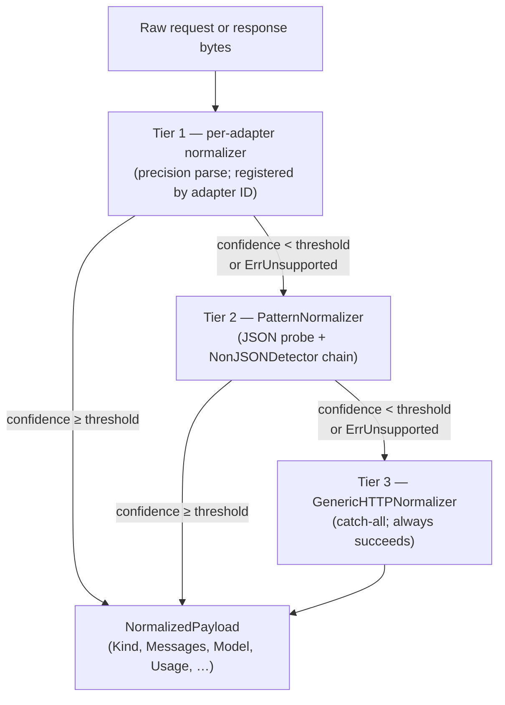

# Compliance Proxy Normalization

*Audience: contributors adding new provider adapters, new consumer-surface adapters, or new non-JSON wire format detectors.*

The Compliance Proxy runs the same three-tier normalization pipeline as the AI Gateway and Nexus Hub. Normalization converts raw request/response bytes into a structured `NormalizedPayload` that hooks, the analytics UI, and the audit pipeline can all consume without knowing which provider or wire format was used. For API-surface traffic the normalizer extracts full token/usage data; for consumer-surface traffic the primary output is readable text (token stats are secondary and may be absent for browser-based AI tools). A new wire format is added by implementing one interface in one file — not by creating a fresh per-host adapter from scratch.

---

## Three-tier pipeline



Each tier returns a `Confidence` value in `[0.0, 1.0]`. The coordinator walks tiers in order and stops at the first result that meets the configured threshold (default: `0.7`). A tier that partially recognises a body can return a sub-threshold confidence, causing the coordinator to remember the partial result and keep walking — the best partial wins over Tier-3 if Tier-2 never fully claims.

## Tier 1 — per-adapter precision normalizers

Tier-1 normalizers are registered by adapter ID and parse their wire format end-to-end. They are the right choice for any well-defined JSON API format where full token/usage extraction is required.

Normalizers registered in the Compliance Proxy binary at startup:

```go
reg := normalize.NewRegistry()
normalize.RegisterDefaultAIBuiltins(reg)       // openai, anthropic, gemini + 14 OpenAI-compat aliases
adapters.RegisterTier1AdapterNormalizers(reg)  // chatgpt-web, claude-web, gemini-web, openai-compat
extract.WireTier2(reg)                         // Tier-2 pattern probe
reg.Freeze()
```

For API-surface traffic, `OpenAIChatNormalizer`, `AnthropicMessagesNormalizer`, and `GeminiGenerateNormalizer` produce:
- Full `Messages[]` with roles, content blocks, and tool calls
- `Model` identifier
- `FinishReason`
- Complete `Usage` (prompt tokens, completion tokens, cache tokens, reasoning tokens)

These values appear in `traffic_event_normalized` and flow through to the analytics dashboards and hook decisions.

### Adding a Tier-1 per-host adapter

To upgrade a consumer-surface adapter from Tier-2 pattern detection to Tier-1 precision:

1. Add a `normalize.go` alongside the adapter under `packages/shared/traffic/adapters/<host>/`.
2. Implement `Normalize` using the `extract.NormalizeForAdapter` helper:

```go
func (a *Adapter) Normalize(_ context.Context, raw []byte, meta normalize.Meta) (normalize.NormalizedPayload, error) {
    return extract.NormalizeForAdapter(raw, meta, extract.AdapterSpecHint{
        AdapterID:     "my-host",
        ReqSpecIDs:    []string{"openai-chat"},
        RespSpecIDs:   []string{"openai-chat-nonstream", "openai-chat-sse"},
        MinConfidence: 0.5,
    })
}
```

3. The `adapters.RegisterTier1AdapterNormalizers` loop type-asserts the adapter at startup — no further wiring is needed.

## Tier 2 — PatternNormalizer and the NonJSONDetector framework

Tier-2 fires when no Tier-1 entry claims the body. It runs two passes:

### Pass A — JSON multi-spec probe

Byte-sniffs the body first (ignoring the Content-Type header, which is often wrong for consumer traffic). Iterates 7 known chat-request specs and 7 response specs from `packages/shared/transport/normalize/extract/specs.go`. Each spec scores the body on:

- Presence of a locator field (`messages`, `contents`, `prompt`) — up to +0.4
- Role presence at the spec's `RolePath` — up to +0.3
- Content extractable at `ContentPath` — up to +0.3
- Signature fields (distinctive top-level keys like `anthropic_version`, `generationConfig`) — up to +0.2

The spec with the highest score wins if it exceeds the threshold. This means a browser sending an OpenAI-shaped body (e.g., a custom AI assistant) is recognized as `kind=ai-chat` without a per-host registration.

### Pass B — NonJSONDetector chain

For non-JSON wire formats, Tier-2 iterates the `NonJSONDetectors` registry in `packages/shared/transport/normalize/extract/detector.go`. Each detector declares:

```go
type NonJSONDetector interface {
    ID() string
    LooksLike(raw []byte) bool                                 // O(constant) byte sniff
    Decode(raw []byte, direction string) (ChatDetection, bool) // full extract
}
```

`LooksLike` is a fast prefix check (16–256 bytes). It gates the full `Decode` call, so adding many detectors does not significantly impact the hot path.

Current detectors:

| Detector | Wire format | Matched hosts |
|---|---|---|
| `ConnectRPCProtobufDetector` | 5-byte Connect-RPC envelope + `GetChatRequest` / `StreamChatResponse` protobuf | `api2.cursor.sh` (Cursor IDE) and any Connect-RPC-shaped AI tool |
| `BatchExecuteDetector` | `f.req=` form-urlencoded request + `)]}'`-prefixed chunked JSON response | `gemini.google.com`, Google Translate AI assist, and any Google web AI consumer surface |

Both detectors produce `kind=ai-chat` with structured `Messages[]` and an extracted model name. The Cursor adapter additionally stamps `confidence≈0.95` and `detectedSpec="cursor"`.

### Adding a new non-JSON wire format

To support a new non-JSON wire format (binary protocol, gRPC-Web, private envelope):

1. Implement the `NonJSONDetector` interface.
2. Append the struct to the `NonJSONDetectors` slice in `packages/shared/transport/normalize/extract/detector.go`.
3. If the host already has a Tier-1 adapter, have the adapter's `Normalize` method call `detector.Decode()` and stamp its own `adapterID` on the result (see `cursor/normalize.go` and `geminiweb/normalize.go`).

No other changes are needed — the PatternNormalizer picks up new detectors automatically.

## Text-first normalizer — consumer-surface policy

For consumer-surface traffic — ChatGPT web, Claude.ai, Cursor IDE, Gemini web — the required normalizer output is **readable text**. Losing token and usage statistics at this stage is acceptable. The reason: consumer surfaces do not expose token counts in their wire formats consistently; requiring full canonical structure produces brittle adapters that break on minor UI changes.

This means:
- `Messages[].Content[].Text` is always populated for Tier-1 and Tier-2 `ai-chat` payloads.
- `Usage.PromptTokens` and `Usage.CompletionTokens` may be zero for browser-based surfaces.
- Hooks scoped to `"ai-chat"` receive a readable prompt and response regardless of whether token counts are available.
- The analytics UI shows the conversation view for these rows; the token/cost section shows "unavailable" when counts are absent.

API-surface traffic (same providers, but via SDK) goes through Tier-1 with full usage extraction — text and tokens both present.

## Storage — `traffic_event_normalized` sidecar

`NormalizedPayload` produced by the pipeline is stored as-is in the `traffic_event_normalized` sidecar table (1:1 with `traffic_event`). The write path at the Hub audit-sink is idempotent (`ON CONFLICT DO NOTHING`). Normalization failures are recorded as `status = 'failed'` with an `error_reason` field — the parent `traffic_event` row is never rolled back on normalization failure.

---

## Canonical docs

- [`normalization-architecture.md`](https://github.com/AlphaBitCore/nexus-gateway/blob/main/docs/developers/architecture/services/ai-gateway/normalization-architecture.md) — full three-tier pipeline, confidence scoring, storage strategy, adding adapters
- [`compliance-pipeline-architecture.md`](https://github.com/AlphaBitCore/nexus-gateway/blob/main/docs/developers/architecture/services/compliance-proxy/compliance-pipeline-architecture.md) — §6 (content extraction, text-first policy) and §7 (hook pipeline after normalization)

**Adjacent wiki pages**: [Compliance Proxy Traffic Event Taxonomy](Compliance-Proxy-Traffic-Event-Taxonomy) · [Canonical Vs Wire Format](Canonical-Vs-Wire-Format) · [AI Gateway Streaming](AI-Gateway-Streaming) · [Compliance Proxy Overview](Compliance-Proxy-Overview)
