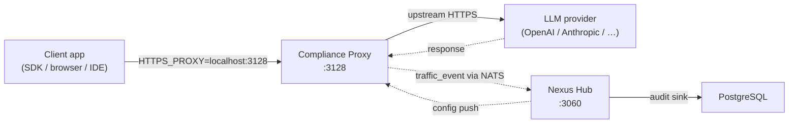
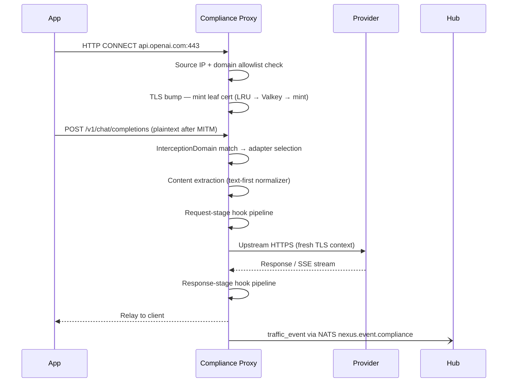

# Compliance Proxy Overview

The Compliance Proxy is a transparent TLS forward proxy with a full compliance pipeline. Applications point their HTTPS proxy setting at it; the proxy bumps TLS, classifies traffic, runs the hook pipeline, forwards upstream, and emits a `traffic_event` row for every completed request — all without any change to application code. It is one of Nexus Gateway's three independent traffic paths, covering scenarios where SDK reconfiguration is not possible or undesirable. For API SDK traffic it produces full token and cost accounting; for consumer-surface traffic (ChatGPT web, Claude.ai, Cursor IDE) it produces readable text with a best-effort hook scan.

---

## Where it sits in the 5-service architecture

The Compliance Proxy listens for HTTP CONNECT requests on `:3128`. Applications set `HTTPS_PROXY` (or the SDK-level proxy option) to point at it. The proxy then mints a leaf TLS certificate signed by a local CA, establishes two independent TLS sessions (one with the client, one with the upstream provider), and inspects the plaintext HTTP body before forwarding.

The runtime API runs separately on `:3040` (liveness, metrics, break-glass ops). Client traffic does not flow through `:3040`.

## Capability vs AI Gateway

The Compliance Proxy and the AI Gateway capture the same audit row shape (`traffic_event`) and share the same hook framework, but they intercept at different levels and offer different capabilities.

| Capability | AI Gateway | Compliance Proxy |
|---|---|---|
| Intercept method | Explicit SDK proxy (virtual key) | Transparent TLS MITM |
| App code changes needed | Yes — change base URL + key | No |
| Provider routing rules | Yes — declarative rule engine | No — direct to provider |
| Cost tracking | Full (model prices, token counts) | Full for API traffic; best-effort for consumer surfaces |
| Response caching | Yes | No |
| Prompt caching | Yes | No |
| Hook pipeline | Full 3-stage | Full 3-stage |
| Virtual key quotas | Yes | No |
| Consumer-surface capture | No (browser-based AI tools bypass SDK) | Yes — captures ChatGPT web, Claude.ai, Cursor, Gemini web |
| Multi-instance cert cache | Yes (Valkey L2) | Yes (Valkey L2) |

The two paths are complementary, not competing. Organisations often run both: AI Gateway for SDK traffic with routing + caching, and Compliance Proxy for browser-based tools that bypass the SDK path.

## Request lifecycle

Each phase stamps a `phase_*` timestamp on the traffic event, enabling per-phase latency attribution in the analytics UI.

## Configuration and config sync

The Compliance Proxy is a Thing (a node in the Hub-coordinated service mesh). Its runtime configuration is delivered via Hub shadow, not on-disk YAML restarts:

- **Interception domain ruleset** — which hosts and paths to intercept; pulled on change signal.
- **Hook config** — which hooks to run and with what parameters.
- **Kill switch** — single toggle that drops all new connections and drains in-flight ones.
- **Exemptions** — hosts to bypass TLS bump (pinned certs, known-uninterceptable destinations).

The source-IP allowlist is the one exception: it is YAML-only and requires a restart to change. Everything else hot-swaps via atomic pointer swap in the running process.

## Failure modes

| Failure | Behavior |
|---|---|
| Upstream unreachable | Return 503; record on `traffic_event` |
| Hook timeout | Per `fail_behavior`: `fail_open` (relay) or `fail_close` (HTTP 451) |
| TLS bump fails (cert pinning) | Auto-exempt; relay unbumped; no content inspection |
| Kill switch active | Refuse new connections; drain in-flight |
| Hub unreachable | Local kill switch break-glass via runtime API; config frozen at last good state |
| Body > 256 KiB | Overflow to spillstore (S3); `traffic_event` stores reference |

---

## Canonical docs

- [`compliance-proxy-details-architecture.md`](https://github.com/AlphaBitCore/nexus-gateway/blob/main/docs/developers/architecture/services/compliance-proxy/compliance-proxy-details-architecture.md) — subsystem map, cert minting, access control, exemption manager, runtime API
- [`compliance-pipeline-architecture.md`](https://github.com/AlphaBitCore/nexus-gateway/blob/main/docs/developers/architecture/services/compliance-proxy/compliance-pipeline-architecture.md) — phase model, CONNECT handling, TLS bump, hook pipeline, streaming modes

**Adjacent wiki pages**: [Three Traffic Paths](Three-Traffic-Paths) · [Compliance Proxy TLS Interception](Compliance-Proxy-TLS-Interception) · [Compliance Proxy Traffic Event Taxonomy](Compliance-Proxy-Traffic-Event-Taxonomy) · [Compliance Proxy Connecting Your SDK](Compliance-Proxy-Connecting-Your-SDK) · [AI Gateway Overview](AI-Gateway-Overview)
