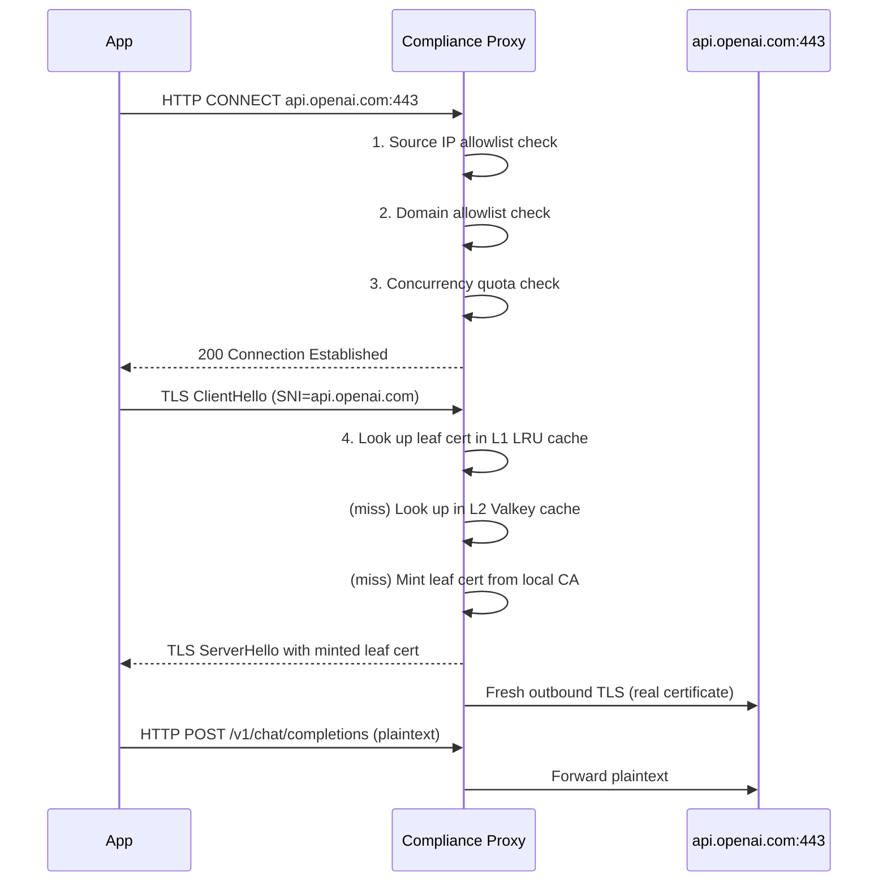

# Compliance Proxy TLS Interception

*Audience: operators deploying the Compliance Proxy and contributors working on TLS bump mechanics.*

The Compliance Proxy intercepts HTTPS traffic using a MITM (man-in-the-middle) technique: it accepts HTTP CONNECT requests, dynamically mints a short-lived leaf certificate signed by a local CA, and establishes two independent TLS sessions — one with the client, one with the upstream provider. The client sees a certificate for the real provider hostname, but signed by the Nexus CA instead of the public CA. Operators must install the Nexus CA root certificate on every client machine for the TLS handshake to succeed without errors.

---

## CONNECT flow and TLS bump mechanics

When an application sets `HTTPS_PROXY=http://proxy:3128`, its HTTPS calls become two-step operations: first an HTTP CONNECT tunnel request, then the encrypted data over that tunnel.



The bump happens at step 4 — the proxy presents a leaf cert for `api.openai.com` signed by the Nexus CA. The application's TLS library accepts it only if the Nexus CA root is installed and trusted on that machine.

## Cert chain and leaf cert properties

The local CA is a long-lived certificate stored on disk with restrictive file permissions (default: read by the proxy process only). Leaf certs have the following properties:

| Property | Value |
|---|---|
| Validity | ~24 hours |
| Key | RSA 2048 or ECDSA P-256 (matches CA default) |
| SAN | Set to the intercepted hostname (`api.openai.com`) |
| Signed by | The local CA key (or KMS if configured) |
| Cached in | L1 in-process LRU + L2 Valkey (cross-instance) |

Short leaf lifetimes limit the blast radius if a leaf cert is extracted from a compromised proxy. The CA itself is longer-lived; its rotation is an admin operation that invalidates all cached leaf certs and requires clients to re-trust the new CA root.

## Two-tier cert cache

Minting a leaf cert takes ~10–50ms (longer if KMS is in the path). In steady state, almost all requests hit the L1 in-process LRU cache:

```
Request for HOST
  → L1 LRU (in-process, ~256 entries)
    HIT  → return                                # microseconds
    MISS →
  → L2 Valkey (~10K entries, cross-instance)
    HIT  → promote to L1, return                # low ms
    MISS →
  → Mint leaf cert from local CA
    → store in L1 + L2
    → return                                    # ~10–50ms
```

The L2 layer is particularly useful during cold starts and rollover deployments: a freshly started instance inherits the cert cache from its peers and does not need to remint.

## KMS integration (optional)

For environments where the CA private key must not reside on the proxy host, the proxy supports optional KMS signing. In this mode, the proxy generates the leaf cert's public key and TBS (to-be-signed) bytes locally, submits them to KMS, and receives the signature back. The CA private key never leaves KMS.

KMS signing adds approximately 50ms per mint. Because the cert cache absorbs most requests, the impact on steady-state latency is small, but a cold cache during a KMS outage can produce mint failures. The proxy falls back to returning 503 on mint failure rather than serving unsigned material.

## Installing the CA root certificate

Operators must distribute the Nexus CA root certificate to every client machine. In development, the CA is at `packages/compliance-proxy/dev-certs/ca.crt`. In production, the CA certificate is issued during the Compliance Proxy deployment.

Common installation locations:

| Platform | Trust store location |
|---|---|
| macOS | System Keychain (login or system) via `security add-trusted-cert` |
| Linux (Debian/Ubuntu) | `/usr/local/share/ca-certificates/nexus-ca.crt` + `update-ca-certificates` |
| Linux (RHEL/CentOS) | `/etc/pki/ca-trust/source/anchors/nexus-ca.crt` + `update-ca-trust` |
| Windows | Certificate MMC (`certmgr.msc`) → Trusted Root CAs |
| Python `requests` | `REQUESTS_CA_BUNDLE=/path/to/ca.crt` or `SSL_CERT_FILE` |
| Node.js | `NODE_EXTRA_CA_CERTS=/path/to/ca.crt` |
| curl | `--cacert /path/to/ca.crt` or add to `~/.curlrc` |

For SDK proxying, see [Compliance Proxy Connecting Your SDK](Compliance-Proxy-Connecting-Your-SDK).

## Pinning detection and auto-exemption

Some clients embed the upstream provider's certificate fingerprint and reject any other certificate — including a validly-signed Nexus leaf. The proxy detects this by observing the client's TLS Alert (typically `bad_certificate`). After a configurable number of consecutive failures (default: 3), the proxy auto-exempts the destination:

1. Records the exemption in its in-memory exemption store (rebuilt from Hub shadow; there is no separate database table for exemptions).
2. Surfaces the exemption in the Control Plane UI (Exemptions page).
3. Relays future flows to that destination **unbumped** — no content inspection, no body capture, hook pipeline does not run.

Auto-exemptions expire after a configurable window (default: 7 days). At expiry, the next flow re-attempts the bump; if it fails again, the exemption re-applies automatically.

Manual exemptions, created by an admin through the CP UI, are permanent until removed.

```
proxy_pinning_failures_total    ← counter, increments on each TLS Alert
proxy_exemption_applied_total   ← counter, {source="auto"|"manual"}
```

## Access control before the bump

The proxy evaluates three checks before attempting a TLS bump for any CONNECT request:

1. **Source IP allowlist** — defined in `compliance-proxy.yaml`'s `accessControl:` block, loaded at startup, not hot-swapped. A CONNECT from a non-allowlisted IP returns `403 Forbidden`.
2. **Domain allowlist** — a merge of static YAML entries and database-driven `InterceptionDomain` rows; hot-swapped when Hub broadcasts a config change. A CONNECT to a non-allowlisted domain returns `403 Forbidden`.
3. **Concurrency limits** — per-source-IP concurrent connection cap. Excess connections receive `429 Too Many Requests`.

Rejected attempts produce a `traffic_event` row (with `source = 'compliance-proxy'`) rather than a silent drop, so operators can audit denied connection attempts.

---

## Canonical docs

- [`compliance-pipeline-architecture.md`](https://github.com/AlphaBitCore/nexus-gateway/blob/main/docs/developers/architecture/services/compliance-proxy/compliance-pipeline-architecture.md) — phase model, pinning detection, TLS bump, streaming modes
- [`compliance-proxy-details-architecture.md`](https://github.com/AlphaBitCore/nexus-gateway/blob/main/docs/developers/architecture/services/compliance-proxy/compliance-proxy-details-architecture.md) — two-tier cert cache implementation, KMS integration, exemption manager

**Adjacent wiki pages**: [Compliance Proxy Overview](Compliance-Proxy-Overview) · [Compliance Proxy Domain Device Predicates](Compliance-Proxy-Domain-Device-Predicates) · [Compliance Proxy Connecting Your SDK](Compliance-Proxy-Connecting-Your-SDK) · [Deployment TLS Certificates](Deployment-TLS-Certificates)
