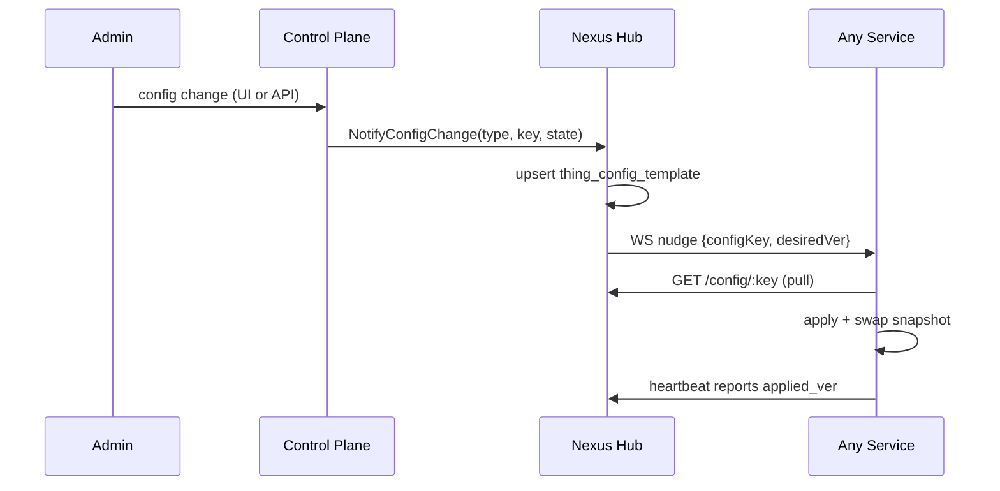

# Configuration Architecture

*Audience: contributors adding or renaming config keys, yaml fields, or env variables.*

Configuration in Nexus Gateway is layered across five storage tiers — each owned by a distinct role and mutable at a distinct time. The architecture guarantees one authoritative location per concept, preventing the silent double-writes that caused 12+ breakages in the pre-GA system. The five invariants (R1-R5) are binding: no PR that touches a yaml field, env variable, or config key ships without conforming to them.

---

## Five storage layers

Every configuration concept lives in exactly one layer. Precedence runs from boot-time static to runtime hot-push:

| Layer | Store | Owner | When mutable | Used for |
|---|---|---|---|---|
| L1 | Code defaults | Developer | Release only | Hardcoded sane initial values (timeouts, retry counts, buffer sizes) |
| L2 | `yaml` (`<svc>.{config,dev,prod.yaml.example}.yaml`) | SRE | Restart only | Service shape — ports, retention, CORS, upstream timeouts, IP allowlists |
| L3 | `env` (`.env` local, `systemd EnvironmentFile=` prod) | SRE | Restart only | Secrets + environment-specific URLs |
| L4 | `thing_config_template` + `thing_config_override` (Postgres) | Admin via UI | Runtime hot-push | Operational policies — routing rules, kill switch, hooks, cache, agent settings |
| L5 | `system_metadata` (Postgres key-value) | Admin via UI | Runtime + invalidation | Singleton domain settings whose shape doesn't fit a template state |

**Secrets are L3 only.** No secret field (auth tokens, HMAC keys, credential-encryption keys, internal-service tokens, DB passwords) appears in any committed YAML. Every secret has a corresponding env variable in `.env.example`. YAML carries only service-shape and non-secret tunings. Cross-service shared secrets are tagged `[MUST MATCH]` in `.env.example` — drift between consumers is the most common source of inter-service 403s.

## Five invariants (binding)

| Rule | Constraint | Enforcement |
|---|---|---|
| **R1** | Each concept lives in exactly one of L1-L5. No double-write. | Startup audit + schema registry at `packages/shared/schemas/configkey/` |
| **R2** | Secrets are L3 only. Never in YAML or template state. | CLAUDE.md "Secrets are env-only" binding |
| **R3** | An L4 template key must have an admin UI or a publisher. Orphan rows are forbidden. | Per-key catalog in the architecture doc; CI startup audit |
| **R4** | An L4 template key must have a registered receiver in the target service. | Startup audit cross-references `cfgloader.Register*` against `ValidByThingType` |
| **R5** | YAML (L2) fallback values must be sufficient for cold-start. L4 push is an enhancement, not a precondition. | Service boot must succeed with no Hub connection |

## Type A vs Type B config keys

L4 keys split into two patterns based on how the receiver uses them:

**Type A — config blob**: the state JSON IS the configuration. Hub delivers the full state body via the WebSocket change-signal. The receiver unmarshals it directly and applies. Examples: `killswitch`, `cache`, `gateway_passthrough`, `agent_settings`, `log_level`.

**Type B — invalidation trigger**: the state is always `null` or `{}`. The real data lives in a SQL table. Hub bumps the template's `version` and signals the receiver; the receiver ignores the bytes and reloads from DB (or from a Hub pull endpoint for agents that have no DB access). Examples: `providers`, `routing_rules`, `hooks`, `virtual_keys`, `credentials`.

**Hybrid**: `virtual_keys` carries a structured invalidation payload `{op:"invalidate", ids:[...]}` for targeted per-key cache purge — meaningful state but signal-shaped, not authoritative config.

## Pull-only config sync

All five services pull config from Hub on boot and on change-signal. Hub never pushes full state. This is the Hub-centric pull-only config sync model — a hard architectural invariant.



Every Type B key carries `needsPull: true` so agents without direct DB access still converge. A service that boots with no Hub connection starts from its L2 YAML defaults (R5) and converges once Hub is reachable.

## Per-key catalog

Keys are exported as constants in `packages/shared/schemas/configkey/configkey.go` and validated against `ValidByThingType` (`validation.go`). Hub's startup audit cross-references every DB row against the registry — unknown `(type, key)` tuples emit a WARN.

Key counts by service:

| Service | Keys | Notable keys |
|---|---|---|
| `nexus-hub` | 2 | `log_level`, `observability` |
| `control-plane` | 2 | `log_level`, `observability` |
| `ai-gateway` | 19 | `cache`, `killswitch` (N/A), `gateway_passthrough`, `routing_rules`, `hooks`, `virtual_keys`, `providers`, `models`, `credentials`, `response_cache.*`, `semantic_cache.*` |
| `compliance-proxy` | 10 | `killswitch`, `hooks`, `interception_domains`, `exemptions`, `streaming_compliance`, `onboarding` |
| `agent` | 10 | `agent_settings`, `killswitch`, `hooks`, `exemptions`, `interception_domains`, `diag_mode`, `installed_rule_packs` |

The full per-key catalog with Type, Notes, and Verdict lives in
[`configuration-architecture.md`](https://github.com/AlphaBitCore/nexus-gateway/blob/main/docs/developers/architecture/cross-cutting/foundation/configuration-architecture.md) §7.

## Naming conventions

Each concept transforms deterministically across all four representations:

| Representation | Convention | Example |
|---|---|---|
| YAML field | camelCase | `forwardHeaders`, `nexusHubUrl` |
| Env variable | `SCREAMING_SNAKE_CASE` | `NEXUS_HUB_URL`, `INTERNAL_SERVICE_TOKEN` |
| configKey (L4) | snake_case, no suffix | `cache`, `routing_rules`, `gateway_passthrough` |
| Go struct field | PascalCase | `Registry.NexusHubURL` |

Shared infrastructure URLs use no service prefix (`DATABASE_URL`, `REDIS_MODE`, `NATS_URL`, `NEXUS_HUB_URL`). Service-private knobs add a service prefix (`AI_GATEWAY_PORT`, `NEXUS_HUB_ID`). Cross-service shared secrets use bare names tagged `[MUST MATCH]` in `.env.example` — `INTERNAL_SERVICE_TOKEN`, `CREDENTIAL_ENCRYPTION_KEY`, `AUTH_SERVER_ISSUER`.

## Rename discipline

A rename touches at minimum four layers simultaneously (Go source, YAML, env example, DB seed). Half-completing a rename leaves the system in an inconsistent silent-failure state. Every rename sweeps all 14 layers documented in `configuration-architecture.md` §6.5. The gate command is:

```bash
OLD="old_key_name"
git grep -E "\b${OLD}\b" -- ':!docs/developers/architecture/configuration-architecture*.md'
# Must return ZERO matches before the PR merges.
```

---

## Canonical docs

- [`configuration-architecture.md`](https://github.com/AlphaBitCore/nexus-gateway/blob/main/docs/developers/architecture/cross-cutting/foundation/configuration-architecture.md) — 4-layer model, R1-R5 invariants, full per-key catalog, rename discipline
- [`packages/shared/schemas/configkey/`](https://github.com/AlphaBitCore/nexus-gateway/blob/main/packages/shared/schemas/configkey/) — Go constants, `ValidByThingType`, `TypedRegistry`

**Adjacent wiki pages**: [Hub Coordination](Hub-Coordination) · [Service Call Framework](Service-Call-Framework) · [Thing Model And Config Sync](Thing-Model-And-Config-Sync) · [Kill Switch](Kill-Switch) · [Emergency Passthrough](Emergency-Passthrough)
