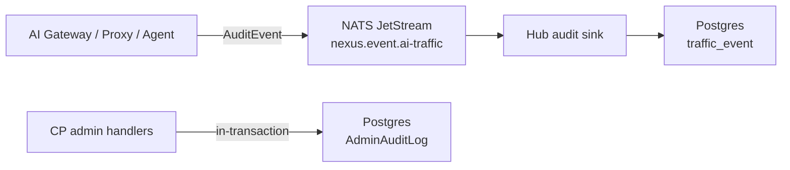

# Control Plane Audit Log

*Audience: compliance leads and contributors wiring new admin events.*

The audit log is the immutable record of every admin action and every traffic-affecting event in Nexus Gateway. Two distinct tables serve two distinct purposes: `traffic_event` for data-plane request rows, and `AdminAuditLog` for admin mutations and sensitive reads. Both are correlated by the Hub-stamped Nexus request ID.

---

## Two audit tables

| Table | Source | Granularity | Integrity |
|---|---|---|---|
| `traffic_event` | AI Gateway, Compliance Proxy, and the Desktop Agent on every traffic-affecting call | One row per request | Indexed; spillstore overflow for large bodies |
| `AdminAuditLog` | Control Plane on every admin-API mutation and sensitive read | One row per admin action | Hash-chained (`previousHash`, `integrityHash`, `hashInput`) |

`AdminAuditLog` rows are inserted in-transaction by CP admin handlers. `traffic_event` rows travel through the audit pipeline (MQ → Hub → Postgres). There is no separate agent audit table — agent traffic rows land in `traffic_event` with `trafficSource = AGENT`.

## traffic_event schema

Key columns:

- `trafficSource` — `COMPLIANCE_PROXY | DNS_TERMINATED | AGENT`
- `ingressType` — which gateway ingress handled the call
- `provider`, `model` — resolved provider and model
- `latencyMs`, `upstream_ttfb_ms` — latency phases
- `requestHookDecision`, `responseHookDecision` — hook outcomes
- `org_id`, `org_name` — tenant attribution
- `cost_usd` — stamped from Model row prices
- `RequestBody`, `ResponseBody` — body containers (inline or spill reference)

Bodies ≤ 256 KiB are stored inline in `traffic_event_payload`. Bodies above the threshold overflow to spillstore (S3 in production). When an admin clicks "Show body" in the Traffic page, the backend generates a presigned S3 URL.

## AdminAuditLog hash chain

`AdminAuditLog` rows form a hash chain for tamper detection:

- `hashInput` — a deterministic string combining the row's fields.
- `integrityHash` — SHA-256 of `hashInput`.
- `previousHash` — the `integrityHash` of the preceding row.

This chain allows off-line verification that no row was deleted or modified after insertion. The Hub scheduled job `audit-chain-verify` periodically validates the chain.

Because tombstoned rows would break chain verification, the practical retention horizon for `AdminAuditLog` is the table's full lifetime (typically 365 days).

## Audit emission path

Each data-plane emitter packages an `AuditEvent` and writes to MQ via a per-service `Writer`. When MQ is unreachable, AI Gateway and the Compliance Proxy spool to local NDJSON; the Desktop Agent spools to an encrypted SQLite queue and uploads via Hub HTTP. Both fallbacks feed the same Postgres insert path.

## PII redaction

Sensitive content passes through a redaction step before the event reaches MQ. Three primitives:

- **Hash** — SHA-256; analytics can detect duplicates without seeing plaintext.
- **Token** — stable, opaque, per-value, per-tenant replacement.
- **Mask** — replace with `***` (unrecoverable).

The redaction strategy is configured per hook (`HookConfig.onMatch.redactStrategy`). Redaction happens before the event leaves the originating service.

## Retention

Retention is system-wide (per-tenant configurability is a future enhancement):

- `traffic_event` — typically 90 days; bodies in spillstore have separate retention.
- `AdminAuditLog` — typically 365 days.

The Hub scheduled job `data-retention` runs daily, deletes expired rows in batches, and emits a `system:data_retention.completed` audit row with the deleted count.

## Querying the audit log

The CP UI Traffic page queries `GET /api/admin/traffic-events` with filters (VK, provider, model, time range, hook decision). The admin audit log is surfaced through audit-specific endpoints. Cross-table correlation uses `nexus_request_id` / `trace_id`.

Key indexes on `traffic_event`: `(emitted_at)`, `(org_id, emitted_at)`, `(request_id)`, `(virtual_key_id, emitted_at)`, `(provider, model, emitted_at)`.

## Failure modes

| Failure | Behaviour |
|---|---|
| MQ down | HTTP fallback |
| Agent offline | SQLite local queue; drains when Hub is reachable |
| Postgres down | Hub buffers in JetStream (sized for ~24h); resumes on return |
| Spillstore down | Bodies dropped; event recorded with `body_dropped=true` |
| DLQ growing | Alerts fire; manual replay via `tools/db-migrate/manual-scripts/` |

---

## Canonical docs

- [`audit-pipeline-architecture.md`](https://github.com/AlphaBitCore/nexus-gateway/blob/main/docs/developers/architecture/cross-cutting/observability/audit-pipeline-architecture.md) — full pipeline: emission, transport, ingestion, retention, failure modes
- [`admin-audit-log-coverage.md`](https://github.com/AlphaBitCore/nexus-gateway/blob/main/docs/developers/architecture/cross-cutting/observability/admin-audit-log-coverage.md) — per-endpoint admin-audit coverage matrix

**Adjacent wiki pages**: [Control Plane Overview](Control-Plane-Overview) · [Control Plane Alerting Rules](Control-Plane-Alerting-Rules) · [Control Plane SIEM Bridge](Control-Plane-SIEM-Bridge) · [Feature Audit And SIEM](Feature-Audit-And-SIEM) · [Security Audit Forensics](Security-Audit-Forensics)
