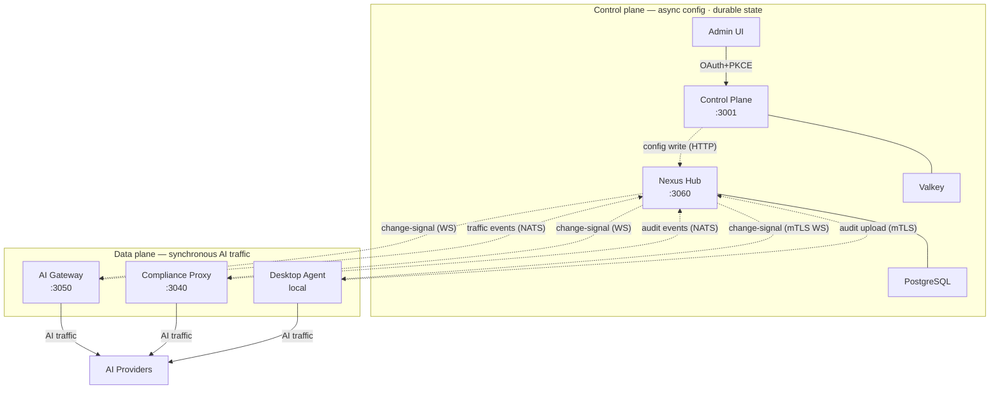

# Control Plane Vs Data Plane

*Audience: evaluators assessing operational resilience, and contributors understanding the separation of concerns between services.*

Nexus Gateway separates responsibilities into two independent tiers: the control plane (Nexus Hub + Control Plane service) owns all durable state and configuration authority, while the data plane (AI Gateway + Compliance Proxy + Desktop Agent) carries live AI traffic. The defining property of this split is that a control-plane outage does not stop AI traffic — data-plane services hold config in atomic in-memory snapshots and continue routing, enforcing hooks, and auditing requests from those snapshots. This design makes enforcement degradation (Hub unreachable, config updates paused) a different failure mode from traffic disruption (no requests served).

---

## What each tier owns

**Control plane — Hub + Control Plane:**

- **Durable state**: Thing registry, device shadows (desired + reported config), IAM policies, provider credentials (encrypted), alert rules, scheduled jobs.
- **Authentication surfaces**: OAuth+PKCE for admin sessions, SSO/IdP federation (SAML/OIDC).
- **Config authority**: the only tier that can write to `thing.desired` config keys. Every admin change flows: Control Plane → Hub → shadow write → change-signal → Thing pull.
- **Analytics**: queries against `traffic_event`, `admin_audit_log`, alert history.
- **Operational surface**: CP UI Infrastructure section (Nodes, Config Sync, Jobs, Kill Switch).

Both Hub and the Control Plane are stateless process instances — their state lives in PostgreSQL and Valkey. The Control Plane is itself a Thing registered with Hub; Hub applies the same shadow contract to itself as to any other service.

**Data plane — AI Gateway + Compliance Proxy + Desktop Agent:**

- **Live AI traffic**: authentication (VK or TLS interception), routing, forwarding, streaming, body capture.
- **Hook enforcement**: request-stage and response-stage pipelines from `packages/shared/policy/hooks`, running in all three traffic paths with the same code.
- **Audit emission**: traffic events and hook decisions to NATS JetStream, drained by Hub's audit sink into PostgreSQL.
- **Config consumers**: each data-plane service pulls its config from Hub on boot and on each change-signal, holds config in atomic in-memory snapshots, and writes only reported-state heartbeats back to Hub.

Solid arrows carry synchronous AI traffic. Dotted arrows carry asynchronous config signals, heartbeats, and audit events.

## Why a Hub outage does not stop AI traffic

Data-plane services are designed to be resilient to control-plane unavailability after the initial boot.

On boot, each data-plane service connects to Hub, pulls its full config shadow (Cat A inline values + Cat B key values via explicit pulls), applies the config, and reports back. After boot, config is held in per-service in-memory snapshots using atomic-pointer swaps — reloading config never blocks in-flight requests.

If Hub becomes unreachable after a successful boot:
- The data-plane service continues operating from the last-pulled config snapshot.
- Change-signals stop arriving, so new routing rules, hook config changes, and credential rotations do not propagate until connectivity is restored.
- AI traffic continues: routing, hook enforcement, cost stamping, and audit emission all function.
- Audit emission queues if NATS is also unreachable; events are not lost (NATS at-least-once delivery + local SQLCipher queue for the Desktop Agent).
- Alerts fire when Hub WS heartbeats stop arriving.

If Hub is down at service boot:
- Server-side services block on startup. Starting with an empty config would silently disable all enforcement; the fail-closed cold-start is intentional.
- The Desktop Agent follows the same principle.

The net result: during a control-plane outage, the last-known configuration stays active, traffic flows, and enforcement continues. Operators must reconnect Hub to propagate new config changes.

## Data-plane fail-open for hook errors

Within a running data-plane service, hook pipeline errors (hook evaluation timeout, hook process crash, dependency failure) are handled with a fail-open policy: if a hook cannot return a decision, the request proceeds as if the hook returned `Approve`. The request is served; an alert fires; the traffic event records the hook failure reason.

This prevents a single misconfigured PII scanner or a flapping webhook integration from silently stopping all AI traffic for affected users. The audit record for a hook-error event captures the failure reason so compliance reviewers can identify the affected window.

**Streaming compliance modes** give operators control over the fail-open surface for streaming responses:
- `passthrough` — no hook inspection, no body capture; traffic flows through immediately.
- `buffer_full_block` — assembles the full response before forwarding any byte; the hook runs at stream end; a hard reject returns HTTP 451 before the client sees any content.
- `chunked_async` — relays chunks to the client in real time; hooks run per chunk and at stream end; a hard reject cannot retract already-sent bytes but is recorded and alerted.

## Emergency passthrough (controlled bypass)

When the compliance pipeline itself cannot run — a hook service outage, mass misconfiguration — emergency passthrough provides a controlled, audited, time-limited bypass. This is distinct from the hook-error fail-open above: it is an explicit admin action, not an automatic fallback.

Emergency passthrough:
- Requires an admin to activate it explicitly via the CP UI or admin API.
- Has a mandatory expiry: maximum 8 hours, default 1 hour. Hub auto-reverts expired rows every 60 seconds.
- Operates via a Cat A shadow key (inline, millisecond propagation to all Things).
- Maintains a complete audit trail: every bypassed request emits a `traffic_event` with `passthrough=true` + `bypass_reason`.
- Supports three orthogonal bypass flags per tier (`bypassHooks`, `bypassCache`, `bypassNormalize`) at three tiers (global, adapter, provider).

A fresh data-plane boot with no shadow defaults to **enforced** mode — fail-closed cold-start prevents a Hub-down boot from silently disabling enforcement.

For the full emergency passthrough contract, see [Fail Open Posture](Fail-Open-Posture).

## Shared business logic — `packages/shared/`

All three data-plane services share compliance business logic through `packages/shared/`. The critical packages:

| Package | What it provides |
|---|---|
| `packages/shared/policy/hooks` | The hook pipeline — request, response, and per-chunk streaming stages with the `Approve / Modify / Reject / Abstain` decision model. |
| `packages/shared/transport/normalize/` | Tier-1 normalizers for OpenAI, Anthropic, Gemini wire formats. Tier-2 `NonJSONDetector` framework for binary/non-JSON protocols. |
| `packages/shared/transport/thingclient/` | WebSocket primary + HTTP fallback connection to Hub, heartbeat, shadow pull, `OnConfigChanged` callbacks. |
| `packages/shared/traffic/adapters/` | Traffic adapter registry: `api/`, `web/`, `ide/`, `generic/` surfaces covering 50+ providers. |
| `packages/shared/mq/` | NATS JetStream interface (pluggable; NATS is the current driver) used for traffic event and audit event emission. |
| `packages/shared/spillstore/` | Body overflow to S3 / local FS for bodies ≥ 256 KB. |
| `packages/shared/identity/` | IAM evaluation and VK resolution helpers. |

The monorepo uses `go.work` to build all services together. `packages/shared/` is the only package that all services import — per the conventions binding: `shared/` API is additive-only once shipped in a released agent binary.

## Operational implications of the two-tier split

**Config lag.** When Hub or the Control Plane is unreachable, config changes do not propagate. An admin who disables a hook or rotates a credential will not see the change take effect on data-plane services until connectivity is restored. The "Config Sync" page in the CP UI shows which Things are in drift and when they last applied each config key.

**Traffic event lag.** If NATS JetStream is unavailable, data-plane services buffer traffic events in memory (bounded buffer; overflow drops the oldest events first). The Desktop Agent buffers in the local SQLCipher queue (which persists across restarts). Events are replayed when NATS reconnects.

**Horizontal scaling.** Because data-plane services are stateless (state is in PostgreSQL + Valkey, config is pulled from Hub), multiple instances of the AI Gateway or Compliance Proxy can be deployed behind a load balancer. Hub's change-signal fan-out reaches each registered Thing independently. The Desktop Agent is a per-device singleton by definition.

**Config change propagation time.** Cat A keys (kill switch, emergency passthrough): milliseconds — the value rides the WebSocket change-signal. Cat B keys (hook configs, routing rules, credentials): sub-second — the change-signal triggers a pull, then the Thing applies atomically. An admin change to a routing rule is live on all AI Gateway instances within a second under normal conditions.

**Credential rotation without restart.** When an admin rotates a provider credential via the CP UI, the Control Plane encrypts the new value with `CREDENTIAL_ENCRYPTION_KEY`, persists the new row to PostgreSQL, and signals Hub. Hub signals the AI Gateway via the WS change-signal for the `credentials` Cat B key. The AI Gateway invalidates the entry in its in-memory decrypt cache. The next request that needs this credential fetches fresh ciphertext and decrypts. No AI Gateway restart is required, and there is no stale-credential window after the signal arrives (typically sub-second).

This design — control-plane authority over credentials, data-plane decrypt-on-demand — is why credential rotation is operationally safe at any time. The routing engine never holds plaintexts; they exist only in the executor's stack frame during the upstream call lifetime.

## The config-change lifecycle end-to-end

A concrete example shows the full flow from admin action to live enforcement:

1. Admin opens the CP UI and enables a new PII-redaction hook for the `openai` adapter.
2. The CP UI calls `POST /admin/hooks` on the Control Plane. The Control Plane validates the request via `iamMW` (checks the admin has `admin:hooks.write`), creates the hook row in PostgreSQL, and calls `POST /api/hub/shadow/{thing_id}/hooks` on Hub.
3. Hub persists the new hook config to the `thing.desired` JSONB column and increments `hooks/v`.
4. Hub looks up all Things with `service_kind = ai-gateway` and sends a WebSocket change-signal identifying the `hooks` key.
5. Each AI Gateway instance receives the signal, pulls the new hook config from Hub via `GET /api/hub/shadow/{thing_id}/hooks`.
6. Each AI Gateway applies the new hook config via an atomic-pointer swap (no in-flight request is blocked).
7. Each AI Gateway stamps a new `reported` entry: `{ hooks/v: N, applied_at: now }`.
8. Hub reads the reported stamp on the next heartbeat and clears the drift for that instance.
9. The CP UI Config Sync page reflects the update within seconds.

This flow applies identically to routing rules, credentials, agent settings, and all other Cat B keys. The only variation is which Things receive the change-signal — the AI Gateway for routing rules and hooks, the Compliance Proxy for domain predicates and hooks, the Desktop Agent for `agent_settings`.

## Booting a new data-plane instance

The sequence for booting a new AI Gateway instance (same for Compliance Proxy) illustrates the full two-tier interaction:

1. Process starts. Reads `ai-gateway.yaml` + env vars. `bootenv` loads the repo-root `.env` in development.
2. Database connection pool established. Verifies DB is reachable.
3. `thingclient.Connect` called. Sends `INTERNAL_SERVICE_TOKEN` bearer to Hub via HTTP. Hub creates or updates the Thing row.
4. Full shadow pull: Hub sends the current `desired` snapshot. Service applies all Cat A values immediately.
5. Cat B pull loop: for each key with `needsPull: true`, service calls Hub's shadow HTTP API and gets the current value.
6. All Cat B callbacks run. Routing rules, hook configs, credentials, kill switch — all applied.
7. Reported state stamped to Hub: `{ routing/v: 42, hooks/v: 17, ... }`.
8. Service enters the live WebSocket loop and begins accepting traffic on `:3050`.

Steps 1–7 must complete before the service responds to any requests. If Hub is unreachable at step 3, the process blocks indefinitely (fail-closed cold-start). In container orchestration, the readiness probe failing at this stage signals the scheduler to not route traffic to the new instance.

## What "stateless" means for data-plane services

The data-plane services (AI Gateway, Compliance Proxy, Desktop Agent) are described as "stateless." This has a specific meaning in context: they hold no durable state that cannot be reconstructed from Hub on reconnect. Every request's routing context, quota consumption, and audit record is externalized immediately — the in-process memory holds only the current config snapshots, in-flight request contexts, and bounded event buffers.

Specifically, data-plane services:
- **Do not own their configuration.** Config is authoritative in Hub; data-plane services hold cached copies via atomic in-memory snapshots.
- **Do not own their credentials.** Credentials are authoritative in Hub PostgreSQL; data-plane services hold references resolved at dispatch time.
- **Do not own their audit records.** Traffic events are emitted to NATS immediately; the service does not need to persist them.
- **Do own their in-flight request state.** A request currently being processed exists only in the serving goroutine's stack. If the process crashes, the in-flight request is abandoned. The client receives a connection reset; no partial audit record is emitted.
- **Do own their Valkey counters.** Rate-limit and quota counters are in Valkey; data-plane services read and write these counters. Valkey availability is required for quota enforcement.

This definition of "stateless" is why scaling out data-plane services is safe: every new instance starts from Hub's authoritative config and does not need to coordinate with existing instances.

## The configreconcile watchdog

The Control Plane runs a background `configreconcile` worker (`packages/control-plane/internal/platform/configreconcile/`) that periodically checks for divergence between the Control Plane's authoritative config tables (hook rows, routing rules rows, credential rows in PostgreSQL) and the `thing.desired` shadow JSONB columns in Hub.

**What it does:** on each reconcile cycle, the worker:
1. Reads the latest config rows from the Control Plane's PostgreSQL tables.
2. Calls Hub's shadow read API to get the current `desired` snapshot for each affected Thing.
3. Compares the two. If the shadow is stale (e.g., a migration added a new `thing_config_template` row but the `desired` was never updated), the worker calls `Hub.NotifyConfigChange` to trigger a fresh fan-out.

**Why it exists.** Without this watchdog, there is a class of divergence that would never self-heal: if the database was modified outside the normal Control Plane API flow (migration, manual SQL, seed script), the shadow could be stale indefinitely. The reconcile worker closes this gap.

**Wiring location.** The worker is wired at `packages/control-plane/cmd/control-plane/wiring/reconcile.go` and runs as a goroutine inside the Control Plane process. It shares the same Hub client that the Control Plane uses for real-time config writes.

The reconcile interval is configurable (default 5 minutes). It is not a replacement for the real-time change-signal path — it is a background correction mechanism for anomalous state.

## Resilience testing matrix

Understanding the two-tier split helps predict behavior under various failure scenarios. The table below maps each scenario to which tier is affected and what operators observe:

| Failure | Control plane affected | Data plane affected | Traffic | Config updates | Audit |
|---|---|---|---|---|---|
| Hub process crash (after data-plane boot) | ✅ | Partial (no new signals) | Continues | Paused | Buffered in NATS |
| Control Plane process crash | ✅ | ❌ | Continues | Paused (admin UI down) | Continues |
| PostgreSQL down | ✅ | ❌ | Continues | Paused | Buffered |
| Valkey down | Partial (sessions fail) | Partial (cache misses, quota counters lost) | Continues (hooks run) | Continues | Continues |
| NATS down | ❌ | Partial (audit emission paused) | Continues | Continues | Buffered in memory / SQLCipher |
| All control plane down (after data-plane boot) | ✅ | ❌ | Continues | Paused | Buffered |
| All control plane down (before data-plane boot) | ✅ | ✅ | Blocked (fail-closed cold-start) | N/A | N/A |

The most important column is "Traffic": it is "Continues" in every scenario except boot-time control-plane failure. This confirms that the two-tier split achieves its goal — a control-plane outage does not degrade user-facing AI throughput.

## Querying across the two tiers

Operators frequently need to correlate control-plane events (config changes, admin actions) with data-plane events (traffic, hook decisions, costs). The platform provides two correlated audit streams for this purpose.

**Admin audit log.** Every admin action — creating a routing rule, enabling a hook, rotating a credential, activating emergency passthrough — emits an entry to the `admin_audit_log` table in PostgreSQL. These entries are visible on the CP UI Audit Log page. They include: actor, action, resource NRN, timestamp, diff (what changed). This stream is the control-plane audit trail.

**Traffic event log.** Every AI request that flows through any of the three data-plane paths emits a `traffic_event` row (via NATS → Hub audit sink). These rows include: trace_id, source path, VK, provider, model, token counts, cost, hook decision, passthrough flag, cache status, timestamp. This stream is the data-plane audit trail.

Correlating the two: when an admin enables a new hook at `T=0` and a user's request is affected by that hook at `T=5s`, the admin audit log shows the hook activation, and the traffic event log shows the first request to hit the new hook. The `Config Sync` page shows the propagation lag: `T=0.6s` for the AI Gateway to apply the config. Combining these gives a complete timeline.

## Anti-patterns: what not to build on top of this split

Several tempting shortcuts violate the two-tier contract in ways that cause operational problems:

**Do not add config writes to data-plane services.** The AI Gateway, Compliance Proxy, and Desktop Agent must not write to `thing.desired` or any admin config table directly. They report state; they do not set state. A data-plane service that writes config would bypass the Control Plane IAM check and the Hub version counter.

**Do not use Valkey pub/sub for config propagation.** The Valkey instance is a cache. Config propagation uses Hub WebSocket push. A service that subscribes to a Valkey channel for config invalidation will not receive changes — the channel is never written to. This is the #1 source of "why isn't my config change taking effect?" bugs from contributors unfamiliar with the architecture.

**Do not start a data-plane service without Hub connectivity.** Server-side data-plane services intentionally block at boot until they can pull their shadow from Hub. Disabling this check (e.g., adding a `--no-hub` flag or catching the boot error and continuing) silently disables all enforcement for the service's lifetime. The fail-closed cold-start is a compliance guarantee.

## Observability: reading the split in practice

The CP UI Infrastructure section exposes the two-tier split as observable:

- **Nodes page.** Shows each registered Thing's `status` (online/degraded/offline), the WebSocket session age, and the last heartbeat time. A data-plane service that falls off this page has lost its Hub connection and is running from stale config.
- **Config Sync page.** Shows per-Thing per-key drift: `desired.version` vs `reported.version`. A large drift on many Things after an admin save usually means the Hub WS fan-out is backed up. A persistent drift on one Thing means that Thing has an apply error.
- **Jobs page.** Shows the last run time of each Hub scheduled job. A `kill_switch.reconcile` job that hasn't run in > 60s should alert — it is the auto-revert guardian.
- **Kill Switch page.** Shows the current global / adapter / provider passthrough states and their expiry times. This page updates in near-real-time because the kill switch is a Cat A shadow key.

---

## Canonical docs

- [`overview.md`](https://github.com/AlphaBitCore/nexus-gateway/blob/main/docs/developers/architecture/overview.md) — §3 control plane vs data plane, §2 Hub-centric Thing model
- [`emergency-passthrough-architecture.md`](https://github.com/AlphaBitCore/nexus-gateway/blob/main/docs/developers/architecture/cross-cutting/safety/emergency-passthrough-architecture.md) — three-tier bypass, mandatory expiry, fail-closed cold-start, Hub 60s reconcile
- [`thing-config-sync-architecture.md`](https://github.com/AlphaBitCore/nexus-gateway/blob/main/docs/developers/architecture/cross-cutting/foundation/thing-config-sync-architecture.md) — pull-only config sync, failure modes table when Hub is down

**Adjacent wiki pages**: [Architecture Overview](Architecture-Overview) · [The Five Services](The-Five-Services) · [Thing Model And Config Sync](Thing-Model-And-Config-Sync) · [Fail Open Posture](Fail-Open-Posture) · [Trust Boundaries](Trust-Boundaries)
