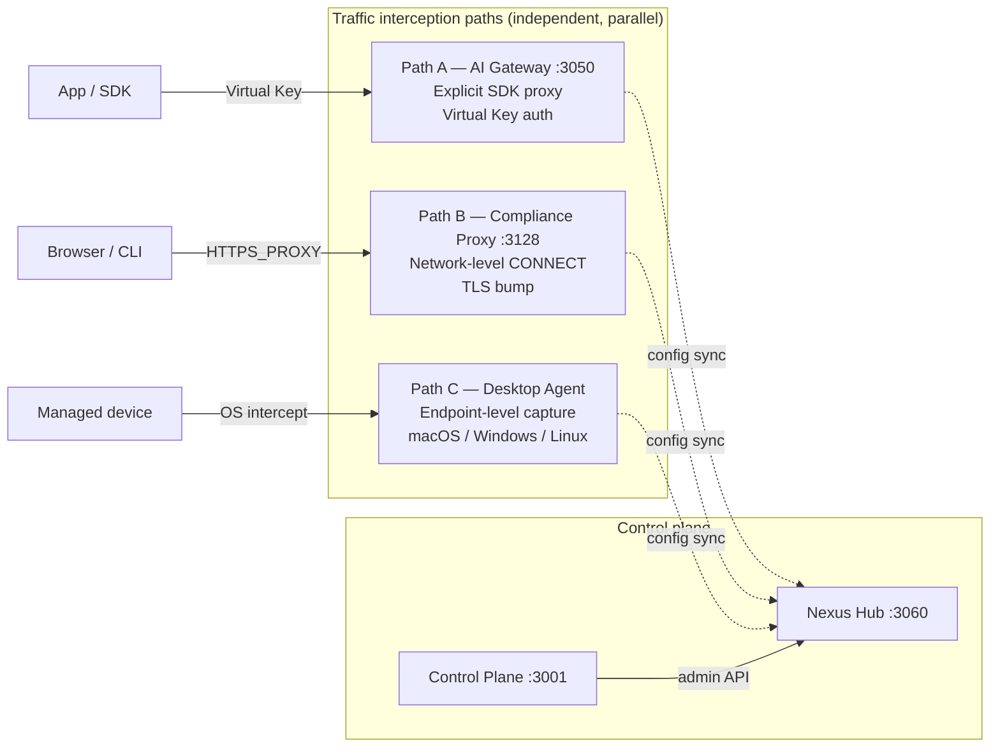

# Deployment Models

Nexus Gateway intercepts AI traffic through three independent paths — AI Gateway (explicit SDK proxy), Compliance Proxy (network-level TLS bump), and Desktop Agent (endpoint-level capture) — that can be deployed individually or in any combination. All three paths share a common Hub-centric pull-only config sync model: configuration changes made in the Control Plane UI propagate to every active path within sub-seconds via a Hub WebSocket change-signal. No Redis pub/sub is involved; Redis is pure cache.

---

## The three traffic paths

### Path A — AI Gateway (explicit proxy)

Applications send requests to the AI Gateway at `/v1/chat/completions`, `/v1/messages`, `/v1/responses`, or `/v1/embeddings` using a Virtual Key instead of a provider API key. The AI Gateway performs Virtual Key authentication, applies routing rules, enforces quotas, runs the compliance hook pipeline, and forwards the request to the configured upstream provider.

When to choose: SDK-integrated applications, cost tracking per team or project, multi-provider routing, or per-key rate limiting.

Capabilities: 7 routing strategies (single, load-balance, fallback, conditional, A/B split, policy narrowing, smart LLM-dispatch), two-phase quota management, request and response hook pipeline with streaming checkpoint inspection, prompt cache, response cache, and per-request cost stamping.

### Path B — Compliance Proxy (network-level)

Deployed as a forward proxy. Clients set `HTTPS_PROXY` or use a PAC file to route HTTPS traffic through the proxy. The proxy intercepts via HTTP CONNECT tunnels, performs TLS interception (MITM) with dynamic ECDSA P-256 leaf certificate issuance, and applies the compliance hook pipeline before forwarding to the upstream provider.

When to choose: network-perimeter deployments where application changes are not feasible, environments that require all AI traffic to pass through a single compliance chokepoint, or browser and CLI tools that cannot be SDK-integrated.

Because TLS interception requires device trust, every client device must have the Proxy CA installed in its OS trust store. See [Deployment-TLS-Certificates](Deployment-TLS-Certificates) for CA generation and distribution.

### Path C — Desktop Agent (endpoint-level)

Installed on each endpoint. The agent intercepts outbound HTTPS traffic at the OS level using platform-native mechanisms: Network Extension (`NETransparentProxyProvider`) on macOS, CONNECT proxy on Windows, and iptables transparent proxy on Linux. The agent enrolls with Nexus Hub on first boot and receives its configuration via Hub-shadow pull.

When to choose: BYOD or managed-device environments, remote workers, endpoint-level compliance enforcement where network-level interception is not feasible.

macOS limitation: the Network Extension intercepts at the network layer and surfaces only connection metadata (host, IP, port, process) to the Go agent. TLS MITM and content inspection are not performed on macOS; policy-based allow/deny decisions and metadata-level auditing are fully functional. Full content inspection with compliance hooks is available on Windows and Linux.

---

## Path combinations

The three paths are independent and parallel — traffic captured by one path does not flow through another. An application using the AI Gateway does not also pass through the Compliance Proxy or Desktop Agent.

| Scenario | Paths | Rationale |
|---|---|---|
| SDK-integrated apps | A only | Full routing, quota, cost tracking per key |
| Network perimeter compliance | B only | Transparent, no app changes required |
| Remote workforce / BYOD | C only | Per-device enforcement |
| Hybrid: SDKs + browsers/CLI tools | A + B | Gateway for SDK traffic, proxy for network traffic |
| Hybrid: SDKs + managed devices | A + C | Gateway for SDK traffic, agent for device traffic |
| Full coverage | A + B + C | All traffic paths governed |

Compliance hooks configured in the Control Plane UI apply to all three paths (subject to `applicableIngress` filtering on each hook). Audit events from all three paths are queryable in the unified audit timeline.

---

## Configuration flow and latency

Config changes reach each path via the Hub-shadow WebSocket change-signal. Each service pulls only the changed keys on signal receipt, then hot-swaps them atomically without restart.

| Path | Config mechanism | Latency |
|---|---|---|
| AI Gateway | Hub WebSocket signal → pull changed keys → `atomic.Pointer` hot-swap | Sub-second |
| Compliance Proxy | Hub WebSocket signal → pull changed keys → hot-swap `PolicyResolver` | Sub-second |
| Desktop Agent | Hub WebSocket signal → pull changed keys → apply locally | Seconds (online); resumes on reconnect |

Redis is not the config invalidation channel. Valkey/Redis outages do not affect config propagation.

---

## Topology

The single-node production baseline co-locates all four server-side services — Hub, Control Plane, AI Gateway, Compliance Proxy — plus PostgreSQL, Valkey, and NATS JetStream on a single host behind nginx and an ALB. Per-endpoint Desktop Agents enroll with Hub over WebSocket.

The stateless service tier and pull-only config model are designed to support multi-node and region-split deployments without changing the data-plane contracts. See [Deployment-Single-Node-Production](Deployment-Single-Node-Production) for the current EC2 production topology.

---

## Canonical docs

- [`deployment-models.md`](https://github.com/AlphaBitCore/nexus-gateway/blob/main/docs/users/product/deployment-models.md) — full capability tables per path and config-sync latency table
- [`deployment.md`](https://github.com/AlphaBitCore/nexus-gateway/blob/main/docs/operators/ops/deployment.md) — service-level dependency matrix and Docker options
- [`ec2-single-node.md`](https://github.com/AlphaBitCore/nexus-gateway/blob/main/docs/operators/ops/ec2-single-node.md) — complete single-node production runbook

**Adjacent wiki pages**: [Deployment-Single-Node-Production](Deployment-Single-Node-Production) · [Deployment-TLS-Certificates](Deployment-TLS-Certificates) · [Deployment-Environment-Variables](Deployment-Environment-Variables) · [Three-Traffic-Paths](Three-Traffic-Paths) · [Fail-Open-Posture](Fail-Open-Posture)
