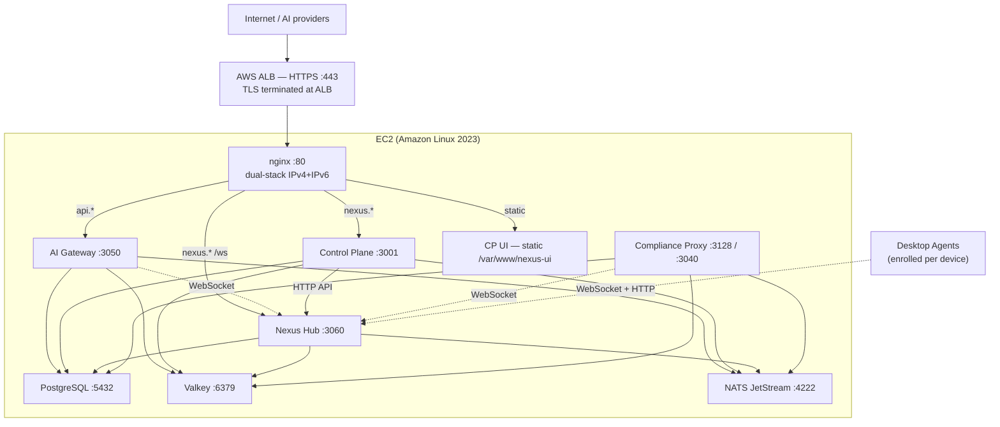

# Deployment Single Node Production

Nexus Gateway runs in production as a single Amazon Linux 2023 EC2 instance co-locating all four Go services — Hub, Control Plane, AI Gateway, Compliance Proxy — plus PostgreSQL, Valkey, NATS JetStream, and nginx, fronted by an AWS ALB. This page summarizes the production topology and the critical deployment steps; the canonical step-by-step runbook with all commands is [`ec2-single-node.md`](https://github.com/AlphaBitCore/nexus-gateway/blob/main/docs/operators/ops/ec2-single-node.md).

---

## Topology



TLS is terminated at the ALB; all inter-service traffic is plain HTTP on loopback. The Control Plane UI is compiled with `npm run build` and served as static files from nginx — no Node.js process runs in production.

---

## Deployment summary

The canonical runbook covers six phases. The order is binding: the seed constraint in particular causes hard-to-debug failures if skipped.

### 1. Infrastructure

Install PostgreSQL 16, Valkey or Redis (see [Deployment-Cache-MQ](Deployment-Cache-MQ)), nginx, and NATS JetStream. NATS is not in the Amazon Linux package repository; install manually from the GitHub releases page. Create the `nexus` OS user and directories:

```bash
sudo useradd -r -s /sbin/nologin nexus
sudo mkdir -p /etc/nexus /var/log/nexus /var/lib/nexus/{authkeys,agent-ca,proxy-ca}
sudo chown -R nexus:nexus /var/log/nexus /var/lib/nexus
```

### 2. Build and deploy binaries

Cross-compile the four Go services from the repo root with `CGO_ENABLED=0 GOOS=linux GOARCH=amd64` and SCP to `/usr/local/bin/`. Embed the version string so each service shows its exact release in the Hub Nodes page:

```bash
VER="$(git describe --tags --match 'prod-*' --abbrev=0)@$(git rev-parse --short HEAD)"
LDFLAGS="-X main.buildVersion=${VER}"
GOOS=linux GOARCH=amd64 CGO_ENABLED=0 go build -ldflags "$LDFLAGS" \
    -o nexus-hub ./packages/nexus-hub/cmd/nexus-hub/
# (repeat for control-plane, ai-gateway, compliance-proxy)
```

### 3. Compliance Proxy CA

Generate an ECDSA P-256 CA key and self-signed certificate. The proxy rejects RSA keys at startup — this is a hard constraint, not a warning.

```bash
sudo openssl ecparam -name P-256 -genkey -noout \
  -out /var/lib/nexus/proxy-ca/ca.key
sudo openssl req -new -x509 -days 3650 \
  -key /var/lib/nexus/proxy-ca/ca.key \
  -out /var/lib/nexus/proxy-ca/ca.crt \
  -subj '/C=US/O=YourOrg/CN=Nexus Proxy CA'
```

Full CA generation options, KMS integration, and CA rotation procedures are in [Deployment-TLS-Certificates](Deployment-TLS-Certificates).

### 4. Database migrations and seed

Run from a machine that can reach the database (SSH tunnel if needed). **The seed must complete before the Control Plane starts — or the Control Plane must be restarted after the seed.** The `mount.go` startup path calls `idps.GetLocal()` to register the `/authserver/password` route; if the local `IdentityProvider` row is absent at startup, the route is skipped for the lifetime of that process, and password login returns `404`.

```bash
cd tools/db-migrate
npx prisma migrate deploy   # apply pending migrations
npx prisma db seed          # seed IdPs, OAuth clients, default data
sudo systemctl restart nexus-control-plane   # required if CP started before seed
```

See [Deployment-Database-Migrations](Deployment-Database-Migrations) for the full migration mechanics.

### 5. Systemd units

Each service runs under a systemd unit as the `nexus` user with `Restart=on-failure` and `LimitNOFILE=1048576`. Start order:

`PostgreSQL → Valkey → NATS → Hub → Control Plane → AI Gateway → Compliance Proxy`

The 1 M file-descriptor limit matters: the Compliance Proxy can hold O(10K) concurrent CONNECT tunnels (3–5 file descriptors each), and Hub and AI Gateway maintain long-lived WebSocket connections.

### 6. nginx configuration

Route by hostname: `nexus.*` → Control Plane (`:3001`) and static UI, `api.*` → AI Gateway (`:3050`), `hub.*` → Hub (`:3060`). Every `server {}` block must have both `listen 80;` and `listen [::]:80;` for dual-stack. Missing the IPv6 line causes ALB health checks arriving via IPv6 to hit the default server and return 404.

---

## Deployment checklist

| Category | Item |
|---|---|
| Infrastructure | PostgreSQL running; `nexus` user and `nexus_gateway` database created |
| Infrastructure | Valkey/Redis running on `:6379` |
| Infrastructure | NATS JetStream running on `:4222` |
| Secrets | `INTERNAL_SERVICE_TOKEN` — same value in all 4 services |
| Secrets | `ADMIN_KEY_HMAC_SECRET` — same in Control Plane and AI Gateway |
| Secrets | `CREDENTIAL_ENCRYPTION_KEY` — same 64-hex-char value in both |
| Certificates | Proxy CA key at `/var/lib/nexus/proxy-ca/ca.key` is EC P-256 |
| Certificates | Auth keystore dir exists at `/var/lib/nexus/authkeys` |
| Database | `npx prisma migrate deploy` completed |
| Database | `npx prisma db seed` completed — local `IdentityProvider` row exists |
| Services | Control Plane started (or restarted) after seed |
| Services | All services show `online` in CP UI → Infrastructure → Nodes |
| nginx | `nginx -t` passes; each `server {}` has `listen [::]:80;` |
| Smoke | `https://nexus.example.com` loads; login succeeds; `/healthz` on each service returns `200` |

---

## Known gotchas

| Symptom | Cause | Fix |
|---|---|---|
| Password login returns `404` | CP started before the seed ran | Restart CP after seed |
| `thing` rows missing after DB reset | AI Gateway and Compliance Proxy do not auto-re-register when the `thing` table is truncated while services run | Restart both services |
| Compliance Proxy won't start — `no EC PRIVATE KEY PEM block found` | CA key was generated as RSA | Regenerate with `openssl ecparam -name P-256` |
| nginx routes to wrong vhost | Missing `listen [::]:80;` in a `server {}` block | Add to every server block |
| `redirect_uri not registered` on OAuth authorize | Production URL absent from `cp-ui` OAuth client `redirectUris` | Re-run seed or patch the DB row directly |
| NATS not available via package manager | NATS is not in Amazon Linux repos | Download from GitHub releases, install to `/usr/local/bin/` |

---

## Management script

`${NEXUS_HOME}/nexus.sh` wraps `systemctl` with human-friendly aliases: `restart all`, `restart cp`, `stop proxy`, `logs gw`, etc. Service aliases: `hub`, `cp`, `gw`, `proxy`, `nats`, `nginx`.

---

## Canonical docs

- [`ec2-single-node.md`](https://github.com/AlphaBitCore/nexus-gateway/blob/main/docs/operators/ops/ec2-single-node.md) — canonical step-by-step runbook with all commands, OS tuning, and nginx config
- [`deployment.md`](https://github.com/AlphaBitCore/nexus-gateway/blob/main/docs/operators/ops/deployment.md) — service-level env variable tables and Docker deployment options
- [`pki-and-certs.md`](https://github.com/AlphaBitCore/nexus-gateway/blob/main/docs/operators/ops/pki-and-certs.md) — CA generation, KMS integration, and CA rotation

**Adjacent wiki pages**: [Deployment-Models](Deployment-Models) · [Deployment-TLS-Certificates](Deployment-TLS-Certificates) · [Deployment-Environment-Variables](Deployment-Environment-Variables) · [Deployment-Database-Migrations](Deployment-Database-Migrations) · [Operations-Day-2-Cheatsheet](Operations-Day-2-Cheatsheet)
