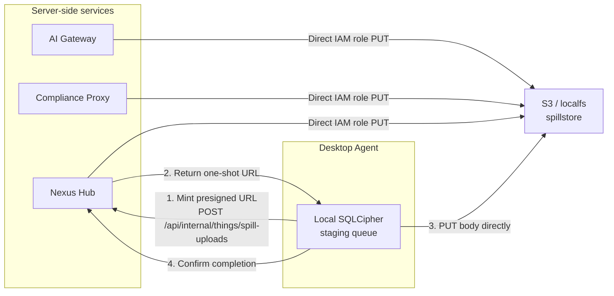

# Deployment Spillstore Setup

Spillstore is the overflow storage layer for large audit body captures. Audit rows in PostgreSQL hold inline JSONB for bodies up to 256 KiB; anything larger overflows to an S3 bucket (or a local filesystem driver for development). The audit row stores a spill reference (`SpillRef`) containing the storage key, byte size, and SHA-256 hash; the admin UI fetches the body on demand via a presigned URL issued by Nexus Hub. Desktop Agents use a separate upload flow because they do not have direct S3 credentials.

---

## Why spillstore exists

Without overflow storage, very large request or response bodies — multi-turn conversations, large context windows, base64-encoded file uploads — land as megabyte JSONB rows in PostgreSQL. Queries that scan many such rows time out, and the admin UI body fetch becomes unreliable. With spillstore, the median audit row is bounded to a few KB regardless of body size, and the body fetch is a separate operation that can fail gracefully without losing the audit metadata.

Bodies land in spillstore when `size > 256 KiB`. Below that threshold, they are stored inline in the `traffic_event_payload.inline_request_body` / `inline_response_body` JSONB columns.

---

## Storage backends

| Backend | When to use |
|---|---|
| S3 (`s3`) | Production — AWS S3 with KMS encryption and lifecycle rules |
| Local filesystem (`localfs`) | Development and single-node setups without S3 access |

The `SpillStore` interface in `packages/shared/storage/spillstore/` abstracts both drivers. The backend is selected at startup by `spillfactory` based on configuration.

### S3 production setup

**Bucket layout:** `s3://<bucket>/<prefix>/<YYYY-MM-DD>/<event-id>-<direction>.bin`

The date prefix makes per-day lifecycle rules cheap. The `direction` suffix is either `request` or `response`. Production uses `prod/` as the prefix; development uses `dev/`.

**Encryption:** S3 server-side encryption (`SSE-KMS`) with a customer-managed KMS key. HTTPS only; bucket policy rejects HTTP requests.

**Retention lifecycle rules:**
- `prod/*` — 90 days (per-tenant configurable via Hub job)
- `dev/*` — 7 days

**IAM roles:** server-side services (AI Gateway, Compliance Proxy, Hub) write directly to S3 using the EC2 instance role. No static credentials are needed on the instance.

**Integrity:** each body's SHA-256 is computed at upload time and stored as S3 object metadata (`x-amz-meta-sha256`). The admin UI verifies the hash on download. A mismatch surfaces as "Body corrupt" with the stored and computed hashes shown.

### Local filesystem (dev only)

Uses the same date-prefixed key shape as S3 so development and production are structurally identical. Bodies land under the configured base directory. No cross-instance sharing.

---

## Three upload paths



### Server-side direct

AI Gateway, Compliance Proxy, and Hub write bodies directly to S3 using the service's IAM role. No presigned URL involved.

### Agent presigned URL flow

Desktop Agents do not have S3 credentials. The upload ceremony:

1. Agent emits an audit event; the body is held in the local SQLCipher staging table.
2. Agent calls `POST /api/internal/things/spill-uploads` (authenticated via the enrolled device identity) to mint a one-shot upload URL.
3. Hub validates the request, issues a presigned PUT URL (TTL up to 5 minutes; clamped server-side), and returns the storage key and backend type.
4. Agent PUTs the body directly to the URL (S3 presigned URL in production, or Hub's own `/api/internal/spill/blob/{token}` endpoint in development).
5. Agent includes the `SpillRef` (key + SHA-256) in the audit envelope.

The Hub's blob endpoint (development only) verifies the HMAC token, performs SETNX dedup in Redis (replay protection), validates `Content-Length` against the registered size, streams the body while computing SHA-256, and returns `204` on success. A previously-used token returns `409` — agents that receive `409` should assume the original PUT succeeded.

### Presigned URL TTL

GET presigned URLs (admin fetch) have a 15-minute TTL. PUT presigned URLs (agent upload) have a longer TTL (1 hour) to tolerate flaky agent uplinks. The admin UI generates a fresh GET URL on each click — no long-lived sharing.

---

## Audit row schema

The `traffic_event_payload` table stores both inline and spill paths:

```
traffic_event_payload {
  traffic_event_id      -- FK to traffic_event.id
  inline_request_body   JSONB?          -- present when size < 256 KiB
  inline_response_body  JSONB?
  request_spill_ref     JSONB?          -- { "key": "...", "size": 1572864, "sha256": "abc..." }
  response_spill_ref    JSONB?
  request_size_bytes    BIGINT?
  response_size_bytes   BIGINT?
  request_truncated     BOOLEAN         -- size cap hit
  response_truncated    BOOLEAN
}
```

Request and response are independent: one can spill while the other stays inline.

---

## Failure modes

| Failure | Behavior |
|---|---|
| S3 unreachable at write time | Audit event emits with `body_dropped=true`, `body_dropped_reason="s3_unreachable"`; alert fires; audit metadata is preserved |
| Presigned URL mint fails (Hub down) | Admin UI shows "Body unavailable — Hub unreachable"; audit row is still fully readable |
| Body checksum mismatch on download | Surfaces as "Body corrupt" with stored vs computed SHA-256 |
| Lifecycle rule deletes body before audit row | Admin UI shows "Body expired" with original timestamp |
| Agent SQLCipher queue full | Oldest non-blocked events drop with `body_dropped=true`; audit metadata still emits when connectivity returns |

---

## Agent SQLCipher staging

The agent maintains a local encrypted queue (SQLCipher with the platform keystore key) that holds body captures until they can be uploaded. The queue drains as connectivity allows. On queue rotation (full), oldest non-blocked events are dropped with `body_dropped=true` — audit metadata without the body is still uploaded. This makes the agent resilient to extended offline periods.

---

## Canonical docs

- [`spillstore-architecture.md`](https://github.com/AlphaBitCore/nexus-gateway/blob/main/docs/developers/architecture/cross-cutting/storage/spillstore-architecture.md) — threshold, storage layout, spill ref schema, three upload paths, failure modes, retention
- [`e37-s2-agent-presigned-spill.yaml`](https://github.com/AlphaBitCore/nexus-gateway/blob/main/docs/users/api/openapi/admin/e37-s2-agent-presigned-spill.yaml) — OpenAPI spec for the mint and blob endpoints (request/response schemas, error codes, replay protection)

**Adjacent wiki pages**: [Deployment-Hardware-Sizing](Deployment-Hardware-Sizing) · [Deployment-Cache-MQ](Deployment-Cache-MQ) · [Spillstore](Spillstore) · [Agent-Privacy-Data-Flows](Agent-Privacy-Data-Flows) · [Security-Audit-Forensics](Security-Audit-Forensics)
