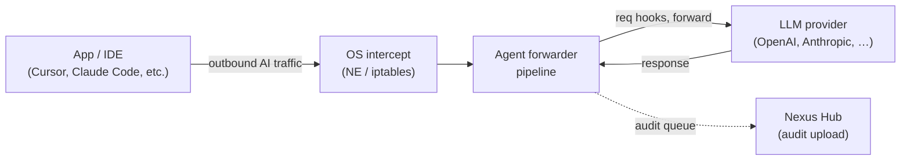

# Feature Desktop Agent

The Nexus Desktop Agent is a Go binary installed on developer workstations that intercepts AI-bound network traffic at the OS level — before it leaves the machine. On macOS it uses a Network Extension (`NETransparentProxyProvider`); on Linux it uses `iptables` NAT-redirect. The agent runs the same compliance hook pipeline, captures the same audit events, and uploads them to the Hub over mTLS. For organizations that need endpoint coverage alongside server-side capture, the agent closes the gap.

---

## What Nexus does

The agent operates as a **client-side compliance proxy** — the same forwarder model as the server-side Compliance Proxy, but executing locally on the endpoint:

The local pipeline runs five phases:

1. **Resolve destination** — read SNI / first bytes to identify the target host.
2. **Decide intercept policy** — match domain against the admin-pushed allowlist. Traffic not in scope is relayed unmodified.
3. **TLS bump** (Linux) — full MITM with an admin-trusted certificate. macOS Network Extension sees connection metadata only (host, IP, port, process) — no TLS bump on macOS today.
4. **Request-stage hooks** — same `HookConfig` shape, same built-in hooks, same decisions.
5. **Forward** to upstream (the real provider, not Nexus).
6. **Response-stage hooks**.
7. **Audit-event emit** to a local encrypted SQLite queue; drained to Hub over mTLS when online.

Cross-service stitching uses `trace_id` — when the same logical request also hits the AI Gateway, the Traffic Monitor timeline joins them on that ID.

## Enrollment and policy distribution

The agent enrolls with Nexus Hub using a one-time enrollment token. During enrollment, the Hub's self-issued ECDSA P-256 Certificate Authority signs the agent's CSR to issue an mTLS client certificate. All subsequent communication (config pulls, audit uploads) uses that certificate.

Policy and hook configurations are delivered via the Hub's **config sync** (pull-only model). When an administrator changes hook policy in the Control Plane, the Hub records the new target config, signals the agent over WebSocket, and the agent pulls the updated configuration. No agent restart is needed.

The Control Plane **Infrastructure → Nodes** page shows each enrolled agent with its version, connectivity status, applied config version, and whether it is in sync with the target config.

## Traffic-upload level

Administrators control how much of the agent's traffic is uploaded to the Hub for audit. The `agent_settings.trafficUploadLevel` config key (set via config sync) accepts:

| Level | What is uploaded |
|---|---|
| `all` | Every intercepted request |
| `processed` (default) | Requests that were inspected and passed hooks |
| `blocked` | Only requests that were rejected by a hook |

Deny, block, and error events bypass this filter and are always uploaded.

## Platform status

| Platform | Mechanism | Status |
|---|---|---|
| macOS | `NETransparentProxyProvider` (Network Extension) | Shipping. Metadata-only intercept (no TLS bump). Fail-open invariants enforced. |
| Linux | `iptables` NAT-redirect transparent proxy | Shipping. Full TLS bump with content-aware hooks. |
| Windows | — | Not yet wired. Build seams exist; no kernel-mode driver ships. |

On macOS, the Network Extension operates in the host's outbound packet path. A hang, panic, or misconfigured claim in the NE process would block all outbound traffic on the Mac. The agent enforces five fail-open invariants (timeout-based passthrough, no hardcoded enforcement lists, no synchronous blocking in the flow-decision path) to prevent this. See [Fail Open Posture](Fail-Open-Posture) for the full invariant list.

## How to install and configure

The agent is distributed as a `.pkg` installer for macOS and a system package for Linux:

1. Download the installer from the Control Plane **Infrastructure → Nodes** page (or the canonical download URL configured by the operator).
2. Run the installer; it places the Go binary, configures the systemd/launchd service, and installs the Network Extension on macOS.
3. In the Control Plane, generate an enrollment token under **Infrastructure → Nodes → New Enrollment Token** and enter it in the agent setup wizard.
4. The agent completes mTLS certificate exchange and appears in the Nodes list within a few seconds.
5. Push hook policy by updating the relevant `HookConfig` rows in the Control Plane — the agent receives and applies the change without restart.

---

## Canonical docs

- [`agent-forwarder-architecture.md`](https://github.com/AlphaBitCore/nexus-gateway/blob/main/docs/developers/architecture/services/agent/agent-forwarder-architecture.md) — forwarder pipeline phases, platform intercept layers, audit upload, traffic-upload level
- [`agent-enrollment-architecture.md`](https://github.com/AlphaBitCore/nexus-gateway/blob/main/docs/developers/architecture/services/agent/agent-enrollment-architecture.md) — mTLS certificate exchange, enrollment token flow
- [`agent-ne-fail-open-architecture.md`](https://github.com/AlphaBitCore/nexus-gateway/blob/main/docs/developers/architecture/services/agent/agent-ne-fail-open-architecture.md) — macOS NE fail-open invariants

**Adjacent wiki pages**: [Feature Hooks Framework](Feature-Hooks-Framework) · [Feature Audit And SIEM](Feature-Audit-And-SIEM) · [Agent Overview](Agent-Overview) · [Agent Enrollment Attestation](Agent-Enrollment-Attestation) · [Installing The Desktop Agent](Installing-The-Desktop-Agent) · [Features Index](Features-Index)
