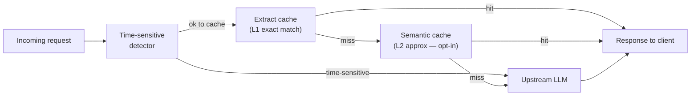

# Feature Response Cache

The gateway response cache short-circuits the entire upstream LLM call when a previously-served response can answer the incoming request. Nexus maintains two cooperating tiers in a single Valkey instance: an exact-match Extract cache (L1) and an optional semantic-similarity Semantic cache (L2). Both tiers record savings per traffic event; the Control Plane Cache ROI page aggregates net savings across tiers.

---

## What Nexus does

A request walks the cache path before any upstream call:

**Extract tier (L1)** is the exact-match cache. The cache key is a SHA-256 hash of the canonical request body — model, messages, tools, temperature, and similar deterministic fields. Streaming vs non-stream get disjoint hash spaces. A hit replays the stored response with `gateway_cache_status = hit`, `gateway_cache_kind = extract`; upstream cost is zero and latency drops to near-zero (Valkey round-trip).

**Semantic tier (L2)** is the approximate-match cache, disabled by default and opt-in per route. It embeds the incoming prompt via a fleet-wide embedding model, then searches a Valkey HNSW vector index for the nearest cached prompt. When cosine similarity meets or exceeds the configured threshold (default 0.96), the cached response is replayed. L2 is particularly useful for paraphrased or semantically similar workloads — summarisation, idea generation, FAQ serving.

Both tiers record savings on the traffic event:
- `gateway_cache_status` — `hit | miss | skipped` (the unified field UI filters bind to).
- `gateway_cache_kind` — `extract | semantic` (on hits only).
- `gateway_cache_savings_usd` — what the upstream call would have cost at the model's list price.

## Time-sensitive prompt detection

Before any cache decision, the gateway evaluates a hub-pushed list of freshness rules. Each rule combines keyword matching with structural checks (question mark, named entity) to identify prompts that ask about current or changing state — stock prices, weather, today's news, live scores. When a rule fires, both L1 and L2 skip lookup and write, and the request proceeds directly to upstream. This prevents stale content from being served or poisoned into the cache.

The skip is recorded as `gateway_cache_status = skipped`, `gateway_cache_skip_reason = time_sensitive`. Administrators manage the rule list in the Control Plane Cache settings without code changes.

## Semantic tier detail

The L2 tier adds two operational considerations beyond L1:

**Embedding model.** L2 uses a single fleet-wide embedding model for all routes — vector spaces from different models are mathematically incompatible and cannot be mixed in one index. The model is configured once on the **Settings → Cache Embedding** page (a dedicated singleton configuration, mirroring the AI Guard configuration page). Per-route Cache Settings carries L2 policy (enabled, threshold, scope) but not the model choice.

**Scope and isolation.** By default, semantic hits are scoped to entries cached under the same virtual key (`vary_by = vk`). This is stricter than L1 (which allows cross-VK reuse for deterministic prompts) because semantic similarity opens an attack surface: a crafted prompt can semantically match a different user's cached response. Wider scopes (`org`, `none`) are available with explicit admin opt-in.

**Circuit breaker.** If the embedding provider has repeated failures, the semantic tier's circuit breaker trips to `open` state and skips L2 entirely until the provider recovers — protecting latency on the L1-miss path. While the breaker is open, each request stamps `gateway_cache_skip_reason = embedding_circuit_open` and proceeds directly to upstream.

## Cache ROI page

The Control Plane Cache ROI page aggregates per-route:
- Hit rate by tier (extract / semantic / combined)
- Gross cost saved per tier
- Embedding cost (semantic tier only; the embedding call itself has a cost)
- Net savings = gross saved − embedding cost
- Hit latency vs miss latency
- Time-sensitive skip rate

If L2 embedding costs exceed L2 savings on a given route, disable the semantic tier for that route.

## Where it sits

- Extract cache primitives: `packages/ai-gateway/internal/cache/core/`
- Semantic cache: `packages/ai-gateway/internal/cache/semantic/`
- Time-sensitive freshness detector: `packages/ai-gateway/internal/cache/freshness/`
- Cache orchestration in the request handler: `packages/ai-gateway/internal/ingress/proxy/proxy.go`
- Hit replay (shared by both tiers): `packages/ai-gateway/internal/ingress/proxy/proxy_cache.go`

## How to enable and configure

All response-cache configuration lives in the Control Plane **AI Gateway → Cache** page:

1. **Extract cache (L1)** is enabled by default. Adjust TTL per route under the route's Cache Settings tab. The fleet-wide global kill switch (Cache Global Config) can disable all cache tiers instantly for incident response.

2. **Semantic cache (L2)** requires two steps:
   - Configure the fleet-wide embedding model under **Settings → Cache Embedding**. Choose an OpenAI cloud embedding model or a self-hosted OpenAI-compatible endpoint (vLLM, Ollama, LiteLLM).
   - On each routing rule that should use L2, open **Cache Settings** and enable semantic cache. Set the similarity threshold (start at 0.96 and lower if hit rate is too low) and the scope.

3. **Time-sensitive rules** are managed under the Cache → Freshness Rules tab. The default ruleset covers time, financial, news, weather, and sports patterns in English and Chinese. Add or disable rules as needed for the deployment's workload.

---

## Canonical docs

- [`response-cache-architecture.md`](https://github.com/AlphaBitCore/nexus-gateway/blob/main/docs/developers/architecture/services/ai-gateway/response-cache-architecture.md) — Extract and Semantic tier detail, key derivation, singleflight, circuit breaker, index lifecycle, failure modes, cost accounting
- [`prompt-cache-architecture.md`](https://github.com/AlphaBitCore/nexus-gateway/blob/main/docs/developers/architecture/services/ai-gateway/prompt-cache-architecture.md) — distinct provider-side KV-cache feature (different layer, works alongside response cache)

**Adjacent wiki pages**: [Feature Prompt Cache](Feature-Prompt-Cache) · [Feature Cost Tracking](Feature-Cost-Tracking) · [AI Gateway Response Cache](AI-Gateway-Response-Cache) · [Storage Cache MQ Stack](Storage-Cache-MQ-Stack) · [Features Index](Features-Index)
