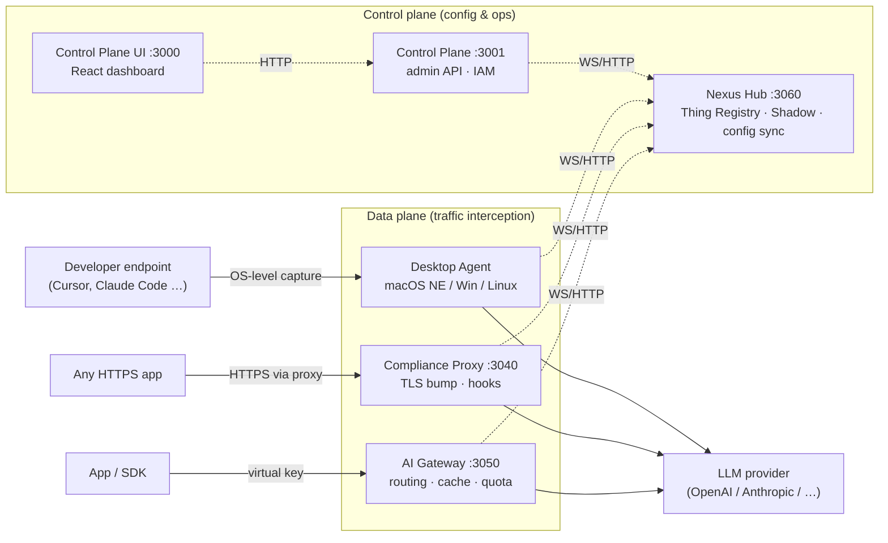

# Nexus Gateway Wiki Home

Nexus Gateway is an enterprise AI traffic platform that centralises governance, compliance enforcement, and observability for every AI API call in an organisation. It addresses three coverage gaps that simpler proxies leave open — SDK calls that bypass network-level controls, endpoint AI tools (Cursor, Claude Code, Copilot) that bypass both, and traffic that reaches a gateway but lacks consistent classification, routing policy, or audit trail. Three independent interception paths close all three at once: an OpenAI-compatible SDK proxy (AI Gateway), a transparent TLS-intercepting network proxy (Compliance Proxy), and an OS-level desktop agent. All three share the same Go compliance pipeline, the same audit destination, and the same control plane — so a policy configured once applies everywhere.

---

## Start here

| I am a... | Read |
|---|---|
| Evaluator — first encounter | [What Is Nexus Gateway](What-Is-Nexus-Gateway) · [Why Nexus](Why-Nexus) · [Use Cases](Use-Cases) |
| Evaluator — comparing tools | [Comparisons](Comparisons) · [Production State](Production-State) |
| First-time runner | [Quickstart](Quickstart) · [Prerequisites](Prerequisites) |
| Production operator | [Deployment Models](Deployment-Models) · [Operations Runbook Index](Operations-Runbook-Index) |
| Contributor | [Contributing](Contributing) · [Architecture Overview](Architecture-Overview) |
| Security reviewer | [Security Threat Model](Security-Threat-Model) · [Fail Open Posture](Fail-Open-Posture) |

---

## Five-service split

The platform runs as five cooperating Go services. The three traffic paths (AI Gateway, Compliance Proxy, Agent) are data-plane; Nexus Hub and Control Plane are control-plane. All five register with Hub and pull configuration from Hub's device shadow — Hub never pushes full state.

Solid arrows carry AI traffic (synchronous). Dotted arrows carry control and config-sync messages (WebSocket primary, HTTP fallback). The three traffic pipes are independent — each enforces hooks on its own traffic. If an Agent-captured flow happens to route through the Compliance Proxy, an attestation header prevents double-processing.

For the full system topology with storage layer detail, see [`docs/developers/architecture/overview.md`](https://github.com/AlphaBitCore/nexus-gateway/blob/main/docs/developers/architecture/overview.md).

---

## What this repo is also

Alongside the gateway software, this repo ships the complete AI vibe-coding workbench that built it — `CLAUDE.md` bindings, `.cursor/rules/`, `.claude/skills/`, and a `scripts/check-*` lint suite. The methodology covers the full SDD pipeline (Architecture → Requirements → SDD → OpenAPI → Code → Tests → Verify), parallel-session safety, and a 2-round completion self-audit. See [Workbench Overview](Workbench-Overview) for how the pieces fit together, and [`docs/developers/workflow/ai-workflow.md`](https://github.com/AlphaBitCore/nexus-gateway/blob/main/docs/developers/workflow/ai-workflow.md) for the fork-adoption guide.

---

## Where to go next

| Resource | What it covers |
|---|---|
| [What Is Nexus Gateway](What-Is-Nexus-Gateway) | Product pitch, three coverage gaps, three traffic paths |
| [Why Nexus](Why-Nexus) | Gap analysis, non-goals, 5-service rationale |
| [Use Cases](Use-Cases) | Enterprise compliance, cost arbitrage, AI dev-tool governance, and more |
| [Comparisons](Comparisons) | Head-to-head matrix vs LiteLLM, Portkey, Kong, Cloudflare, and others |
| [Production State](Production-State) | What is serving real traffic today, HA status, air-gapped status |
| [Quickstart](Quickstart) | `git clone` → running stack → first AI request |
| [Architecture Overview](Architecture-Overview) | Five-service mental model, Hub config sync, storage layer, trust boundaries |
| [Features Index](Features-Index) | Capability catalog — one line per feature with links |
| [Contributing](Contributing) | SDD workflow, AI workbench, pre-commit checks, PR review checklist |
| [`README.md`](https://github.com/AlphaBitCore/nexus-gateway/blob/main/README.md) | Product pitch, performance numbers, quick-start commands |

---

## Canonical docs

- [`README.md`](https://github.com/AlphaBitCore/nexus-gateway/blob/main/README.md) — product pitch, performance numbers, quick-start commands, repository layout
- [`docs/developers/architecture/overview.md`](https://github.com/AlphaBitCore/nexus-gateway/blob/main/docs/developers/architecture/overview.md) — canonical system topology, storage layer, control vs data plane
- [`docs/users/product/overview.md`](https://github.com/AlphaBitCore/nexus-gateway/blob/main/docs/users/product/overview.md) — product narrative, value proposition, capability summary

**Adjacent wiki pages**: [What Is Nexus Gateway](What-Is-Nexus-Gateway) · [Why Nexus](Why-Nexus) · [Architecture Overview](Architecture-Overview) · [Quickstart](Quickstart) · [Contributing](Contributing)
