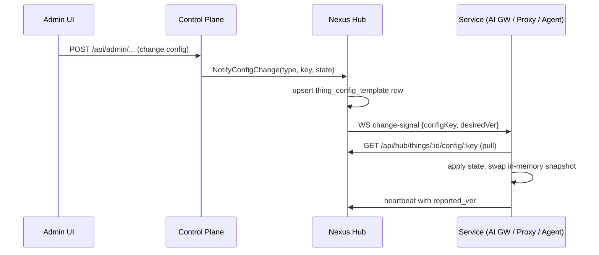

# Hub Coordination

*Audience: contributors and operators who need to understand how Nexus Gateway services register, coordinate, and exchange config.*

Nexus Hub is the central registry and coordination point for all five services in the 5-service architecture. Every service — AI Gateway, Compliance Proxy, Control Plane, Desktop Agent, and Hub itself — registers with Nexus Hub as a managed node (internally called a Thing). This single registry gives operators uniform observability, a shared config-sync contract, and one enrollment lifecycle for services and endpoint agents alike.

---

## Why a central hub

Before the Hub-centric model, config invalidation ran over Redis pub/sub channels (`nexus:config:shared`). That approach scattered change detection across services and added a coordination layer that couldn't be audited. Hub replaces pub/sub with an explicit pull-only model: Hub holds the desired state for every node; each service pulls on signal and reports what it applied. The result is observable drift, auditable config history, and no silent stale-state windows.

The architectural invariant is hard: Valkey (the Valkey 8 Redis-compatible store) is pure cache — sessions, IAM, response cache, rate-limit counters, quota counters, desired-state snapshots. No pub/sub at Nexus. Config sync is Hub WebSocket + HTTP; bulk events are NATS JetStream.

## The service registry

Hub maintains a `thing` table in PostgreSQL. Every service row carries:

- `thing_id` — stable, globally unique, used in URLs and audit rows.
- `type` — one of `hub`, `control-plane`, `ai-gateway`, `compliance-proxy`, `agent`.
- `status` — `online` / `degraded` / `offline`. Computed by Hub from heartbeat data, not self-reported.
- A **device shadow** — three JSONB columns on the row: `desired` (what the admin set), `reported` (what the service applied), and `drift` (gap between the two).

Backend services share a `thing_service` extension row (adds `service_kind`, `version`, `process_uid`). Agents use a `thing_agent` extension (adds `device_id`, `os`, `hostname`, `user_id`).

Hub self-registers as a Thing (`packages/nexus-hub/internal/self/reg/`) so the same contract applies to Hub itself. Because Hub cannot call its own WebSocket, it consumes its own desired state via PostgreSQL `LISTEN config_changed` (`packages/nexus-hub/internal/self/shadow/`).

## Config sync flow

Config changes flow through Hub in one direction — push from the admin down, pull from services up:

Key properties of this flow:
- The change-signal is a **nudge**, not a payload. The service pulls the actual state over Hub's HTTP API.
- Services default to **enforced** on cold-start — no shadow = no passthrough. They wait for the first pull before serving traffic (except the kill-switch path, which is fail-closed by design).
- Every Type B config key carries `needsPull: true` so agents with no direct DB access can still converge.

## Hub internal subpackages

Hub's internals split by concern across several packages under `packages/nexus-hub/internal/`:

| Package | Role |
|---|---|
| `fleet/{manager,shadow,store}` | Thing registry operations, shadow blob writes, override merging |
| `ws/` | WebSocket server — mTLS connections, change-signal fan-out, heartbeat |
| `config/` | Change-signal dispatcher: when a Cat B key changes, routes the nudge to the right WS connections |
| `self/{reg,shadow}/` | Hub's own Thing row and LISTEN-based self-config |
| `jobs/{scheduler,consumer,defs}/` | Scheduled jobs (drift reconcile, expiry revert, retention) |
| `traffic/{ingest,siem,store}/` | Traffic-event consumption from NATS and DB writes |
| `identity/{agentca,enrollment,store}/` | Agent enrollment, CA signing, IAM |
| `alerts/{client,engine,eval}/` | Alert rule evaluation and dispatch |

The `storage/store/` package is the Hub's shared DB query layer. Per-feature query files live under their feature's `<feature>/store/` subdirectory (`fleet/store/`, `identity/store/`, etc.), not in one monolithic file.

## NATS consumers

Hub owns the durable NATS JetStream consumers for all event streams:

| Consumer | Subject prefix | Sink |
|---|---|---|
| `traffic-event-sink` | `nexus.event.ai-traffic`, `nexus.event.compliance`, `nexus.event.agent` | Postgres `traffic_event` |
| `audit-sink` | `nexus.event.admin-audit` | Postgres `admin_audit` |
| `alert-dispatcher` | `nexus.event.alert` | Webhook / SIEM / email |
| `diag-sink` | `nexus.event.diag` | Postgres `diag_event` |

Operational metric samples (`metrics_sample`) travel over the WebSocket link directly — not through NATS — because they are KB-scale and benefit from the WS link's low-latency back-channel.

## Drift reconciliation

The Hub scheduler runs a drift job every minute:

1. Query Things where `desired_ver != reported_ver`.
2. Re-push the drifted config key via WebSocket (or MQ HubSignal if the WS link is down).
3. Track retry count in Valkey (`nexus:drift:retry:<thingID>`); after 3 attempts within 5 minutes, flip Thing status to `drift`.

Hub itself is excluded from the drift loop — it converges synchronously via its PostgreSQL `LISTEN/NOTIFY` path.

---

## Canonical docs

- [`nexus-hub-internals-architecture.md`](https://github.com/AlphaBitCore/nexus-gateway/blob/main/docs/developers/architecture/services/hub/nexus-hub-internals-architecture.md) — Hub internal subpackage reference
- [`thing-model.md`](https://github.com/AlphaBitCore/nexus-gateway/blob/main/docs/developers/architecture/cross-cutting/foundation/thing-model.md) — Thing data model and terminology boundary
- [`thing-config-sync-architecture.md`](https://github.com/AlphaBitCore/nexus-gateway/blob/main/docs/developers/architecture/cross-cutting/foundation/thing-config-sync-architecture.md) — Cat A/B/C keys, change-signal, pull mechanics

**Adjacent wiki pages**: [Service Call Framework](Service-Call-Framework) · [Configuration Architecture](Configuration-Architecture) · [Thing Model And Config Sync](Thing-Model-And-Config-Sync) · [Storage Cache MQ Stack](Storage-Cache-MQ-Stack) · [The Five Services](The-Five-Services)
