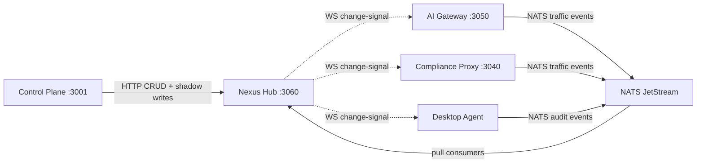

# Service Call Framework

*Audience: contributors adding cross-service flows or debugging service-to-service communication.*

Nexus Gateway's 5-service architecture coordinates through three transport channels: Hub WebSocket for config-sync signals, HTTP for CRUD and presigned-URL operations, and NATS JetStream for bulk event delivery. Each channel has a distinct job, and the assignment is deliberate — mixing them produces either latency problems (bulk events on WS) or missed signals (config sync on NATS). This page maps the channels, describes the envelope format, and explains how to pick the right carrier for a new event type.

---

## Three transport channels



| Channel | Direction | Used for |
|---|---|---|
| **Hub WebSocket** | Hub → Things (server-push nudge) | Config change-signal, heartbeat, config pull-response |
| **HTTP (CP ↔ Hub)** | Request/response | Admin CRUD, shadow read/write, presigned-URL issuance |
| **HTTP (Thing → Hub fallback)** | Thing → Hub | Audit upload when NATS is unreachable |
| **NATS JetStream** | Things → Hub (fan-in) | Bulk events: traffic, audit, ops metrics, alerts |

Config sync is **not** on NATS. Bulk events are **not** on WebSocket. The only exception is `metrics_sample` payloads, which travel directly over the WebSocket link because they are KB-scale and benefit from low latency — not over NATS.

## Hub responsibility split

Hub and Control Plane divide their ownership cleanly:

| Concern | Owned by |
|---|---|
| Thing registry, shadow, drift reconcile | Hub |
| Scheduled jobs (drift, expiry, retention) | Hub |
| Alert rule evaluation | Hub |
| Audit event sink (NATS consumer → Postgres) | Hub |
| Admin REST API, IAM evaluation | Control Plane |
| OAuth+PKCE authorization server | Control Plane |
| Admin UI (BFF) | Control Plane |

When a Control Plane admin handler changes a policy (routing rule, hook, kill-switch), it calls Hub's HTTP API to notify the shadow. Hub updates the template row and dispatches the change-signal to affected Things. The CP handler never reaches into service memory directly.

## MQ envelope format

Every NATS message carries a small structured envelope:

```json
{
  "event_id": "01HXYZ...",
  "trace_id": "...",
  "request_id": "...",
  "schema_version": 3,
  "emitted_at": "2026-05-15T12:34:56Z",
  "thing_id": "thing-abc",
  "payload": { ... }
}
```

The same fields are reflected in NATS message headers (`nexus-event-id`, `nexus-trace-id`) for cheap filtering without payload deserialization. `schema_version` enables forward-compatible schema evolution — consumers must tolerate higher versions than they were compiled with by skipping unknown fields.

## Stream layout

NATS JetStream streams are per-domain so retention and quota tuning can differ by data type:

| Stream | Subjects | Retention |
|---|---|---|
| `nexus.traffic` | `nexus.event.ai-traffic`, `nexus.event.compliance`, `nexus.event.agent` | 24 h hot + Postgres durable |
| `nexus.audit` | `nexus.event.admin-audit` | 7 d hot + Postgres durable |
| `nexus.ops_metrics` | `nexus.event.diag` | 24 h hot |
| `nexus.alerts` | `nexus.event.alert` | 24 h hot |

Stream definitions live in `packages/shared/transport/mq/streams.go` and are applied by Hub on boot. Hub auto-provisions streams if they are missing — consumers wait until ready.

## Dual-write and dedup

Some events support dual-write: MQ primary, HTTP fallback when MQ is unreachable. Every event carries a stable `event_id` (UUID v7, generated by the emitter). Hub sinks use the DB `UNIQUE` constraint on `event_id` as the dedup mechanism — a duplicate write is swallowed by the constraint without error. JetStream's message-id ack window suppresses redelivery storms.

Never skip the natural-key `UNIQUE` constraint on a dual-write path — without it, downstream rollups double-count silently.

## How to add a new cross-service event

1. Choose the carrier using the table in the previous section. Most new events belong on NATS.
2. Add the subject convention to `packages/shared/transport/mq/streams.go`.
3. Declare or extend the relevant stream (retention, max-msgs, max-bytes).
4. If consumed in Hub, wire the consumer in `packages/nexus-hub/internal/jobs/consumer/`.
5. Add Prometheus counters: published count, ack lag, NAK count, DLQ depth.
6. Add an alert rule for DLQ depth and consumer lag.
7. Ensure the sink has a `UNIQUE` constraint if the stream supports dual-write.
8. Update the relevant Tier-1 architecture doc (e.g., `audit-pipeline-architecture.md` for a new audit event type).

---

## Canonical docs

- [`service-call-framework.md`](https://github.com/AlphaBitCore/nexus-gateway/blob/main/docs/developers/architecture/cross-cutting/foundation/service-call-framework.md) — canonical entry index into all per-area architecture docs
- [`mq-architecture.md`](https://github.com/AlphaBitCore/nexus-gateway/blob/main/docs/developers/architecture/cross-cutting/foundation/mq-architecture.md) — NATS JetStream interface, streams, subject taxonomy, dedup
- [`thing-config-sync-architecture.md`](https://github.com/AlphaBitCore/nexus-gateway/blob/main/docs/developers/architecture/cross-cutting/foundation/thing-config-sync-architecture.md) — config sync mechanics (not on NATS)

**Adjacent wiki pages**: [Hub Coordination](Hub-Coordination) · [Configuration Architecture](Configuration-Architecture) · [Storage Cache MQ Stack](Storage-Cache-MQ-Stack) · [Thing Model And Config Sync](Thing-Model-And-Config-Sync) · [Architecture Overview](Architecture-Overview)
