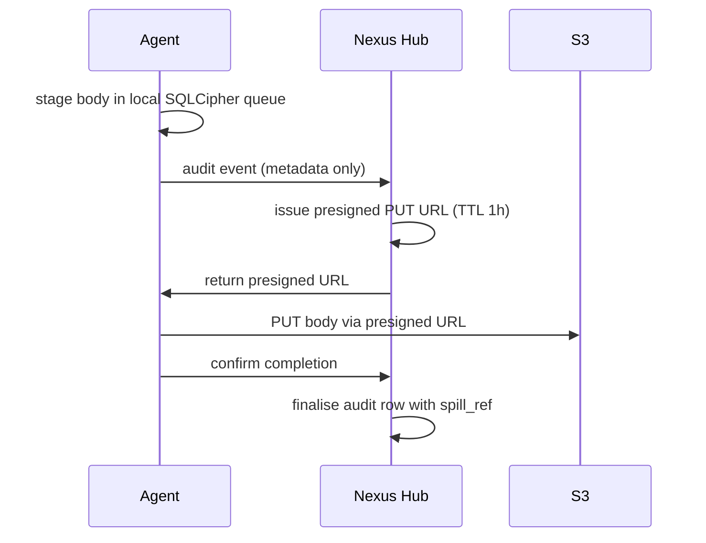

# Spillstore

*Audience: contributors and operators working with large traffic event bodies, S3 configuration, or the agent audit pipeline.*

Spillstore is Nexus Gateway's overflow layer for request and response bodies that exceed the 256 KiB inline threshold. Bodies below the threshold are stored directly in PostgreSQL JSONB columns on `traffic_event_payload`; bodies above it are written to an object store (S3 in production, local filesystem in dev), and the audit row carries a reference. Admins retrieve large bodies on-demand via Hub-issued presigned GET URLs — the body fetch is its own operation and can fail gracefully without corrupting the audit record.

---

## The threshold and storage layout

The inline limit is **256 KiB** per body (request or response, independently). Above that threshold, the body overflows to spillstore. The audit row always exists; the body is the optional attachment.

In production, bodies land in S3 with the path:

```
s3://nexus-payload-capture-bucket/<prefix>/<YYYY-MM-DD>/<event-id>-<direction>.bin
```

Where `<direction>` is `request` or `response` and `<prefix>` is the store's configured prefix (e.g., `prod/`). Per-day partitioning makes lifecycle-rule retention cheap. The body's SHA-256 is stored as S3 object metadata (`x-amz-meta-sha256`) for integrity verification on download — not in the object key.

The `traffic_event_payload` row carries parallel columns for both storage paths:

| Column | Present when |
|---|---|
| `inline_request_body` / `inline_response_body` | Body ≤ 256 KiB |
| `request_spill_ref` / `response_spill_ref` | Body > 256 KiB (JSONB: `{key, size, sha256}`) |
| `request_size_bytes` / `response_size_bytes` | Always |
| `request_truncated` / `response_truncated` | Size cap hit |

Request and response can independently spill or stay inline. The admin UI reads from `traffic_event_payload` and branches: if inline body is present, render directly; if spill ref is present, request a presigned URL from Hub and fetch client-side.

## Three upload paths

### Server-side direct

AI Gateway, Compliance Proxy, and Hub write to S3 directly using their IAM role credentials. This is the fast path; it runs inline with the audit emit.

### Agent presigned upload

Desktop Agents have no S3 credentials. The agent flow uses presigned PUT URLs:



The longer PUT TTL (1 hour vs the standard 15 minutes for GET URLs) tolerates flaky agent uplinks.

### Local filesystem (dev only)

The `SpillStore` interface includes a local-FS driver for dev environments without S3. The same date-prefixed key shape is used, so retention sweeps are identical across drivers.

## Presigned URLs

- **GET URLs** (admin body fetch): issued by Hub, 15-minute TTL. Fresh URL generated per click — never long-lived.
- **PUT URLs** (agent upload): issued by Hub, 1-hour TTL.

The short GET TTL bounds the leak radius if a URL is accidentally shared. Bucket policy rejects HTTP; HTTPS only. S3 server-side encryption uses a customer-managed KMS key (`SSE-KMS`).

## Retention

Lifecycle rules on the bucket:

- `prod/*` — 90 days default (per-tenant configurable).
- `dev/*` — 7 days.

The `retention.purge.spillstore` Hub job reconciles orphaned S3 objects whose audit row was already deleted — a defence-in-depth layer on top of the lifecycle rule.

## Agent local staging

The agent holds bodies in a local SQLCipher queue until uploaded. The queue is encrypted at rest using the platform keystore key. On queue full, oldest non-blocked events drop with `body_dropped=true` on the audit row — metadata always emits even when the body is lost.

## Failure modes

| Failure | Behaviour |
|---|---|
| S3 unreachable at write time | Audit event emits with `body_dropped=true` and `body_dropped_reason="s3_unreachable"`. Alert fires. |
| Hub down (GET presign fails) | Admin UI shows "Body unavailable — Hub unreachable". Audit row is still readable. |
| Body checksum mismatch on download | UI surfaces "Body corrupt" with stored vs computed SHA-256. |
| Bucket misconfigured (4xx on PUT) | Same as unreachable; alert. |
| Lifecycle rule deletes body before audit row | UI shows "Body expired" with original timestamp. |

---

## Canonical docs

- [`spillstore-architecture.md`](https://github.com/AlphaBitCore/nexus-gateway/blob/main/docs/developers/architecture/cross-cutting/storage/spillstore-architecture.md) — full spillstore spec including the agent SQLCipher staging path
- [`audit-pipeline-architecture.md`](https://github.com/AlphaBitCore/nexus-gateway/blob/main/docs/developers/architecture/cross-cutting/observability/audit-pipeline-architecture.md) — parent body-storage tiering

**Adjacent wiki pages**: [Storage Cache MQ Stack](Storage-Cache-MQ-Stack) · [Hub Coordination](Hub-Coordination) · [Observability Stack](Observability-Stack) · [Deployment Spillstore Setup](Deployment-Spillstore-Setup)
