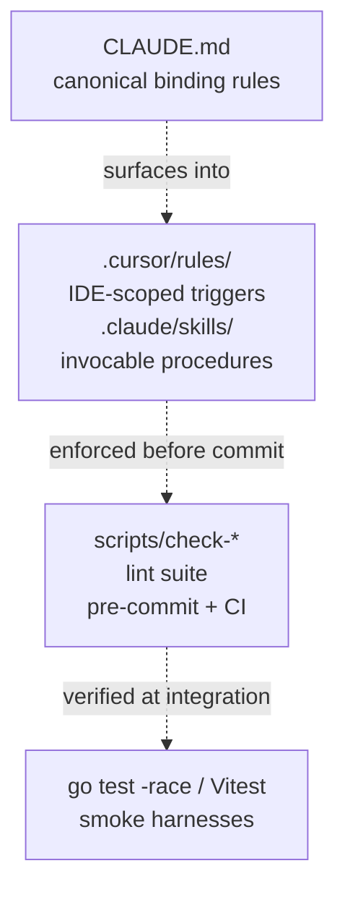

# Workbench Overview

*Audience: engineers considering adopting the AI vibe-coding workbench on a different codebase.*

The AI vibe-coding workbench is a four-layer system for disciplined AI-assisted development: a canonical binding-rules file (`CLAUDE.md`), IDE-side rule files (`.cursor/rules/`), invocable skill procedures (`.claude/skills/`), and a mechanical lint + test gate (`scripts/check-*`). Together the four layers keep an AI agent converging on production-quality output instead of drifting — adding backward-compatibility shims, mocking infrastructure in tests that are supposed to catch infrastructure bugs, or silently refactoring adjacent code while fixing a narrowly scoped bug. The workbench is the direct product of incidents that cost real engineering hours, and every binding rule in it cites the specific failure mode it prevents.

---

## The four artifact layers

The layers form a cascade: each layer catches what the layer above missed.

### Layer 1 — `CLAUDE.md`

A single file at the repo root. Every sentence is binding unless explicitly waived. The file carries:

- **Mandatory rules.** Hard contracts: plan-first workflow, complex-task Plan + Todo, worktree-per-session isolation, unit-test coverage ≥95%, no inline yaml secrets, code/doc lockstep, real-implementation-only, English-only artifacts.
- **Pre-edit reading (3-doc rule).** Every code edit must be preceded by reading the architecture doc, the feature doc, and the conventions doc for the area being changed.
- **Mandatory development workflow.** The SDD pipeline: Plan + Todo → Architecture → Requirements → SDD → OpenAPI → Code → Unit Tests → Verify → Ask-about-commit. No step skipped above triviality.
- **Current state / Project structure.** Stable facts an agent should not rediscover from scratch each session.

`CLAUDE.md` is always loaded into the agent's context. Ephemeral content must stay out of it.

### Layer 2 — `.cursor/rules/` and `.claude/skills/`

Two parallel surfacings of the same workflow, one per IDE tooling.

`.cursor/rules/` contains 35 `.mdc` rule files. Fourteen are `alwaysApply: true` — they load into every prompt regardless of file context. The remaining 21 fire on `globs:` patterns when a matching file is open or staged. The always-apply rules are meta-rules (SDD workflow, pre-edit reading, self-audit, English-only, no backward compatibility, worktree discipline); the glob-scoped rules carry domain bindings for specific subsystems (agent runtime invariants, NE fail-open safety, provider adapter format rules, IAM impact review, migration timestamp uniqueness).

`.claude/skills/` contains 25 invocable procedures. Each skill is a self-contained runbook with pre-conditions, numbered steps, binding rules, verification gate, and recovery notes. A skill encodes the tacit knowledge that would otherwise live in a developer's head. The catalog covers: deployment and operations, end-to-end testing, architecture and design, and debug and audit work.

### Layer 3 — `scripts/check-*`

The lint suite enforces the mechanical consequences of binding rules. The suite runs in both directions: pre-commit (staged-file-scoped, under 1 second per check, blocks on 14 HARD gates) and CI (full-tree strict mode). Each script produces actionable error messages that cite the binding rule, not just "FAILED". Scripts that would be blocked by pre-existing violations carry an allowlist with documented category rationale rather than silently skipping enforcement.

Key gates: `check-go-coverage.sh` (95% per-package), `check-doc-lockstep.mjs` (code/doc parity), `check-no-prod-todos.mjs` (no TODO/FIXME in production code), `check-no-yaml-secrets.mjs` (env-only secrets), `check-arch-doc-triggers.mjs` (architecture doc triggers), `check-terminology.mjs` (IoT boundary enforcement).

### Layer 4 — Tests

`go test -race -count=1` on every Go package, Vitest on the Control Plane UI, and AI Gateway smoke harnesses that verify `traffic_event` rows, cross-ingress codec parity, cache-hit classification, and Prometheus counter correctness. The lint layer verifies shape; tests verify behavior.

---

## Evidence of effect

Several measurable outcomes flow directly from the workbench bindings:

**95% per-package Go coverage.** Enforced by `scripts/check-go-coverage.sh` and the pre-commit hook. The allowlist (`scripts/.coverage-allowlist`) catalogues every exempt package with a category and rationale; entries require explicit user approval. Packages that were at single-digit coverage before the binding was introduced are now at or above threshold.

**Code/doc lockstep.** `scripts/check-doc-lockstep.mjs` maps code globs to architecture docs, feature docs, OpenAPI specs, and runbooks. A PR that changes AI Gateway routing code without updating the routing architecture doc fails CI. The result is that the `docs/developers/architecture/` tree stays accurate enough to use as a planning input — not as a post-hoc record.

**Zero unreviewed endpoint additions.** The IAM impact review binding (`iam-impact-review.mdc`) requires a 5-step audit on any PR that adds, moves, or renames an admin API endpoint, sidebar nav item, or route path. Drift between UI `allowedActions` and handler middleware produces silent 403s; the audit catches that class of bug before merge.

**No production stubs.** `scripts/check-no-prod-todos.mjs` gates every commit. The real-implementation-only rule prevents the pattern of merging skeleton code with `// TODO: implement` placeholders that never get filled in.

**Self-audit before every "done".** The 2-round completion self-audit (Q1: all todos done? Q2: no stub strings? Q3: tests cover changes? Q4: no "fix later" claims?) runs before any completion report. Two clean consecutive rounds are required.

---

## How the pieces fit together

A typical feature development session on Nexus Gateway looks like:

1. The human provides intent and approval for the plan.
2. The agent reads `CLAUDE.md` and the always-apply cursor rules (loaded automatically).
3. Before code touches disk, the agent reads the three pre-edit docs for the area (architecture + feature + conventions) — enforced by `pre-edit-reading.mdc`.
4. A plan and todo list are created — enforced by `sdd-workflow.mdc` and `complex-task-plan-todo.mdc`.
5. The SDD pipeline runs: requirements doc, SDD story, OpenAPI spec, then code.
6. Any subsystem-specific cursor rule (e.g., `ne-fail-open.mdc` when editing Swift Network Extension code, `provider-adapter-canonical-openai.mdc` when adding a new LLM adapter) fires automatically based on the files edited.
7. Pre-commit hooks run the staged-file-scoped lint checks.
8. The 2-round self-audit runs before the agent claims the work is done.
9. The agent asks the human about committing; never auto-commits.

---

## Who reads this workbench

The workbench is designed for two audiences who share the same codebase:

**Human maintainers** get a development discipline that is explicit about what the AI agent is expected to do at each phase, what requires human approval, and what gates exist before code ships. The plan-first rule keeps scope discussions before code appears; the self-audit requirement keeps the agent accountable; the no-auto-commit rule keeps the human in the loop for the final review.

**AI agents** get a stable contract for every session. Rather than rediscovering project conventions by reading the codebase, the agent loads `CLAUDE.md` and the always-apply rules at startup and has the invariants needed to produce correct work immediately. The glob-scoped rules carry domain-specific bindings to exactly the right context without polluting unrelated work.

The workbench is also designed for **fork-adopters**: engineers who want to transplant the discipline to a different codebase. The meta-rules are universal; the domain rules are specific and clearly labeled. See [Workbench Forking Guide](Workbench-Forking-Guide) for the step-by-step adoption path.

## Canonical docs

- [`ai-workflow.md`](https://github.com/AlphaBitCore/nexus-gateway/blob/main/docs/developers/workflow/ai-workflow.md) — the four artifact layers, SDD pipeline, self-audit gate, and fork-adoption guide
- [`CLAUDE.md`](https://github.com/AlphaBitCore/nexus-gateway/blob/main/CLAUDE.md) — canonical binding rules
- [`ai-skill-catalog.md`](https://github.com/AlphaBitCore/nexus-gateway/blob/main/docs/developers/workflow/ai-skill-catalog.md) — full skill catalog with portability ratings

**Adjacent wiki pages**: [Workbench CLAUDE md Anatomy](Workbench-CLAUDE-md-Anatomy) · [Workbench Cursor Rules](Workbench-Cursor-Rules) · [Workbench Claude Code Skills](Workbench-Claude-Code-Skills) · [Workbench Forking Guide](Workbench-Forking-Guide) · [Workbench Lessons Learned](Workbench-Lessons-Learned) · [Contributing](Contributing)
