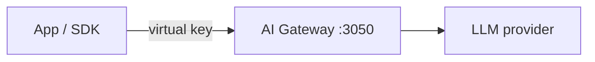
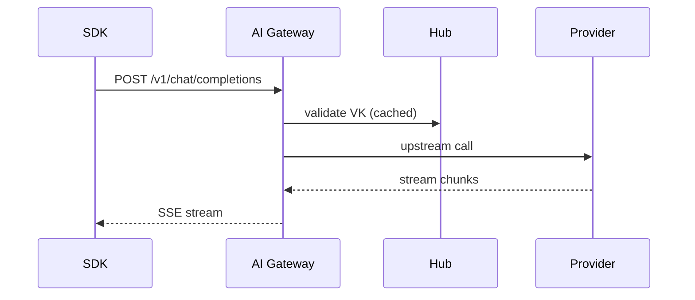
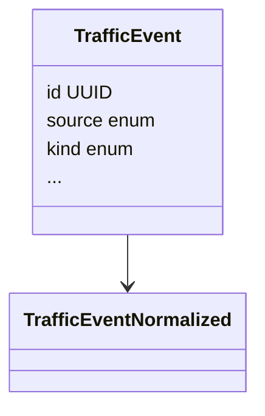

# Wiki style guide

> Companion to `page-template.md`. Template covers page **shape**; this file
> covers **voice, terminology, link conventions, and diagram patterns**. Both
> are binding for every wiki page.

## Wiki is not archaeology (binding)

Wiki pages describe what the system IS today. They never narrate IA history,
decision-log entries, supersession, or "what used to be". Banned content in
any wiki page:

- `DEC-NNN`, "decision log", "rejected alternatives"
- "supersedes", "previously", "no longer", "deprecated" (referring to internal
  changes — third-party deprecations like "the legacy `docker-compose` v1 is
  no longer supported by Docker" are fine, that's ecosystem fact, not Nexus
  history)
- "as of `<date>`", "in 2026-MM-DD we…" (dated framing of current state)
- "the 2026-MM-DD audit found…" (decision-log archaeology)
- "this was added in E*<n>*", "this replaces the old E*<m>* approach"
- "originally", "historically", "tracks historical misplacements"

Forward-looking voice describes the current behavior directly:

| Archaeology (banned) | Forward-looking (good) |
|---|---|
| "As of 2026-05-21 the directory contains one example." | "The directory contains one example:" |
| "E58-S0 introduced the shared decoder; before that, every consumer maintained its own." | "Every consumer reads from the shared decoder — adding a field once propagates everywhere." |
| "The conformance gaps table tracks historical misplacements; all gaps are closed as of 2026-05-21." | "The conformance gaps table documents the canonical slot for ambiguous placements." |
| "No customer signal as of 2026-05-20; epic is on hold." | "No active customer demand; framework stays in code and supports revival." |

Release-History.md is the only wiki page where past-tense release events are
appropriate (the page is literally about what shipped when). Even there, the
entries focus on what each release ADDED to current capability, not what was
broken/superseded by it.

**Why**: published wiki pages are read by evaluators and new users. They have
no context for decision archaeology, and reading "previously this was X"
without context is confusing. The `git log`, the `docs/handoffs/<program>/`
directory, and the memory anchors carry the change history for maintainers.

## Voice

| Trait | Rule | Bad | Good |
|---|---|---|---|
| Declarative | State facts. Avoid hedging. | "Nexus may be able to route…" | "Nexus routes traffic via declarative rules." |
| No hype | No "world-class", "best-in-class", "advanced", "powerful". | "World-class AI gateway." | "AI traffic gateway with compliance, routing, caching." |
| No 1st-person plural | No "we", "our", "us". Use project name or passive. | "We support OpenAI." | "Nexus supports OpenAI via the `openai` adapter." |
| No 2nd-person breeze | No "you'll see", "let's", "we'll cover". | "Let's set up your VK." | "Create a virtual key from the AI Gateway page." |
| Sentence-case headings | H2/H3 use sentence case, not Title Case. | "## How To Add A Provider" | "## How to add a provider" |
| No filler | "In this section we will discuss…" | drop entirely | start with the content |
| Backed claims | Every non-obvious claim links to a doc or code path | "Costs are accurate" | "Costs come from the `Model` row prices, stamped at request time — see [cost-estimation-architecture.md](…)" |

## Terminology (IoT-boundary binding from CLAUDE.md)

The wiki is a **user-facing** surface by default; use the user-facing column
unless the page audience is "contributor" or "concept".

| Internal (contributor / concept pages) | User-facing (most wiki pages) |
|---|---|
| Thing | node (when generic), or specific service name |
| Shadow | config (target / applied) |
| desired | target |
| reported | applied |
| drift | out of sync |
| Thing registry | service registry |
| pull-only config sync | config sync (pull model) |

Verify via `npm run check:terminology` if uncertain — that lint enforces the
boundary in `docs/users/`. Wiki pages are NOT in lockstep, but the same
boundary applies for consistency.

### Audience-specific exceptions

- `Concepts-*` pages explain the internal terminology — use internal terms
  but with a parenthetical first-mention gloss: "Thing (a node in the Hub-coordinated
  service mesh)".
- `Dev-*`, `Recipe-*`, `Workbench-*` pages target contributors — internal
  terminology is fine without gloss.
- `Feature-*`, `Operations-*`, `Deployment-*`, `Getting-Started-*`, `FAQ-*`,
  `Use-Cases.md`, `Comparisons.md` — user-facing terminology mandatory.

### Catalog pages — H2-section count exception

Most pages cap at 5 H2 sections. Catalog pages (`Use-Cases.md`,
`Comparisons.md`, `Features-Index.md`, `Glossary.md`, `Recipe-Index.md`,
`API-OpenAPI-Index.md`, `Operations-Runbook-Index.md`, `Examples-Catalog.md`)
inherently enumerate items — each item is a section, and the section count
matches the catalog size (6-10 H2 sections is normal, 10+ acceptable). The
template's 2-5 rule applies to non-catalog pages.

## Names and casing

| Subject | How to write |
|---|---|
| Product name | "Nexus Gateway" in prose; "Nexus" allowed after first mention |
| Service names | "Nexus Hub", "Control Plane" (capitalized when standalone), "AI Gateway", "Compliance Proxy", "Desktop Agent" |
| Component nouns | "virtual key", "routing rule", "hook" (lowercase) |
| Provider names | "OpenAI", "Anthropic", "Google", "Azure" — match each vendor's casing |
| Model IDs | exactly as the provider writes them: `gpt-5-mini`, `claude-sonnet-4-6`, `gemini-2.5-pro` |
| API endpoints | inline code: `/v1/chat/completions`, `/v1/messages` |
| File paths | inline code, repo-relative: `packages/ai-gateway/`, `docs/developers/architecture/overview.md` |
| Env vars | inline code, ALL_CAPS: `INTERNAL_SERVICE_TOKEN`, `CREDENTIAL_ENCRYPTION_KEY` |
| Config keys | inline code, exact spelling: `agent_settings.trafficUploadLevel` |

## Links

### Inter-wiki (page-to-page within the wiki)

```markdown
[AI Gateway Prompt Cache](AI-Gateway-Prompt-Cache)
```

- Match the filename without `.md` extension.
- Display text usually matches the rendered title (filename with spaces).
- Never use relative paths or fragments unless linking to a section in the
  same page.

### Down-links (wiki → main repo file) — ABSOLUTE URLs (E76-DEC-010 binding)

```markdown
[`overview.md`](https://github.com/AlphaBitCore/nexus-gateway/blob/main/docs/developers/architecture/overview.md)
```

- Always start with `https://github.com/AlphaBitCore/nexus-gateway/blob/main/`.
- Display text wraps the bare filename in backticks: `` [`overview.md`](…) `` —
  this signals "external file reference" visually.
- For section anchors, append `#<lowercased-heading-with-hyphens>`.

### Down-links to specific lines

If pointing at a specific line/range:

```markdown
[`codec.go:103-107`](https://github.com/AlphaBitCore/nexus-gateway/blob/main/packages/ai-gateway/internal/providers/specs/anthropic/codec/codec.go#L103-L107)
```

### External links

```markdown
[GitHub Wiki Markdown reference](https://docs.github.com/en/get-started/writing-on-github)
```

- Full HTTPS URL.
- Display text describes the target, not "click here".

### What never to do

- `../../docs/developers/...` — relative path. Will 404 once published.
- `[Architecture.md](Architecture.md)` — wiki links never include `.md`.
- `[Architecture](#architecture)` — anchor-only link. Use the page name.

## Mermaid diagrams

### Flowchart (most common)



Rules:
- Use `LR` (left-right) for service-topology diagrams; `TD` (top-down) for
  sequence-like data flow.
- Quote multi-word node labels with `"…"`.
- Use `\n` inside quoted labels for two-line node text.
- Annotate edges with `-->|label|` when the edge represents a typed flow.
- Use `subgraph X["Group Title"]` to group related nodes.
- Solid arrows = synchronous traffic. Dotted arrows (`-. .->`) = async /
  control-plane / config-sync.

### Sequence diagram



Use for: request lifecycle, enrollment ceremony, config-sync flow.

### Class diagram (rare — only for data model)



Use sparingly. Most data-model docs live in `tools/db-migrate/schema.prisma`;
the wiki should link there rather than duplicate.

### What never to do

- Don't use ASCII-art diagrams. Mermaid renders natively in GitHub Wiki.
- Don't reference external image URLs (cache invalidation, broken links).
- Don't use PlantUML, Graphviz dot, or LaTeX (not supported in GitHub Wiki).

## Tables

### When to use

- Capability matrices (provider × ingress, page × audience, etc.)
- Comparison grids (Nexus vs LiteLLM vs Portkey)
- Catalogs (env vars, runbooks, configKey values)
- Multi-column lookups where a paragraph would be hard to scan

### Cell content rules

- Keep cells to a sentence or short phrase. Multi-paragraph content goes outside
  the table.
- Backtick code/paths inside cells.
- For checkboxes, use `✅` / `❌` (Unicode, not images).
- Align `|---|` on the dash row to keep tables readable in the source.

### Bad table patterns

- Tables with 7+ columns become unreadable on mobile/wiki sidebar layouts.
  Limit to 4 columns where possible.
- Tables of bullet lists. If a cell needs bullets, the content is too complex —
  break out into a section.

## Code blocks

### Language hints — always include

```bash
./scripts/dev-start.sh
```

```go
func (a *Adapter) PrepareBody(ctx context.Context, body []byte) ([]byte, error) {
    // ...
}
```

```yaml
- match:
    provider: anthropic
    model: claude-sonnet-4-6
```

```sql
SELECT * FROM traffic_event WHERE source = 'ai-gateway' LIMIT 10;
```

Supported hints commonly used in this wiki: `bash`, `go`, `typescript`, `yaml`,
`json`, `sql`, `mermaid`, `text` (for plain output / log lines).

### What never to do

- Don't paste actual secrets (HMAC keys, passwords, real VK strings). Use
  placeholder text like `<VIRTUAL_KEY>` or `vk_xxxxx`.
- Don't paste full files (> 50 lines). Link to the file with `[codec.go](https://...)` instead.

## Numbers, units, dates

| Subject | Format |
|---|---|
| Ports | `:3050`, `:3001` — include the colon |
| Sizes | `8 KB`, `2 MB`, `64 GB` — space between number and unit |
| Times | `50ms`, `2s`, `60s reconcile` — no space for time units |
| Dates | `2026-05-21` — ISO 8601 |
| Counts | `29 models`, `5 services` — no thousands separator below 10,000 |
| Versions | `v1`, `Go 1.25+`, `Node 20+` |
| Cost | `$0.003 / 1K input tokens` — `/ 1K` not `per 1000` |

## Cross-page consistency

Some terms appear in many pages. Use the EXACT phrasing below for searchability:

- "three independent traffic paths" (not "three pipelines" / "three flows")
- "Hub-centric pull-only config sync" (not "config push")
- "macOS NE fail-open" (not "fail safe" / "fail closed")
- "single source of truth" (not "canonical truth" / "single SoT")
- "AI vibe-coding workbench" (not "AI pair-programming kit" / "AI workflow")
- "5-service architecture" (not "4-service", not "6-service"; AI Gateway +
  Compliance Proxy + Agent + Hub + Control Plane)

If a subagent invents a new phrase for any of these concepts, the audit pass
catches and standardizes.

## Audience markers (top of every page)

Optional but recommended for pages whose audience is non-obvious. Place a
single italic line directly after the H1:

```markdown
# AI Gateway Provider Adapters

*Audience: contributors adding or modifying a provider adapter.*

<one paragraph what/why>
```

Use sparingly — pages whose audience is obvious from the title (Home,
Quickstart, FAQ) skip this.

## Worked examples

When showing a step sequence (e.g. recipe pages, getting-started pages), use
numbered prose, not bare bullet lists:

```markdown
1. Clone the repo and bootstrap: `./scripts/dev-start.sh`. This starts Postgres + Valkey + NATS in Docker.
2. Run database migrations: `cd tools/db-migrate && npx prisma migrate dev`.
3. Start the AI Gateway: `cd packages/ai-gateway && go run ./cmd/ai-gateway/ -config ai-gateway.dev.yaml`.
4. Verify it answered: `curl http://localhost:3050/healthz`.
```

Not:

```markdown
- Clone the repo
- Start docker
- Run migrations
- Start AI Gateway
- Verify
```

Numbered prose carries the *why*; bare bullets lose it.
