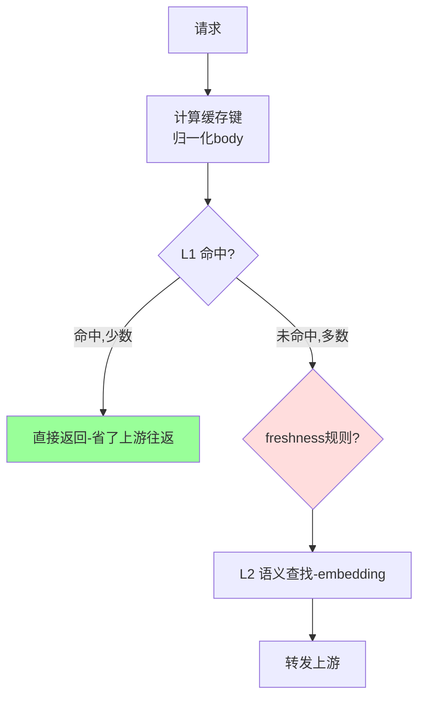
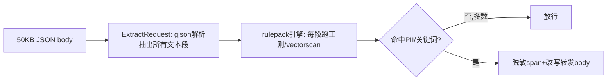
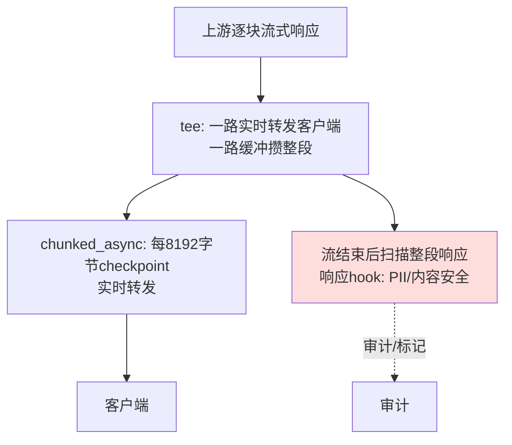

# Nexus AI-Gateway 性能与开关全解（含 Bifrost 对比）

> 面向：技术负责人、运维、以及"为什么开了某个开关性能会降"的所有提问者。
> 读法：**第 1 节是概要**（给老板/决策看结论）；**第 2 节起是详细**（数据、机制、架构图）。
> 测试基线日期：2026-06-24，host-native c6i.4xlarge（16 vCPU），mock LLM 零延迟，loadtest 闭环压测。

---

## 1. 概要（先看这里）

### 1.1 一句话结论

- **裸网关能力（hooks-OFF、cache-OFF）：Nexus 在每一个维度都超过 Bifrost**，并且是在**额外完成持久化审计**的前提下做到的。
- **开启内容合规（hooks-ON）：性能会下降——这是"逐字节内容检查"对比"无脑转发"的必然代价，不是 bug。** 非流式约低 13%，流式约低 35%。
- **每多开一个开关，就多一份每请求的工作**。Nexus 的设计原则是**默认精简、按需开启**，并把能异步的（审计）全部放到旁路、不碰核心链路。

### 1.2 结果速览

| 场景 | Nexus | Bifrost | 结论 |
|---|---|---|---|
| 非流式 RPS（裸网关） | 6484–7352 | 6018–6377 | **Nexus 胜 +2~20%** |
| 流式 RPS / token吞吐（裸，对齐256tok） | ~3000 / ~785k | ~1350 / ~350k | **Nexus 胜 ~2.2×** |
| 流式 TTFT 尾延迟（裸） | p95 292–550ms | p95 2190–3455ms | **Nexus 胜 6~7×** |
| 非流式 RPS（hooks-ON 5个内容hook） | 4891–5545 | 6018–6377 | Nexus 低 ~13% |
| 流式 RPS（hooks-ON，对齐256tok） | 802–989 | 1322–1394 | Nexus 低 ~35% |
| 成功率（全部场景） | 100% | 100% | 持平 |
| gw CPU（裸/hooks-ON 非流式） | 41% / 58% | 90~98% | **Nexus 更省，远未饱和** |

### 1.3 三句话讲清"为什么开关一开就降速"

1. **cache 开**：每请求多一次缓存键计算 + 查找；并且历史上 freshness 规则用 `(?i)` 正则扫整个 50KB 请求体（已修为子串匹配，~1000× 提速）。命中率低时，这些开销 > 收益 → 反而更慢。
2. **hooks-ON 非流式**：每请求多一次**全 body 内容提取（gjson 解析 50KB）+ 正则/vectorscan 扫描**，同步在核心链路上 → 加延迟 → 固定并发下 RPS 下降 ~13%。
3. **hooks-ON 流式**：在上面基础上，响应是**逐块流式**的——内容检查需要 tee 缓冲 + 分块 checkpoint + 流结束后扫描整段响应，这套协调引入**等待延迟**（gw 此时是 idle-waiting，不是 CPU 烧满），所以流式降幅最大（~35%）。

---

## 2. 性能优化全历程：我们改了什么

起点：旧版 "hooks-OFF" 实测只有 ~70 RPS（0.54× Bifrost）。根因是**默认配置把缓存 + freshness + 请求改写全打开了**，每请求在 50KB body 上做大量无谓工作，其中 freshness 用 `(?i)` 正则对整个 body 逐关键词扫描，烧掉 99% CPU。

按以下顺序逐项优化（均只改 Nexus 自己的代码）：

| # | 优化 | 机制 | 收益 |
|---|---|---|---|
| 1 | **freshness 正则 → 子串** | `(?i)` 正则（逐 rune NFA 大小写折叠）→ 预降小写关键词 + `strings.Contains`；候选文本每请求只降一次小写 | 大 body 上 ~1000×，判定完全一致（差分门绿） |
| 2 | **缓存默认关、按需开** | L1 exact-match / L2 semantic / freshness / gemini provider 缓存默认全 OFF（prisma + Go store 兜底 + seed fixtures） | 开箱即精简直通；移除默认的缓存查找 + freshness 扫描 |
| 3 | **请求改写族默认关** | `normaliser_enabled` / `marker_inject` / `marker_boundary3` 默认 OFF；移除 field-order 归一化 | 去掉 ~27% alloc + 篡改转发请求的风险，对性能/正确性双赢 |
| 4 | **L1/L2 缓存层解耦** | 缓存阶段改为"L1 **或** L2 任一启用即工作"，各自独立门控；去掉 L1 充当总闸的混淆 | 修正 L1 关时 L2 被连带关掉的缺陷；差分门 pin |
| 5 | **CP-UI 缓存风险提示** | L1/L2/Provider 三张卡加提示：缓存可选、每请求有开销、命中率低会拖累 | 让管理员理解利弊，少踩坑 |

**审计旁路（关键架构事实）**：请求处理只把**原始字节**入队交给异步 audit writer goroutine；**zstd 压缩 + JSON marshal + 归一化全在异步 batch 路径**，payload/normalized 甚至延迟到**查看时**才解码计算。实测高负载下无 back-pressure → **审计旁路不碰核心链路**（这是一条 binding：旁路可以慢慢做，但绝不能影响核心链路）。

---

## 3. 全维度对比数据（详细）

> 公平性说明：流式原始基线 Bifrost 是 256 token/请求、Nexus profile 默认 64，二者不可直接比 RPS/吞吐；已把 Nexus 对齐到 **256 token/请求** 重测。非流式输出 token 对 RPS 影响可忽略（响应体相对 50KB 输入极小）。

### 3.1 非流式（裸网关，cache-OFF/hooks-OFF）

| 并发 | Nexus RPS | Bifrost RPS | Nexus p95/p99 | Bifrost p95/p99 |
|---|---|---|---|---|
| 100 | 6484（稳态） | 6377 | 38/68 | 38/74 |
| 200 | 6390 | 6298 | 82/123 | 88/158 |
| 400 | 6482 | 6119 | 126/172 | 165/291 |
| 800 | 6635（稳态7352） | 6122 | 200/254 | 259/426 |
| 1200 | 6672 | 6143 | 278/316 | 363/586 |
| 1600 | 6448 | 6018 | 357/422 | 454/679 |

### 3.2 流式（裸网关，对齐 256 token）

| 并发 | Nexus RPS | Bifrost RPS | Nexus tok/s | Bifrost tok/s | Nexus TTFT p95 | Bifrost TTFT p95 |
|---|---|---|---|---|---|---|
| 100 | 2996 | 1394 | 767k | 357k | 58 | 123 |
| 800 | 3072 | 1352 | 787k | 346k | **292** | 2190 |
| 1600 | 3089 | 1322 | 791k | 338k | **550** | 3455 |

Bifrost 流式中继在高并发下尾延迟塌陷（p95 到 3455ms），Nexus 的 SSE 中继（passthrough + tee）分布极紧 → 2.2× 吞吐 + 6~7× 更好的尾延迟。

### 3.3 hooks-ON（5 个内容扫描 hook：pii-scanner / keyword-blocker / request-content-safety / pii-outbound-scanner / response-content-safety）

| 场景 | Nexus hooks-ON | Bifrost | Nexus hooks-OFF | 备注 |
|---|---|---|---|---|
| 非流式 RPS | 4891–5545 | 6018–6377 | 6484–7352 | 开 hook 掉 ~15%，比 Bifrost 低 ~13% |
| 流式 RPS（256tok） | 802–989 | 1322–1394 | 2996–3089 | 开 hook 掉 ~3×，比 Bifrost 低 ~35% |

CPU：hooks-ON 非流式 gw 峰值 ~58%/1600%（hooks-OFF 41%）——**hooks 加了 CPU 但远未饱和**；流式时 gw 反而 idle-waiting（采样几乎为空）→ 流式瓶颈是**延迟/阻塞**不是 CPU。

---

## 4. 为什么 cache-on / hooks-on 会降速：机制详解

### 4.1 请求生命周期（裸 vs hooks-ON）

**核心链路**（影响延迟/RPS）：B→...→F→G→I。**旁路**（不影响核心链路）：H→J→K 全异步。
每多开一个开关（cache / hooks），就在核心链路上插入一段**同步**工作 → 加延迟 → RPS 降。

### 4.2 cache-on 为什么可能更慢

- 缓存的收益只在**命中**时兑现（省一次上游往返）。
- 但**每个请求**（含未命中）都要付：键计算 + 归一化 + L1 查找（+ L2 embedding）。
- 历史上还要付 freshness 正则扫 50KB（已修）。
- **命中率低时：所有请求付开销，极少请求拿收益 → 净亏损、更慢。** 这就是为什么缓存是 opt-in、且 UI 提示"命中率低会拖累系统"。

### 4.3 hooks-ON 非流式为什么慢 13%

profile 实测：开 5 个内容 hook 后，gjson 解析从 ~8% 升到 ~25% CPU。来源是 `extractRequestContentForHooks` → `adapter.ExtractRequest`：**为了找到要扫描的文本，必须把 50KB JSON 解析成内容段**（请求 + 响应各一次）。

- 提取是**一次、跨 5 个 hook 共享**的（不是每 hook 重复），但 gjson 解析 50KB 本身就贵，且**同步在请求路径**。
- 注意：原 handoff 担心的 cgo 调度税（pthread_cond_wait 31%、900万次上下文切换）**已被之前的 cgo-scan-semaphore + GC稳定 scratch-ring 提交修复**——当前 profile 里看不到它了。所以现在 hooks-ON 非流式的瓶颈是 **gjson 内容提取**，不是 cgo 扫描。

### 4.4 hooks-ON 流式为什么慢 3×（最难）

- 流式下，响应不是一次到齐，而是逐块。内容检查需要 **tee 缓冲 + 分块 checkpoint + 流结束后扫描整段**。
- 这套协调（每流的缓冲/同步/收尾）引入**等待延迟**——实测 gw 此时 CPU 采样几乎为空（idle-waiting），证明瓶颈是**阻塞/协调延迟**，不是算力。
- 固定并发下，每流耗时变长 → 并发槽位被占住 → RPS 大幅下降。
- 这是**结构性**的：你在对比"逐块检查每字节的响应" vs "无脑转发字节"。Bifrost 什么都不做，所以快。

---

## 5. 各开关/功能：作用与利弊

| 开关 / 功能 | 作用 | 利 | 弊（性能） | 默认 |
|---|---|---|---|---|
| **L1 响应缓存** | exact-match 命中直接返回 | 命中省整次上游往返 | 每请求键计算+查找；命中率低净亏 | OFF |
| **L2 语义缓存** | embedding 相似命中 | 近似 query 也能命中 | 每请求 embedding 计算，更重 | OFF |
| **freshness 规则** | 时效性 query 跳过缓存 | 避免返回过期答案 | 命中跳过全部缓存层（设计如此） | OFF |
| **请求改写/归一化** | 调整转发 body 提升上游缓存命中 | 上游 provider 缓存命中率↑ | 解析+改写 body，有篡改风险 | OFF |
| **gemini provider 缓存** | 上游 Gemini 上下文缓存标记 | 省上游 token 成本 | 仅 gemini；标记注入开销 | OFF |
| **内容 hooks（PII/合规）** | 逐请求扫描+脱敏 | **合规刚需**：拦截/脱敏敏感数据 | 非流式 +提取扫描；流式 +缓冲协调 | OFF |
| **payload capture** | 存请求/响应体到审计 | 可审计、可回溯 | 异步旁路，不碰核心链路 | OFF |
| **审计（block 模式）** | 100% 持久不丢 | 合规/计费可信 | 旁路缓冲在 NATS；优雅背压 | ON |
| **streaming chunked_async** | 实时转发+仅审计 hook | 流式实时性 | 比纯 passthrough 略重 | chunked_async |

**选型建议**：默认全精简直通即可获得最佳吞吐；只有**真实业务需要**时再开对应开关，并知晓其每请求代价。合规场景（必须 PII 脱敏）应接受 hooks-ON 的开销——它换来的是数据安全，而非性能。

---

## 6. hooks-ON 还能优化的方向（路线图）

当前 hooks-ON 未追平 Bifrost。可挖的杠杆（按预期收益排序）：

1. **非命中路径免结构化提取**：先用合并的 vectorscan DB 扫**原始字节**一遍；无命中（绝大多数请求）直接放行，**跳过 50KB gjson 解析**；仅命中时才做结构化提取+脱敏地址映射。预期显著降非流式延迟。
2. **跨 hook 单次扫描**：同 stage 所有正则类 hook 规则合并成一个 Vectorscan DB，扫一次、按 pattern-ID demux 回各 hook（cgo 税已修，此项主要省扫描字节量）。
3. **流式增量脱敏**：响应边流边扫（滑动窗口处理跨块模式），避免"攒整段再扫"的协调延迟——这是流式追平的关键，也是最难的工程。
4. **共享提取**：cache/audit/hook 三处对同一 body 的解析合一（lazy 物化一次共享）。

> 诚实结论：在做**真实强制脱敏**的前提下，hooks-ON 流式很难"远超"一个什么都不做的裸代理；现实目标是**把开销压到可接受**（接近持平）。上述 #1/#3 是达成"非流式持平、流式可接受"的主要路径。

---

## 7. 复现实验的命令（rig 就绪）

- 构建（**必须在 EC2 上**，否则 vectorscan 链接出错）：`CGO_LDFLAGS="-lstdc++ -lm" go build -tags vectorscan ...`
- 压测（loadtest 机）：`/usr/local/bin/loadtest -config <profile> -target http://172.31.0.36:3050/v1/chat/completions -vk <bench-vk> -model mock-gpt-4o -stages 100:20s,200:20s,400:20s,800:25s,1200:25s,1600:25s -out <dir>`
- 流式对齐 256tok：用 `max_tokens=256` 的 profile。
- 启用 hooks：`update "HookConfig" set enabled=true where name in (...)` → 重启 hub→cp→gw → 确认 `hook_configs size=5`。
- 抓 profile：`kill -USR1 <gw MainPID>` → `/var/log/nexus-pprof/` → `go tool pprof -top`。

---

*结果文件：rig `/var/log/perf/`（bifrost-* / nexus-lean-* / nexus-hookson-*）。profile：rig `/var/log/nexus-pprof/`。*
