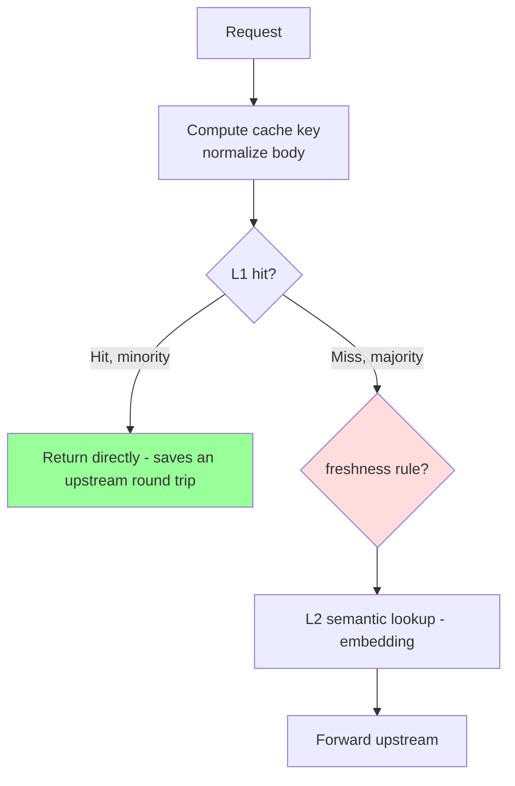
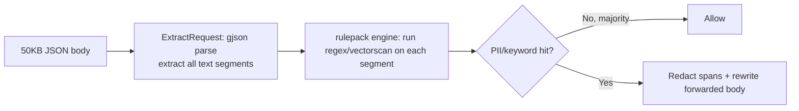
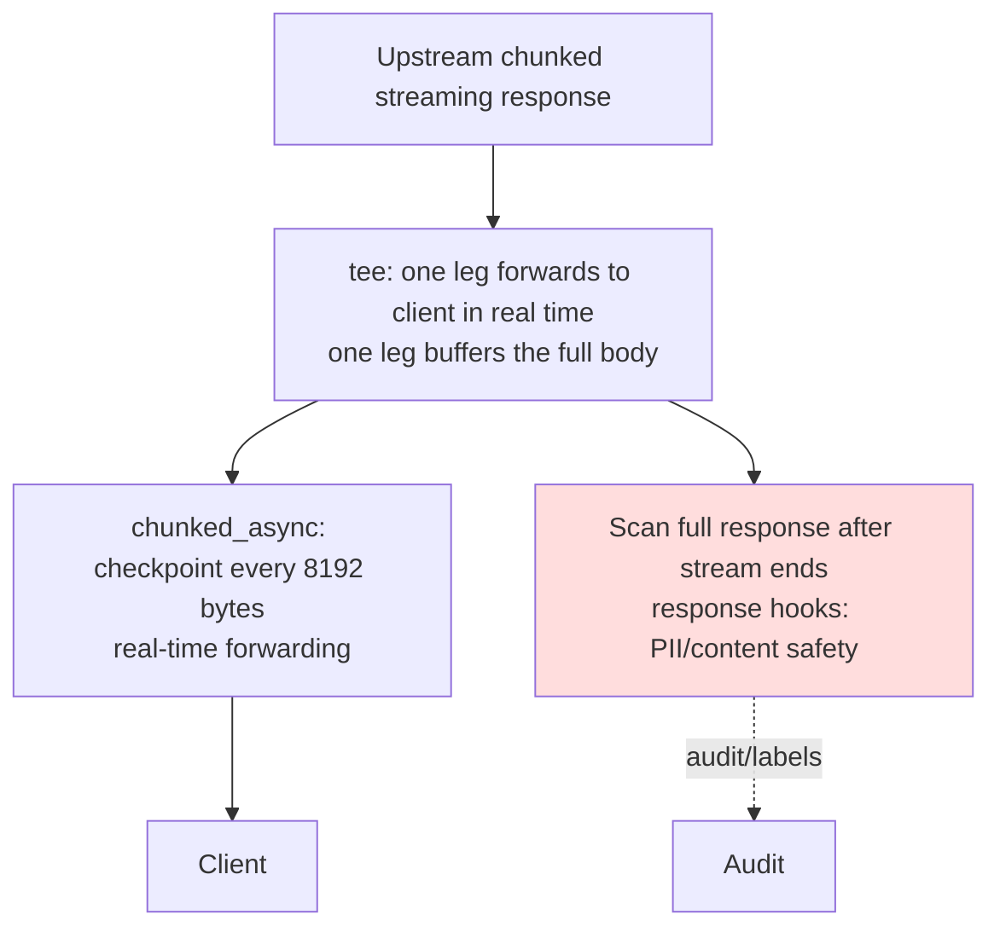

# Nexus AI-Gateway Performance and Switches Explained (with Bifrost Comparison)

> Audience: tech leads, operators, and anyone asking "why did performance drop after enabling a switch".
> How to read: **Section 1 is the summary** (conclusions for managers/decision-makers); **Section 2 onward is the detail** (data, mechanisms, architecture diagrams).
> Test baseline date: 2026-06-24, host-native c6i.4xlarge (16 vCPU), mock LLM with zero latency, loadtest closed-loop benchmark.

---

## 1. Summary (start here)

### 1.1 One-sentence conclusion

- **Bare gateway capability (hooks-OFF, cache-OFF): Nexus beats Bifrost on every dimension**, and does so while **additionally performing persistent auditing**.
- **With content compliance enabled (hooks-ON): performance drops — this is the inevitable cost of "byte-by-byte content inspection" versus "blind forwarding", not a bug.** Non-streaming is ~13% lower, streaming ~35% lower.
- **Every additional switch enabled adds per-request work**. Nexus's design principle is **lean by default, enable on demand**, and everything that can be async (auditing) is moved to the side path, never touching the core path.

### 1.2 Results at a glance

| Scenario | Nexus | Bifrost | Conclusion |
|---|---|---|---|
| Non-streaming RPS (bare gateway) | 6484–7352 | 6018–6377 | **Nexus wins +2~20%** |
| Streaming RPS / token throughput (bare, aligned 256tok) | ~3000 / ~785k | ~1350 / ~350k | **Nexus wins ~2.2×** |
| Streaming TTFT tail latency (bare) | p95 292–550ms | p95 2190–3455ms | **Nexus wins 6~7×** |
| Non-streaming RPS (hooks-ON, 5 content hooks) | 4891–5545 | 6018–6377 | Nexus ~13% lower |
| Streaming RPS (hooks-ON, aligned 256tok) | 802–989 | 1322–1394 | Nexus ~35% lower |
| Success rate (all scenarios) | 100% | 100% | Tied |
| gw CPU (bare / hooks-ON non-streaming) | 41% / 58% | 90~98% | **Nexus uses less, far from saturated** |

### 1.3 Three sentences explaining "why enabling a switch slows things down"

1. **cache on**: each request pays one extra cache-key computation + lookup; historically, the freshness rules also scanned the entire 50KB request body with a `(?i)` regex (since fixed to substring matching, ~1000× speedup). When the hit rate is low, these costs exceed the benefit → net slowdown.
2. **hooks-ON non-streaming**: each request pays one extra **full-body content extraction (gjson parse of 50KB) + regex/vectorscan scan**, synchronously on the core path → added latency → RPS drops ~13% at fixed concurrency.
3. **hooks-ON streaming**: on top of the above, the response is **streamed chunk by chunk** — content inspection requires tee buffering + per-chunk checkpoints + scanning the full response after the stream ends. This coordination introduces **waiting latency** (the gw is idle-waiting at this point, not CPU-saturated), so streaming shows the largest drop (~35%).

---

## 2. The full performance-optimization journey: what we changed

Starting point: the old "hooks-OFF" build measured only ~70 RPS (0.54× Bifrost). Root cause: **the default configuration had cache + freshness + request rewriting all enabled**, doing large amounts of pointless work on the 50KB body per request — with freshness scanning the entire body keyword-by-keyword via a `(?i)` regex, burning 99% of CPU.

Optimizations were applied in the following order (all changing only Nexus's own code):

| # | Optimization | Mechanism | Gain |
|---|---|---|---|
| 1 | **freshness regex → substring** | `(?i)` regex (rune-by-rune NFA case folding) → pre-lowercased keywords + `strings.Contains`; candidate text lowercased only once per request | ~1000× on large bodies, verdicts fully identical (differential gate green) |
| 2 | **Cache off by default, opt-in** | L1 exact-match / L2 semantic / freshness / gemini provider cache all default OFF (prisma + Go store fallback + seed fixtures) | Lean passthrough out of the box; removes the default cache lookup + freshness scan |
| 3 | **Request-rewrite family off by default (demand-driven)** | The upstream rewrite engine has no global switch: at `Reload` it derives `hasWork` from "are there enabled strip rules / does any provider have marker injection on"; with no config the whole segment short-circuits; `marker_inject` / `marker_boundary3` default OFF; removed field-order normalization (the L0 cache-key's `NormalizeKey` always runs) | Removes ~27% alloc + the risk of tampering with forwarded requests — a win for both performance and correctness; one fewer "forgot to enable the global switch" trap |
| 4 | **L1/L2 cache layer decoupling** | Cache stage changed to "works if **either** L1 **or** L2 is enabled", each gated independently; removes the confusion of L1 acting as a master switch | Fixes the defect where disabling L1 also disabled L2; pinned by the differential gate |
| 5 | **CP-UI cache risk hints** | Added hints to the L1/L2/Provider cards: cache is optional, has per-request overhead, and a low hit rate drags performance | Lets admins understand the trade-offs and avoid pitfalls |

**Audit side path (key architectural fact)**: request handling only enqueues the **raw bytes** to an async audit writer goroutine; **zstd compression + JSON marshal + normalization all happen on the async batch path**; payload/normalized are even deferred until **view time** to decode and compute. Measured under high load with no back-pressure → **the audit side path does not touch the core path** (this is a binding rule: the side path may work slowly, but must never affect the core path).

---

## 3. Full-dimension comparison data (detailed)

> Fairness note: in the original streaming baselines, Bifrost was 256 tokens/request while the Nexus profile defaulted to 64 — the two are not directly comparable on RPS/throughput; Nexus was re-tested aligned to **256 tokens/request**. For non-streaming, the effect of output tokens on RPS is negligible (the response body is tiny relative to the 50KB input).

### 3.1 Non-streaming (bare gateway, cache-OFF/hooks-OFF)

| Concurrency | Nexus RPS | Bifrost RPS | Nexus p95/p99 | Bifrost p95/p99 |
|---|---|---|---|---|
| 100 | 6484 (steady state) | 6377 | 38/68 | 38/74 |
| 200 | 6390 | 6298 | 82/123 | 88/158 |
| 400 | 6482 | 6119 | 126/172 | 165/291 |
| 800 | 6635 (steady state 7352) | 6122 | 200/254 | 259/426 |
| 1200 | 6672 | 6143 | 278/316 | 363/586 |
| 1600 | 6448 | 6018 | 357/422 | 454/679 |

### 3.2 Streaming (bare gateway, aligned to 256 tokens)

| Concurrency | Nexus RPS | Bifrost RPS | Nexus tok/s | Bifrost tok/s | Nexus TTFT p95 | Bifrost TTFT p95 |
|---|---|---|---|---|---|---|
| 100 | 2996 | 1394 | 767k | 357k | 58 | 123 |
| 800 | 3072 | 1352 | 787k | 346k | **292** | 2190 |
| 1600 | 3089 | 1322 | 791k | 338k | **550** | 3455 |

Bifrost's streaming relay collapses on tail latency at high concurrency (p95 up to 3455ms); Nexus's SSE relay (passthrough + tee) keeps an extremely tight distribution → 2.2× throughput + 6~7× better tail latency.

### 3.3 hooks-ON (5 content-scanning hooks: pii-scanner / keyword-blocker / request-content-safety / pii-outbound-scanner / response-content-safety)

| Scenario | Nexus hooks-ON | Bifrost | Nexus hooks-OFF | Notes |
|---|---|---|---|---|
| Non-streaming RPS | 4891–5545 | 6018–6377 | 6484–7352 | Hooks cost ~15%; ~13% below Bifrost |
| Streaming RPS (256tok) | 802–989 | 1322–1394 | 2996–3089 | Hooks cost ~3×; ~35% below Bifrost |

CPU: hooks-ON non-streaming gw peaks at ~58%/1600% (hooks-OFF 41%) — **hooks add CPU but stay far from saturation**; during streaming the gw is instead idle-waiting (samples almost empty) → the streaming bottleneck is **latency/blocking**, not CPU.

---

## 4. Why cache-on / hooks-on slow things down: mechanisms in detail

### 4.1 Request lifecycle (bare vs hooks-ON)

```mermaid
flowchart LR
    A[Client request 50KB] --> B[Auth/VK/quota/routing<br/>admissionStage ~22% CPU]
    B --> C{cache enabled?}
    C -->|No - default| D[Prepare upstream body directly]
    C -->|Yes| C1[freshness check + L1 key + L1 lookup<br/>+ L2 semantic lookup]
    C1 --> D
    D --> E{hooks enabled?}
    E -->|No - default| F[Forward upstream]
    E -->|Yes| E1[<b>Content extraction: gjson parse 50KB</b><br/>+ 5 hooks scan text<br/>synchronous, adds latency]
    E1 --> F
    F --> G[Read upstream response]
    G --> H[Enqueue raw bytes<br/>→ async audit side path]
    H --> I[Return to client]
    H -.async.-> J[zstd compress + JSON marshal<br/>→ NATS buffer]
    J -.at view time.-> K[CP decode + normalize]
```

**Core path** (affects latency/RPS): B→...→F→G→I. **Side path** (does not affect the core path): H→J→K, fully async.
Every additional switch (cache / hooks) inserts a segment of **synchronous** work on the core path → added latency → RPS drops.

### 4.2 Why cache-on can be slower

```mermaid
flowchart TD
    R[Request] --> K[Compute cache key<br/>normalize body]
    K --> L{L1 hit?}
    L -->|Hit, minority| HIT[Return directly - saves an upstream round trip]
    L -->|Miss, majority| M{freshness rule?}
    M --> N[L2 semantic lookup - embedding]
    N --> UP[Forward upstream]
    style HIT fill:#9f9
    style M fill:#fdd
```

- The cache's benefit is realized only on a **hit** (saving one upstream round trip).
- But **every request** (including misses) pays: key computation + normalization + L1 lookup (+ L2 embedding).
- Historically it also paid the freshness regex scan over 50KB (since fixed).
- **When the hit rate is low: all requests pay the cost, very few reap the benefit → net loss, slower.** This is why the cache is opt-in and the UI warns "a low hit rate drags the system down".

### 4.3 Why hooks-ON non-streaming is 13% slower

Measured via profile: with 5 content hooks enabled, gjson parsing rises from ~8% to ~25% CPU. The source is `extractRequestContentForHooks` → `adapter.ExtractRequest`: **to find the text to scan, the 50KB JSON must be parsed into content segments** (once for the request and once for the response).

```mermaid
flowchart LR
    B[50KB JSON body] --> X[ExtractRequest: gjson parse<br/>extract all text segments]
    X --> S[rulepack engine: run regex/vectorscan on each segment]
    S --> D{PII/keyword hit?}
    D -->|No, majority| OK[Allow]
    D -->|Yes| RED[Redact spans + rewrite forwarded body]
```

- Extraction is done **once and shared across the 5 hooks** (not repeated per hook), but a gjson parse of 50KB is expensive in itself, and it is **synchronous on the request path**.
- Note: the cgo scheduling tax the original handoff worried about (pthread_cond_wait 31%, 9 million context switches) **was already fixed by the earlier cgo-scan-semaphore + GC-stable scratch-ring commits** — it no longer appears in the current profile. So the current hooks-ON non-streaming bottleneck is **gjson content extraction**, not cgo scanning.

### 4.4 Why hooks-ON streaming is 3× slower (the hardest one)

```mermaid
flowchart TD
    UP[Upstream chunked streaming response] --> T[tee: one leg forwards to client in real time<br/>one leg buffers the full body]
    T --> RELAY[chunked_async: checkpoint every 8192 bytes<br/>real-time forwarding]
    T --> SCAN[Scan full response after stream ends<br/>response hooks: PII/content safety]
    RELAY --> C[Client]
    SCAN -.audit/labels.-> AUD[Audit]
    style SCAN fill:#fdd
```

- Under streaming, the response does not arrive all at once but chunk by chunk. Content inspection requires **tee buffering + per-chunk checkpoints + a full-body scan after the stream ends**.
- This coordination (per-stream buffering/synchronization/teardown) introduces **waiting latency** — measured gw CPU samples are almost empty at this point (idle-waiting), proving the bottleneck is **blocking/coordination latency**, not compute.
- At fixed concurrency, each stream takes longer → concurrency slots stay occupied → RPS drops sharply.
- This is **structural**: you are comparing "inspecting every byte of the response chunk by chunk" vs "blindly forwarding bytes". Bifrost does nothing, so it is fast.

---

## 5. Each switch/feature: purpose and trade-offs

| Switch / feature | Purpose | Benefit | Cost (performance) | Default |
|---|---|---|---|---|
| **L1 response cache** | Return directly on exact-match hit | A hit saves an entire upstream round trip | Per-request key computation + lookup; net loss when hit rate is low | OFF |
| **L2 semantic cache** | Hit via embedding similarity | Similar queries can also hit | Per-request embedding computation, heavier | OFF |
| **freshness rules** | Time-sensitive queries skip the cache | Avoids returning stale answers | A match skips all cache layers (by design) | OFF |
| **Request rewrite/normalization** | Adjust forwarded body to improve upstream cache hits | Upstream provider cache hit rate ↑ | Parse + rewrite body, tampering risk | OFF |
| **gemini provider cache** | Upstream Gemini context-cache markers | Saves upstream token cost | gemini only; marker injection overhead | OFF |
| **Content hooks (PII/compliance)** | Per-request scanning + redaction | **Compliance necessity**: block/redact sensitive data | Non-streaming: + extraction & scan; streaming: + buffering & coordination | OFF |
| **payload capture** | Store request/response bodies for audit | Auditable, traceable | Async side path, does not touch the core path | OFF |
| **Audit (block mode)** | 100% persistent, no loss | Trustworthy for compliance/billing | Side-path buffering in NATS; graceful back-pressure | ON |
| **streaming chunked_async** | Real-time forwarding + audit-only hooks | Streaming real-time behavior | Slightly heavier than pure passthrough | chunked_async |

**Selection advice**: the all-lean passthrough default already yields the best throughput; enable a switch only when a **real business need** exists, knowing its per-request cost. Compliance scenarios (PII redaction is mandatory) should accept the hooks-ON overhead — it buys data safety, not performance.

---

## 6. Remaining hooks-ON optimization directions (roadmap)

hooks-ON has not yet caught up with Bifrost. Available levers (ordered by expected gain):

1. **Skip structured extraction on the no-hit path**: first scan the **raw bytes** once with a merged vectorscan DB; on no hit (the vast majority of requests) allow directly, **skipping the 50KB gjson parse**; only on a hit do structured extraction + redaction address mapping. Expected to significantly reduce non-streaming latency.
2. **Single scan across hooks**: merge all regex-class hook rules of the same stage into one Vectorscan DB, scan once, demux back to each hook by pattern ID (the cgo tax is already fixed; this mainly saves scanned bytes).
3. **Streaming incremental redaction**: scan the response as it streams (sliding window to handle cross-chunk patterns), avoiding the coordination latency of "buffer the whole body, then scan" — this is the key to streaming parity and the hardest engineering.
4. **Shared extraction**: unify the three parses of the same body by cache/audit/hook (lazily materialize once and share).

> Honest conclusion: with **real enforced redaction** in place, hooks-ON streaming can hardly "far exceed" a bare proxy that does nothing; the realistic goal is to **push the overhead down to acceptable** (close to parity). Items #1/#3 above are the main path to "non-streaming parity, streaming acceptable".

---

## 7. Commands to reproduce the experiments (rig ready)

- Build (**must be on EC2**, otherwise vectorscan linking fails): `CGO_LDFLAGS="-lstdc++ -lm" go build -tags vectorscan ...`
- Load test (loadtest machine): `/usr/local/bin/loadtest -config <profile> -target http://172.31.0.36:3050/v1/chat/completions -vk <bench-vk> -model mock-gpt-4o -stages 100:20s,200:20s,400:20s,800:25s,1200:25s,1600:25s -out <dir>`
- Streaming aligned to 256tok: use a profile with `max_tokens=256`.
- Enable hooks: `update "HookConfig" set enabled=true where name in (...)` → restart hub→cp→gw → confirm `hook_configs size=5`.
- Capture a profile: `kill -USR1 <gw MainPID>` → `/var/log/nexus-pprof/` → `go tool pprof -top`.

---

*Result files: rig `/var/log/perf/` (bifrost-* / nexus-lean-* / nexus-hookson-*). Profiles: rig `/var/log/nexus-pprof/`.*
